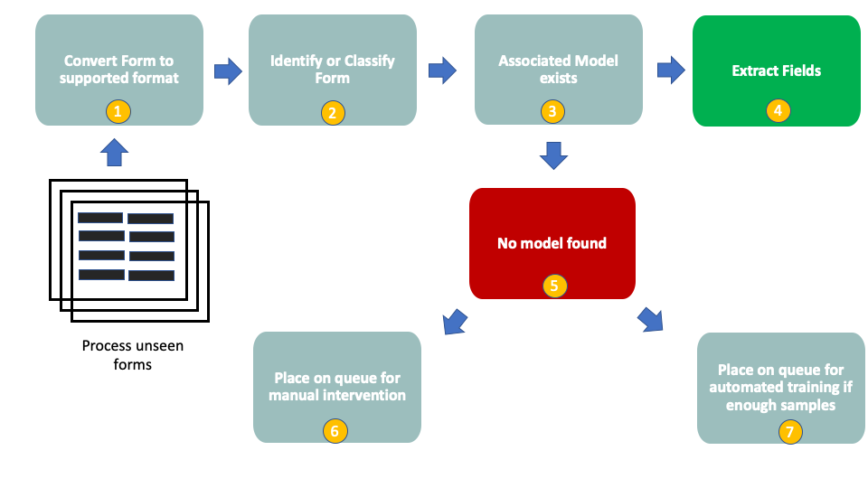
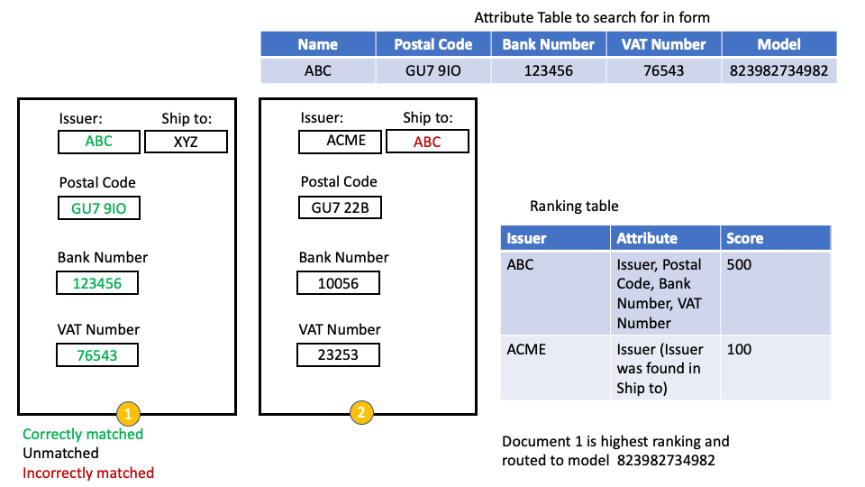

# Classifying forms

When using the Form Recognizer service, there is typically a 1:1 correlation between the forms and their respective layout and the model that they were trained on. In other words, for many forms with the same layout, a single model will exist that can be used for that layout.

Thus in order to be able to run evaluation against a form to extracte the fields required, the form needs to be routed to the correct model. This identification of the form and routing it to the correct model is referred to here as the classification step, as we need to classify the form layout to route it to the appropriate model associated with that layout.

This is clearly a crucial step in the process as if this step performs poorly, all other steps will too.

## Options to classify forms

Broadly speaking, there are two approaches that may be adopted, namely:

* **Computer Vision**: Identify and extract image features from the scanned image that can be used to train a model to identify the form. This could be a logo or a representation of the form layout, if it is unique enough and distinguishable across the dataset.
* **Text based**: Identify and extract text features from the OCR'd image that can be used to either train a model or searched against.

When dealing with large amount of different form layouts, this can be quite complex to implement and maintain. Approaches also need to be included to apply to layouts that change and indeed to new forms that are introduced to the process.

A simple and maintainable option is to use a text based search approach. This implies performing an initial OCR read against the form to extract the text, and then to use simple search techniques to search for identifiable and distingiushable attributes, from a datastore for example, to identify and route the form to the associated model. A ranking based approach with boosting and scoring may be applied to improve classification accuracy.

The image below illustrates the flow at a high level:

* Step 1 - Here we convert our forms to a supported format if needed
* Step 2 - We now classify the forms using an approach that can reliably and accurately extract distinguishable features
* Step 3 - We check our model store lookup (See the Pipelines section) to determine whether a model exists for our identified form
* Step 4 - We can now extract the fields from our model
* Step 5 - In the event that no model exists this implies that we either have misclassified the form, or the layout has changed or this is a new layout or form type
* Step 6 - We can either place this on a queue for human intervention where the form can be inspected and any corrections made
* Step 7 - In the event that this represents a new layout or a changed layout, we can automate the collection of samples of this new/changed layout and automatically train a new model

Have a look at the code accelerator [Attribute Search Classification](attribute_search.py) for an example of how to implement an attribute based search with ranking, boosting and scoring.

## Logical flow of attribute_search.py

* We create a lookup datastore or table that contains the form layout unique id, e.g. Invoice vendor, Form Type Name etc alongside the distinguishable features that we can use to search for. We can also consider adding weightings to these features.
* We OCR the form if we have not done so already so that we can extract the text features
* We now search the OCR for the form line by line for each of the attributes using a variety of techniques including, regex, partial and complete word fuzzy matching
* If we find the attributes we create table with our respective candidates and the score the results.
* Upon completion of the score, we rank and select and return the best candidate

Back to the [Analysis section](../README.md)
