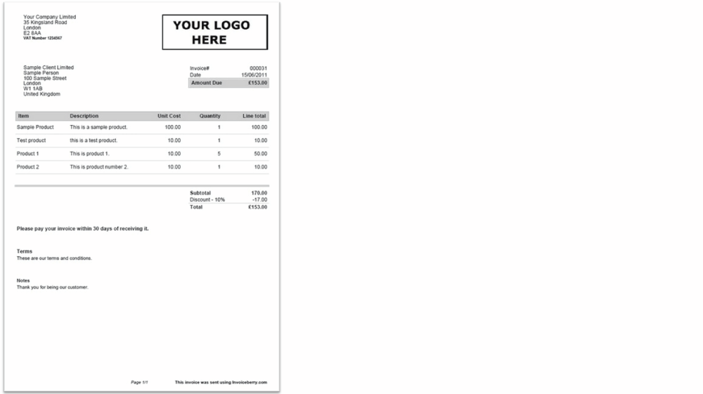

# Using text-based features with clustering algorithm to semi-automatically discover and annotate layout types for different forms in document images

Python code along with the notebooks under this directory can be used to speed up the labelling/annotation for layout types of different forms-like document images.

There is a work in progress to extract this code and the overall approach as a separate UI tool to make the labelling efforts even easier and faster - however until it's implemented and published please add any related suggestions, issues or PRs into current repo.

## Table of content

1. [Getting started](#1-Getting-started)
2. [Approach in a nutshell](#2-Approach-in-a-nutshell)  
<!-- 3. [Detailed steps](#3-Detailed-steps)    -->

### 1. Getting started

In this section you can find ready to reuse notebooks and Python scripts which will help you to discover different layout types within your dataset of forms images as well as help you annotate them for further usage with Forms Recognizer.

Files and folders structure:

```bash
../Form_Layout_Clustering
    |--- notebooks/  # reusable notebooks showing end-to-end usage example
    |--- src/  # all the heavy python code encapsulated into modules
    |--- invoice_vocabulary.txt  # example vocabulary for invoice documents
```

The main file you should be interested in is [layout-clustering-and-labeling notebook](./notebooks/layout-clustering-and-labeling.ipynb) showing end-to-end example of how to implement this approach and reuse with your data.

### 2. Approach in a nutshell

In a nutshell, the approach described in this section could be simplified to the following steps:

1. Extract text from document images with OCR software
2. Process and clean the extracted text using regex and fuzzy matching/filtering based on words vocabulary
3. Use TFIDF vectorizer with N-grams to generate feature vectors representing each document
4. Apply density-based clustering on said features to extract groups of document images with similar/the same forms layout types



<!-- ### 3. Detailed steps -->

<br>

Feel free to reach out to [Karol Zak](mailto:karzak@microsoft.com) in case of additional questions.

For an alternativer approach look at the code accelerator [Search based classification](Attribute_Search_Classification/README.md) for a simple but effective search based approach on text features.

Back to the [Analysis section](../README.md)