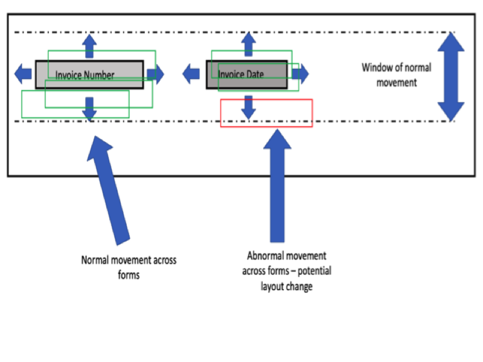

# Investigate Form Variation

This script illustrates a simple starting point to investigate variation with forms of a single layout, for example, invoices that belong to a single vendor.

## Approach of checking the standard deviation of header fields

The theory behind this simple approach is that by analysing many forms with the same layout, we can infer a data driven threshold that represents normal movement of header fields on a form that should have a single layout. We analyse the header fields as these fields are the most likely to not move on a form with a standard layout.

This normal movement is due to scanning subleties such image resolution variation and orientation variation. As such there is always normal 'movement' or jitter of fields across forms due to length of value, scan skewness and perhaps different quality scans for example. There is however a threshold above which abnormal 'movement' occurs, and that is what we are trying to define here.

Once we have inferred this theshold we can use it to help identify variation on forms that should have a single or static layout.

See the image below for an illustration of what we are testing for:



## High level summary of logic

This script will search for ground truth values in the relevant form. The values it will search for need to be the values you utlimately want to extract, see the ```.env``` file for an example.

If found, the bounding box coordinates will be extracted and stored in a csv file. We then sum these coordinates into a single number and run standard deviation against these values. The script also checks for maximum differences in their bounding boxes.

Both of these points above are strong indicators that there may be significant layout variation in the forms. This is vital to know as there is a 1:1 mapping between the form layout and Form Recognizer model to analyze the form.

## Logical steps to apply

1) Choose a set of form fields to use as mappers of the form templates. These are defined in and read from the ```.env file```.

2) OCR the forms

3) Match the ground-truth data of against the form fields instep 1 with the bounding boxes in the extracted OCR content by editing and running ```build_form_variation.py```

## Results and analysis

The result is a CSV file where it's stored which fields have been found and matched for each form, specifying the form key, filename, the form field (also called "key"), and the bounding boxes (area, line, paragraph, page) where such value has been found in the OCR and matched with the ground-truth data.

Once these coordinates are collected we can analyse them to determine whether significant statistical differences exist within the entire data set corresponding to a single form layout or in the case of an invoice, a single vendor.

We can then group the data by form layout and compute the standard deviation of the coordinates of each form field for that layout. This is done by summing the 4 coordinates of each bounding box and using such number as the metric of the bounding box position.
A final score is attained for form layout.

We can empirically define a standard deviation threshold for which it is considered, if exceeded, that a form may have different layouts. This is done by observing the forms with highest standard deviation in their corresponding bounding boxes, and observing samples of such forms.

## Defining a threshold

We want to define a threshold so that for future reference, we can quickly check whether a form's layout may potentially have changed.

It is advised to sample the forms with the highest standard deviation value and manually inspect them to see if there is form layout variation. Find the last standard deviation value where there is variation and set that as the threshold.

Have a look at the code accelerator [Build Form Variation](build_form_variation.py) to build the variation report and [Get Form Variation](get_form_variation.py) to analyse the report.

Back to the [Analysis section](../README.md)
