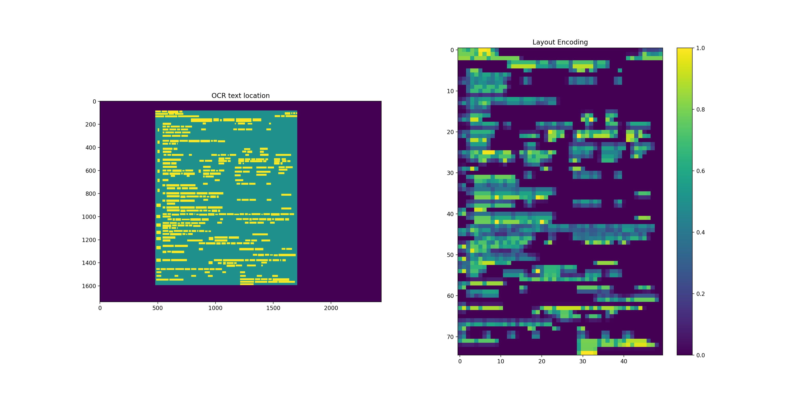
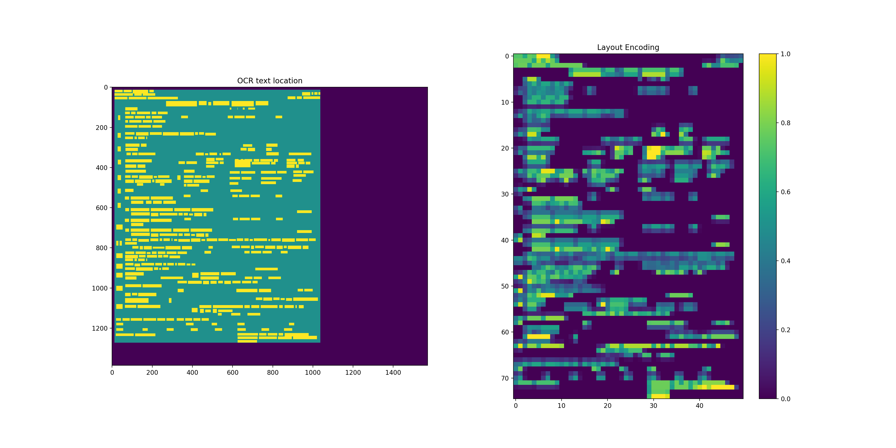

# Layout Routing

This example shows how to train a classifier that looks at OCR results for an unknown form to determine which Form Recognizer model to send the form to.
It has been developed to work on images of forms where the location, orientation or size of the form can change from instance to instance.
For example, a cell phone picture of a form.

The main steps are:

1. Optical Character Recognition - Send the image to OCR endpoint to find text in the image
1. Encode - Transform the OCR results into a fixed format based on the words that are present and their location within the image
1. Classify - Predicts a layout based on the encoded results

## Running the Example

`train.py` is an example command line script for training a routing model.
The example uses the Read API of the Azure Computer Vision cognitive service as the OCR engine.
To run the sample:

1. Install the required packages `pip install -r requirements.txt`
1. Copy `example.env` to a file next to it called `.env`. This is where the code gets the OCR endpoint and key from.
1. Add your endpoint and key for an [Azure Computer Vision](https://azure.microsoft.com/en-us/services/cognitive-services/computer-vision/) instance to the `.env` file.
1. Create a directory with your training data

    * Inside of the directory, there must be a folder to represent each layout
    * Inside of each layout folder, there should be 5 or more examples of the form

Now that the experiment is setup, we can run `train.py` as follows:

```bash
# Run with default parameters
python train.py {path_to_training_data} example_model

# Run with custom parameters
python train.py {path_to_training_data} example_model --number-of-words 100 --shape 60 40
```

Once you have a trained model, you can use `apply.py` to apply it to other images. This is done by:

```bash
# Apply example_model to the image example_image.jpg
python apply.py example_model.json example_image.jpg
```

## Routing model output format

The routing model gets saved as a JSON file.
The trained classifier itself gets saved as an [ONNX](https://onnx.ai/) model, which allows for the model to be run across a large variety of platforms.
In order to include the classifier in the JSON model, the standard `.onnx` file of the model gets base64 encoded and included in the JSON.
We also save the information needed for encoding the OCR results: the vocabulary and layout shape.

The full list of JSON fields and their descriptions is:

* `tags`: Dictionary<string, string>
  * Key vault pairs used for tracking json files
  * Has no impact on the model itself; only to help in tracking the routing json files
* `layouts`: List of strings
  * Layouts that can be output by the routing model
  * Has no impact on the model itself; only to help in tracking the routing json files
* `vocabulary`: List of strings
  * The vocabulary used for the word encoding
* `shape`: List of two integers
  * The shape used for the layout encoding
* `onnxModel`: String
  * Base64 encoded version of the onnx model file
  * If you base64 decode this value you retireve the binary of the associated `.onnx` file

## Appendix

Details on how the example works.

### OCR

The code has been developed to support different OCR providers.
Currently we have implemented classes for two endpoints of the [Azure Computer Vision cognitive service](https://docs.microsoft.com/en-us/azure/cognitive-services/computer-vision/):

* [Read API](https://westcentralus.dev.cognitive.microsoft.com/docs/services/computer-vision-v3-1-ga/operations/5d986960601faab4bf452005)
* [OCR API](https://westcentralus.dev.cognitive.microsoft.com/docs/services/computer-vision-v3-1-ga/operations/56f91f2e778daf14a499f20d)

As different OCR providers return the results in different formats, our wrapper classes unify the output of found words to `List[Word]`.
This way no matter what OCR engine is used, our encoders can operate on the results.

The default OCR provider in the included example is the Read API.
To try a different provider, you must edit the code of `train.py` and `apply.py` to use the new provider.

### Encoding

The OCR results are encoded in two ways: the words that are present and the relative locations of where the words are found.

#### Word Encoding

We are using a [binary Count Vectorizer](https://scikit-learn.org/stable/modules/generated/sklearn.feature_extraction.text.CountVectorizer.html) of the words found in the OCR results of the image against a vocabulary that is created during training.
The output vector is the same size as the vocabulary and has a "1" if the word is present and a "0" if it is not.
This way we have a fixed format which can be fed to the classifier.

Creation of the vocabulary vector can currently be done in two ways:

* Layout agnostic - In this case all of the words found in the training set are stacked together, and the most common words are put into the vocabulary.
* Layout aware - The training data is split based on the layout that the forms belong to. For each layout we find the most common words, then combine the most popular words for each layout to create the vocabulary.

The layout aware method should be used when there is a large difference in the number of example forms per layout or if there is a large variety in the number of words per layout.
Otherwise, the layout agnostic approach can be used.

#### Layout Encoding

The layout encoding captures information about the relative position of all of the word bounding boxes with respect to each other. There are two
key components to extracting the relative positions:

1. We use the outside edge of all of the bounding boxes as a proxy for the forms location in the image. This gives us a crop box that only contains the important pieces
1. We must resize the crop box to be a uniform size. This resizing means we get the same output encoding size regardless of the original image's size

The following two images show examples of how the layout encoding is able to extract relative positional information regardless of the location and size of the form in the original image.
The left hand side of the images show the OCR results, where:

* Dark blue - Pixels outside of the crop box
* Teal - Pixels that are within the crop box, but do not have text themselves
* Yellow - Pixels that contain text

For the right hand side, we have the output of the layout encoding using the shape `(75, 50)`.
There are some deviations between the two encodings due to the output of the OCR engine on different sized images, however we can see a strong similarity between the two.




Steps for the layout encoding:

1. Pick the output shape. The default value is 50 x 50 as this seems to capture enough information to route.

    * If the words on your form are small with respect to the total size of the form, you should experiment with increasing the size of the output to capture the location in higher fidelity
    * If your form is highly rectangular, you can experiment with adjusting the dimensions to reflect the shape of the form. For example, if the forms are printed on A4 paper (210mm x 297mm), you can try `(60,42)` for the shape. Note the shape is (height, width)

1. Loop through all of the found word's bounding boxes to find the exterior edges in each dimension. These are the boundaries of the crop box.
1. Initialize a new array of 0's the size of the output. By setting it to 0's we are saying the default is no bounding box present
1. Calculate the scaling coefficients in each direction. The scaling coefficient for a dimension is equal to the (output shape size) / (the size of the crop box). These are used to add the bounding boxes to the correct location of the output array
1. Loop through each bounding box and insert it into the array:
    * Use the scaling coefficient to locate the indicies in the output array that will be effected
    * Loop through each effected array location and calculate the percentage of the location that is covered by the bounding box
    * Add the percentage to the array location
1. Flatten the 2-d output array in row-major order to be 1-d

### Classifier

Our example has been set up so that any sklearn classifier can currently be used,
through the package [skl2onnx](https://github.com/onnx/sklearn-onnx).
This can be extended to any framework that can be exported to ONNX if desired.

The current implementation uses an [sklearn pipeline](https://scikit-learn.org/stable/modules/generated/sklearn.pipeline.Pipeline.html) to stack together
a [PCA](https://scikit-learn.org/stable/modules/generated/sklearn.decomposition.PCA.html?highlight=pca#sklearn.decomposition.PCA) for dimensionality reduction
of the layout encoding and a [Random Forest Classifier](https://scikit-learn.org/stable/modules/generated/sklearn.ensemble.RandomForestClassifier.html?highlight=random%20forest%20classifier#sklearn.ensemble.RandomForestClassifier).

The reason that the two encodings are concatenated before being passed into the classifier (even though they get split immediately) is so that our model has
a single input. This simplifies dealing with the model from both an sklearn and ONNX perspective. This also gives us the ability to choose any architecture
for the classifier itself (different pre-processing, different classifiers) and make the splits as necessary while leaving the same interface to any code
consuming our classifier.
