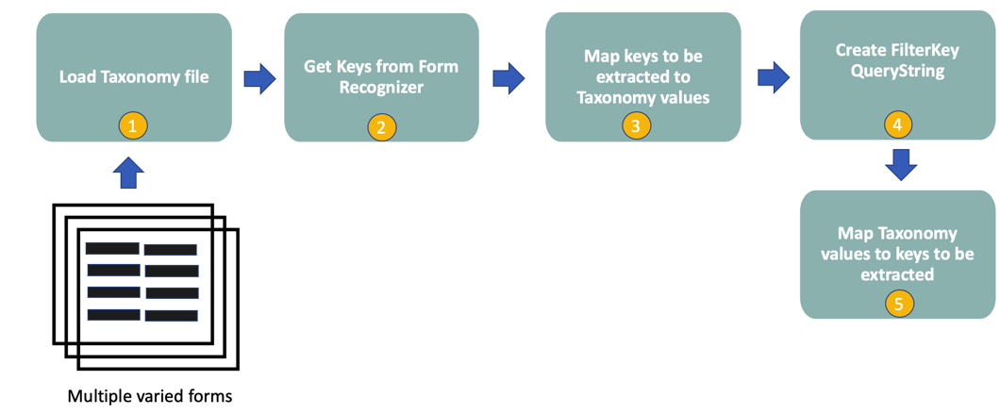

# Predicting forms with Unsupervised Form Recognizer

This section illustrates how to extract/infer/predict unseen forms with the Unsupervised version of Form Recognizer. At this stage, the relevant model associated with the form to extact has been identified and we are now ready to run our prediction.

In summary, these files will download files from a Storage Container that represent the Test set, i.e. files not
trained in the training process and perform a prediction on each one. The corresponding Ground Truth (GT) value will also
be retrieved. Formatting should be applied and both the extracted and formatted value, alongside the GT value will
be written to a json file.

## The logical flow of prediction_unsupervised.py

This script will:

* Iterate through every container if the name of the container contains ENV VAR ```CONTAINER_SUFFIX``` + ENV VAR
```TRAIN_TEST``` . If the ENV VAR ```RUN_FOR_SINGLE_ISSUER``` is set, only this vendor/issuer will be processed.
* Load the corresponding ground truth record (GT) for a form. The GT file is specified by the ENV VAR
```GROUND_TRUTH_PATH```
* Download the files to a local directory specified by the ENV VAR ```LOCAL_WORKING_DIR```. Note, the files will
be randomly sampled for evaluation and the number sampled is specified by the ENV VAR ```SAMPLE_NUMBER```
* Retrieve the values from the GT for the keys we want to extract/tag/label. The keys to be extracted are
specified by the ENV VAR ```KEY_FIELD_NAMES```
* Call Read Layout (OCR) for the invoice if no OCR file exists for the form. The endpoint for the OCR is
specified by the ENV VAR ```ANALYZE_END_POINT``` with the Cognitive Subscription endpoint specified by the ENV VAR
```SUBSCRIPTION_KEY```
* Invoke the prediction/evaluation of Form Recognizer, apply some basic formatting and write to a local directory
specified by the ENV VAR ```LOCAL_WORKING_DIR``` + '/unsupervised_predict_' + [issuername].json

Have a look at the accelerator [Predict Form Recognizer Unsupervised](prediction_unsupervised.py)

## Using a Taxonomy to filter keys

With the Unsupervised version of Form Recognizer, it can save on post-processing developer time by filtering only the keys that are needed for extraction, and by correlating the keys identified by Form Recognizer with the Taxonomy values.



## Logical Flow

* Step 1 - We load the Taxonomy file

* Step 2 - We get the keys from Form Recognizer
Have a look at the function [form_recognizer_get_keys](prediction_unsupervised.py#form_recognizer_get_keys)

* Step 3 - Map the keys we want to extract to the Taxonomy values from Step 2
Have a look at the function [build_unsupervised_filter_keys](prediction_unsupervised.py#build_unsupervised_filter_keys)

* Step 4 - Build the querystring for prediction
Have a look at the function [build_unsupervised_filter_keys](prediction_unsupervised.py#build_unsupervised_filter_keys)

* Step 5 - Map the Taxonomy values back to the key fields we want to extract
Have a look at the function [get_synonym_key_from_value](prediction_unsupervised.py#get_synonym_key_from_value)

Back to the [Extraction section](../README.md)
