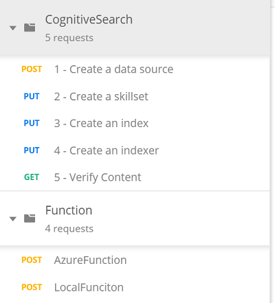

# Azure Cognitive Search

## Azure Cognitive Search Service

[Azure Cognitive Search](https://azure.microsoft.com/en-us/services/search/) is a fully managed search as a service to reduce
complexity and scale easily including:

* Auto-complete, geospatial search, filtering, and faceting capabilities for a rich user experience
* Built-in AI capabilities including OCR, key phrase extraction, and named entity recognition to unlock insights
* Flexible integration of custom models, classifiers, and rankers to fit your domain-specific needs

This repo has been cloned from [https://github.com/ikivanc/Azure-Cognitive-Search](https://github.com/ikivanc/Azure-Cognitive-Search) please refer there for latest versions.

* **This training is requiring [Learn AI Content](https://github.com/Azure/LearnAI-Cognitive-Search) content and modified with a new scenario for Custom List generation scenario, this part is added in this repo.**

Azure Search adds data extraction, natural language processing (NLP), and image processing skills to an Azure Search indexing pipeline, making previously unsearchable or unstructured content more searchable. Information created by Cognitive Search Skills, such as entity recognition or image analysis, gets added to an index in Azure Search.
This one day training will focus on hands-on activities that develop proficiency with Cognitive Search, an Azure Search AI-oriented capability announced at [Microsoft Build 2018](https://www.microsoft.com/en-us/build). These labs assume an introductory to intermediate knowledge of [Visual Studio](https://www.visualstudio.com/vs/community/), the [Azure Portal](https://portal.azure.com), [Azure Functions](https://azure.microsoft.com/en-us/services/functions/) and [Azure Search](https://azure.microsoft.com/en-us/services/search/). If you are not at that skill level, we have prerequisite materials below that you **need** to complete prior to beginning this training.

We will focus on hands-on activities to learn how to create a Cognitive Search solution for all types of business documents. The documents include pdfs, docs, ppts and images, as well as documents with multiple languages.

In below you will create a data flow that uses cognitive skills to enrich your business documents. These enrichments will become part of an Azure Search index.

## Prerequisites

Since this is an AI training on top of Microsoft Azure Services, before we start you need: complete trainings and preperation on:

* [Hands on WorkShop for Cognitive Search](https://github.com/Azure-Samples/azure-search-knowledge-mining)

## Custom Skill for a Custom List Generator in Azure Cognitive Search

Let's assume you have a custom list of products and terms and you would like to search if these items are exists in the documents. If yes, you would like to return these values in a custom list as output. In below steps you can learn how to add a custom list pipeline to above workshop:

1. Here is a ready prepared custom search pipeline in Postman in 5 steps. To define data source, creating skillset, creating an index, creating and indexer and verifying content. You can download export of cognitiveSearch from [CognitiveSearch Postman export](postmanrequests/CognitiveSearch.postman_collection.json)

1. Here are the steps for Custom Skills Pipeline in Postman

    

1. Also Azure Function calls are added for custom skill.


1. Azure Function for extracting Custom List is located under [customskillfunction folder](./customskillfunction)

    ```csharp
    // This is a hard list you can check in your documents
    List<string> techProducts = new List<string> { "Microsoft", "XBOX", "Windows", "Windows 10", "Windows 8", "Windows 8.1", "Office 365", "Dynamics 365", "Azure", "Cortana", "Microsoft Edge" };

    List<string> techTerms = new List<string> { "CRM", "More Personal Computing", "MPC", "AI", "Artificial Intelligence", "Machine Learning", "Deep Learning" };
    ```

    you can check full C# code from [FunctionExtract.cs](customskillfunction/FunctionExtract.cs)

    In postman request function body input will be like:

    ```json
    {
    "values": [
            {
                "recordId": "a1",
                "data":
                {
                    "text":  "This is a test call with some custom terms including Microsoft, Windows , Windows 10 , Azure,AI , More Personal computing"
                }
            }
    ]
    }
    ```

    and function output will be like:

    ```json
    {
        "values": [
            {
                "recordId": "a1",
                "data": {
                    "termList": [
                        "More Personal Computing",
                        "AI"
                    ],
                    "productList": [
                        "Microsoft",
                        "Windows",
                        "Windows 10",
                        "Azure"
                    ]
                },
                "errors": null,
                "warnings": null
            }
        ]
    }
    ```

1. After defining this pipeline and Azure Functions for Custom skills you can find final output in Azure Search index.


## JSON Pipeline

For more details about json body requests:

1 - Create a data source

```json
{
    "name" : "demodata",  
    "description" : "Demo files to demonstrate cognitive search capabilities.",  
    "type" : "azureblob",
    "credentials" :
    { "connectionString" :
      "DefaultEndpointsProtocol=YOUR_CONNECTION_STRING"
    },  
    "container" : { "name" : "customskill" }
}  
```

2 - Create a skillset

```json
{
  "description":
  "Extract entities, detect language and extract key-phrases",
  "skills":
  [
    {
      "@odata.type": "#Microsoft.Skills.Text.NamedEntityRecognitionSkill",
      "categories": [ "Organization" ],
      "defaultLanguageCode": "en",
      "inputs": [
        {
          "name": "text", "source": "/document/content"
        }
      ],
      "outputs": [
        {
          "name": "organizations", "targetName": "organizations"
        }
      ]
    },
    {
      "@odata.type": "#Microsoft.Skills.Text.LanguageDetectionSkill",
      "inputs": [
        {
          "name": "text", "source": "/document/content"
        }
      ],
      "outputs": [
        {
          "name": "languageCode",
          "targetName": "languageCode"
        }
      ]
    },
    {
      "@odata.type": "#Microsoft.Skills.Text.SplitSkill",
      "textSplitMode" : "pages",
      "maximumPageLength": 1000,
      "inputs": [
      {
        "name": "text",
        "source": "/document/content"
      },
      {
        "name": "languageCode",
        "source": "/document/languageCode"
      }
    ],
    "outputs": [
      {
            "name": "textItems",
            "targetName": "pages"
      }
    ]
  },
  {
      "@odata.type": "#Microsoft.Skills.Text.KeyPhraseExtractionSkill",
      "context": "/document/pages/*",
      "inputs": [
        {
          "name": "text", "source": "/document/pages/*"
        },
        {
          "name":"languageCode", "source": "/document/languageCode"
        }
      ],
      "outputs": [
        {
          "name": "keyPhrases",
          "targetName": "keyPhrases"
        }
      ]
    },
    {
        "@odata.type": "#Microsoft.Skills.Custom.WebApiSkill",
        "description": "Our new custom skill for custom list generator",
        "uri": "https://YOUR_FUNCTION_NAME.azurewebsites.net/api/CustomListExtract?code=YOUR_FUNCTION_CODE",
        "batchSize":1,
        "context": "/document",
        "inputs": [
          {
            "name": "text",
            "source": "/document/content"
          }
        ],
        "outputs": [
          {
            "name": "termList",
            "targetName": "termList"
          },
          {
            "name": "productList",
            "targetName": "productList"
          }
        ]
      }
  ]
}
```

3 - Create an index

```json
{

    "fields": [
        {
            "name": "id",
            "type": "Edm.String",
            "searchable": true,
            "filterable": false,
            "retrievable": true,
            "sortable": true,
            "facetable": false,
            "key": true,
            "indexAnalyzer": null,
            "searchAnalyzer": null,
            "analyzer": null,
            "synonymMaps": []
        },
        {
            "name": "content",
            "type": "Edm.String",
            "searchable": true,
            "filterable": false,
            "retrievable": true,
            "sortable": false,
            "facetable": false,
            "key": false,
            "indexAnalyzer": null,
            "searchAnalyzer": null,
            "analyzer": null,
            "synonymMaps": []
        },
        {
            "name": "languageCode",
            "type": "Edm.String",
            "searchable": true,
            "filterable": false,
            "retrievable": true,
            "sortable": true,
            "facetable": false,
            "key": false,
            "indexAnalyzer": null,
            "searchAnalyzer": null,
            "analyzer": null,
            "synonymMaps": []
        },
        {
            "name": "keyPhrases",
            "type": "Collection(Edm.String)",
            "searchable": true,
            "filterable": false,
            "retrievable": true,
            "sortable": false,
            "facetable": false,
            "key": false,
            "indexAnalyzer": null,
            "searchAnalyzer": null,
            "analyzer": null,
            "synonymMaps": []
        },
        {
            "name": "organizations",
            "type": "Collection(Edm.String)",
            "searchable": true,
            "filterable": false,
            "retrievable": true,
            "sortable": false,
            "facetable": false,
            "key": false,
            "indexAnalyzer": null,
            "searchAnalyzer": null,
            "analyzer": null,
            "synonymMaps": []
        },
        {
            "name": "termList",
            "type": "Collection(Edm.String)",
            "searchable": true,
            "filterable": false,
            "retrievable": true,
            "sortable": false,
            "facetable": false,
            "key": false,
            "indexAnalyzer": null,
            "searchAnalyzer": null,
            "analyzer": null,
            "synonymMaps": []
        },
        {
            "name": "productList",
            "type": "Collection(Edm.String)",
            "searchable": true,
            "filterable": false,
            "retrievable": true,
            "sortable": false,
            "facetable": false,
            "key": false,
            "indexAnalyzer": null,
            "searchAnalyzer": null,
            "analyzer": null,
            "synonymMaps": []
        }
    ],
    "scoringProfiles": [],
    "defaultScoringProfile": null,
    "corsOptions": null,
    "suggesters": [],
    "analyzers": [],
    "tokenizers": [],
    "tokenFilters": [],
    "charFilters": []
}
```

4 - Create an indexer

```json
{
  "name":"customlistindexer", 
  "dataSourceName" : "demodata",
  "targetIndexName" : "customlistindex",
  "skillsetName" : "customlistskillset",
  "fieldMappings" : [
        {
          "sourceFieldName" : "metadata_storage_path",
          "targetFieldName" : "id",
          "mappingFunction" :
            { "name" : "base64Encode" }
        },
        {
          "sourceFieldName" : "content",
          "targetFieldName" : "content"
        }
   ],
  "outputFieldMappings" :
  [
        {
          "sourceFieldName" : "/document/organizations",
          "targetFieldName" : "organizations"
        },
        {
          "sourceFieldName" : "/document/pages/*/keyPhrases/*",
          "targetFieldName" : "keyPhrases"
        },
        {
            "sourceFieldName": "/document/languageCode",
            "targetFieldName": "languageCode"
        },
        {
            "sourceFieldName": "/document/termList",
            "targetFieldName": "termList"
        },
        {
            "sourceFieldName": "/document/productList",
            "targetFieldName": "productList"
        }
  ],
  "parameters":
  {
   "maxFailedItems":-1,
   "maxFailedItemsPerBatch":-1,
   "configuration":
    {
     "dataToExtract": "contentAndMetadata",
      "imageAction": "generateNormalizedImages"
  }
  }
}
```

Thanks!

Back to the [Pipelines section](../README.md)
