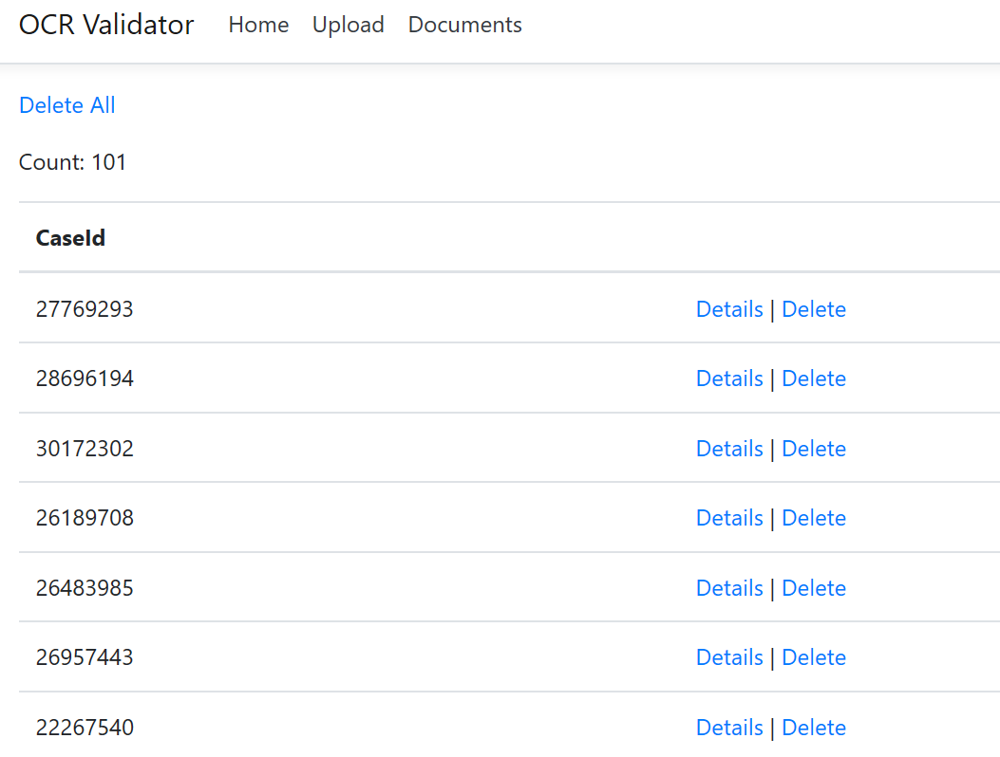

# OCR Validator

## Introduction 

This project aims to validate OCR quality on Azure Search using its built-in OCR skills. It primary creates a *visual debugging tool* to help users identify OCR errors and possible improvements.

The solution consists of 4 projects:

* `OCR.Common`: A common C# .NET Standard Library shared between projects.
* `OCR.Generator`: A Python script that manipulates PDFs, extracting their first page and generating images from them.
* `OCR.Ingestor`: A C# .NET Core console app to perform batch ingestion on an storage account, setting metadata according to a common schema.
* `OCR.Validator.Web`: A C# ASP.NET Core portal that displays OCR results/quality.

## Getting Started

### Infrastructure Deployment

Use the project `infrastructure-terraform` to deploy a basic Cognitive Search infrastructure on Azure. Please follow the instructions on its [README.md](../infrastructure-terraform/README.md)

### Secrets

After deploying all necessary infrastructure, still on `infrastructure-terraform` project, run:

```shell
./generate-secret.sh
```

This will output a JSON structured like this:

```json
{
  "Azure": {
    "Search": {
      "ServiceName": "casessearch13158d90",
      "IndexName": "cases-index",
      "IndexerName": "cases-blob-indexer",
      "AdminApiKey": "787...BD3"
    },
    "Storage": {
      "Blob": {
        "ConnectionString": "DefaultEndpointsProtocol=https;AccountName=casesfiles13158d90;AccountKey=MydmRF...P4A==;EndpointSuffix=core.windows.net",
        "ContainerName": "pdf"
      }
    }
  }
}
```

Then use this outputted JSON and store them in the `OCR.Validator.Web` as [User Secrets in Visual Studio](https://docs.microsoft.com/en-us/aspnet/core/security/app-secrets?view=aspnetcore-2.2&tabs=windows#json-structure-flattening-in-visual-studio).

### Build and Run

Hit F5 on Visual Studio and start `OCR.Validator.Web`.

## Web Portal

The Index page displays information about the environment:


The Upload page allows you to submit an expected PDF, `Expected PDF File` field, and an actual image, `Actual Image File` field. The expected PDF should contain the original text version of the actual image that you intend to test as target for the OCR service. This will upload both files to the blob storage account and then trigger the indexing at Azure Search.


If you click on Documents page, you can see all cases already indexed on Azure Search. You can also delete individual cases or delete everything on both blob and index.



When selecting details from a specific case, you should see the content extracted from the PDF you entered into the `Expected PDF File` field and also the OCR result from the image you entered into the `Actual Image File` field in the Upload page. Then a [Diff algorithm](https://github.com/google/diff-match-patch) is applied, highlighting where the OCR process has possibly failed.


On the enhanced tab above, you can see how applying a set of normalizations can reduce the number of diffs. A text normalizer is defined as:

```csharp
public interface ITextNormalizer
{
    string Normalize(string input);
}
```

The text normalizers applied are:

* [PortugueseCharNormalizer](./OCR/OCR.Common/Normalizers/Text/PortugueseCharNormalizer.cs): replaces Portuguese accents for regular letters.
* [SpecialCharNormalizer](./OCR/OCR.Common/Normalizers/Text/SpecialCharNormalizer.cs): replaces breaklines and other special chars.
* [TagsNormalizer](./OCR/OCR.Common/Normalizers/Text/TagsNormalizer.cs): removes tags introduced by the OCR process.
* [OrdinalNumberNormalizer](./OCR/OCR.Common/Normalizers/Text/OrdinalNumberNormalizer.cs): tries to identify when `No` should be recognized as `N°`.

Also, the normalization process tries to identify similar strings that were correctly parsed with OCR, but were placed in a different location than the original text. To recognize that, the [`StringDistanceNormalizer.cs`](./OCR/OCR.Common/Normalizers/Diff/StringDistanceNormalizer.cs) leverages [Levenshtein String Distance](https://en.wikipedia.org/wiki/Levenshtein_distance) and tries to identify these strings.