# Python Durable Functions Early Preview 🐍🌩

Follow this guide to get up and running with Python Durable Functions!

> **Note:** (2020-06-09) Because updated versions of the Azure Functions Python worker, extension bundles, and templates that are needed for the preview have not yet been published or deployed to Azure, you need to use a dev container with Visual Studio Code Remote for Containers or Visual Studio Online.
>
> You'll be able to deploy to the Linux Consumption plan in June. For now, you need to deploy to Premium or App Service plan in a container that contains the latest unreleased runtime.

## Prerequisites

* Azure subscription - Durable Functions requires a storage account. The easiest way to get started is by connecting to a storage account in Azure.
* An editor that supports Visual Studio dev containers
    - Visual Studio Code
        - Docker - the local machine must be able to run Linux Docker containers
        - [Remote Development extension pack](https://marketplace.visualstudio.com/items?itemName=ms-vscode-remote.vscode-remote-extensionpack) - starts and connects to the dev container
    - Visual Studio Online
        - VS Online provides a development environment in the cloud that you can connect to using VS Code or VS Online's full-featured, browser-based code editor. 

## Instructions

### Start the development environment

Choose one of the following options and follow the instructions to create a development environment.

#### Option 1 - Visual Studio Code with Remote Development extension and Docker

1. Clone this repo to your computer.

1. Open the repo's folder in VS Code.

1. Using the Command Palette (press `F1` or `Ctrl-Shift-P` or `Cmd-Shift-P` (macOS)), search for and run the *Reopen in Container* command. VS Code will reopen, start the development environment in Docker, and connect to it.

#### Option 2 - Visual Studio Online

1. In a new browser window, open this magical link: [Open in Visual Studio Online](https://online.visualstudio.com/environments/new?name=Python+Durable+Functions+Preview&repo=https://github.com/anthonychu/python-durable-preview)

1. If prompted, sign in.

1. A Create Environment dialog appears. Confirm the information and click *Create*. Wait a few minutes to create the environment.

1. Click *Connect* to open the VS Online in-browser code editor.
    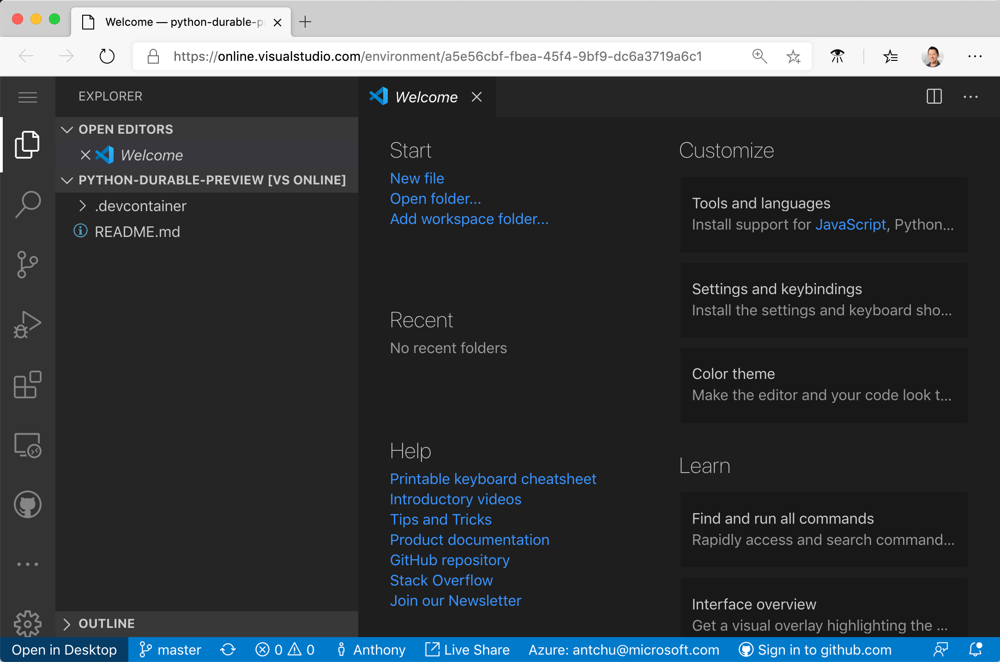

> *Note:* If you'd like to connect to this VS Online environment with VS Code on your computer instead of the in-browser editor, ensure that you have installed and signed in to the [VS Online extension](https://marketplace.visualstudio.com/items?itemName=ms-vsonline.vsonline), then click the *Open in Desktop* button on the bottom left of the browser.

### Create the Azure Functions project

The preconfigured development environment includes the Azure Functions Core Tools CLI (`func`) with the preview Python lanugage worker, useful VS Code extensions, as well as templates to help you get started.

1. In the editor, you should have the default workspace folder opened.

1. Press `F1` or `Ctrl-Shift-P` or `Cmd-Shift-P` (macOS) to open the Command Palette.

1. Search for and run the *Azure Functions: Create New Project...* command.
    > If you are using VS Online, the extensions may not load immediately the first time. If you don't see any Azure Functions commands, try reloading your browser.

    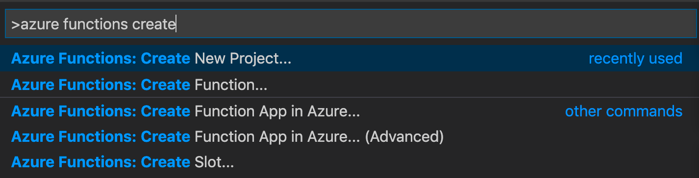

1. Select the following responses when prompted:

    | Prompt | Value | Description |
    | --- | --- | --- |
    | Specify a folder | Current open workspace folder | |
    | Select a language | Python | |
    | Python version | Python 3.7 | Azure Functions supports Python 3.6 - 3.8 |
    | Select a template | Skip for now | |

### Activate virtual environment and install dependencies

When you created the project, the Azure Functions VS Code extension automatically created a virtual environment with your selected Python version. You will activate the virtual environment in a terminal and install some dependencies required by Azure Functions and Durable Functions.

1. Open `requirements.txt` in the editor change its content to the following:

    ```
    azure-functions
    azure-functions-durable>=1.0.0b5
    ```

    Durable Functions requires `azure-functions` version 1.2.0 or greater.

1. Open the editor's integrated terminal in the current folder (`` Ctrl-Shift-` ``).

1. In the integrated terminal, activate the virtual environment in the current folder:

    ```bash
    source .venv/bin/activate
    ```

    

1. In the integrated terminal where the virtual environment is activated, use pip to install the packages we just defined:

    ```bash
    python -m pip install -r requirements.txt
    ```

Use this integrated terminal with the activated virtual environment for the rest of this tutorial.

### Create the functions

The most basic Durable Functions app contains three functions:
- *Orchestrator function* - describes a workflow that orchestrates other functions
- *Activity function* - called by the orchestrator function, performs work, and optionally returns a value
- *Client function* - a regular Azure Function that starts an orchestrator function

> *Note:* If you prefer the command line, you can also perform the steps below using Azure Functions Core Tool's `func new` command.

#### Orchestrator function

1. In the VS Code Command Palette (`F1` or `Ctrl/Cmd-Shift-P`), search for and run the *Azure Functions: Create Function...* command.

1. Following the prompts, provide the following values:
    | Prompt | Value | Description |
    | ------ | ----- | ----------- |
    | Select a template for your function | Durable Functions orchestrator | Create a Durable Functions orchestration |
    | Provide a function name | HelloOrchestrator | Name of your durable function |

> You may be prompted to install a linter and/or enable IntelliCode. Neither of these are required for this tutorial, but you may click *Install* and *Enable it and Reload Window*, respectively, if you wish.

This creates a function in a folder named *HelloOrchestrator*. In the folder, you'll find a `function.json` file that contains metadata describing the function.

You'll also find the function in `__init__.py`. An orchestrator is a Python generator function that describes how activity functions are called.

#### Activity function

1. In the Command Palette, search for and run the *Azure Functions: Create Function...* command.

1. Following the prompts, provide the following values:
    | Prompt | Value | Description |
    | ------ | ----- | ----------- |
    | Select a template for your function | Durable Functions activity | Create an activity function |
    | Provide a function name | Hello | Name of your activity function |

This creates a function in a folder named *Hello*. In the folder, you'll find a function that simply returns a greeting. An activity function is a normal Azure Function; it is where you'll do actual work such as accessing databases and perform calculations.

#### HTTP triggered client function

1. Again, in the Command Palette, search for and run the *Azure Functions: Create Function...* command.

1. Following the prompts, provide the following values:    | Prompt | Value | Description |
    | Prompt | Value | Description |
    | ------ | ----- | ----------- |
    | Select a template for your function | Durable Functions HTTP starter | Create an HTTP starter function |
    | Provide a function name | DurableFunctionsHttpStart | Name of your activity function |
    | Authorization level | Anonymous | For demo purposes, allow the function to be called without authentication |

This creates a function in a folder named *DurableFunctionsHttpStart*. In the folder, you'll find a typical HTTP triggered Azure Function that also takes an orchestration client input binding. The function uses the orchestration client to start an orchestration and return an HTTP response containing URLs the caller can use to check the orchestration's status.

### Run the app

1. Press `F5` or select *Debug: Start Debugging* from the Command Palette. The function app will start and the debugger will attach.

1. Because no storage account was set in `local.settings.json`, the Azure Functions VS Code extension should prompt you to select a storage account. Sign in to Azure and create a new storage account. You may also select an existing storage account that you have *not* used with Durable Functions.
    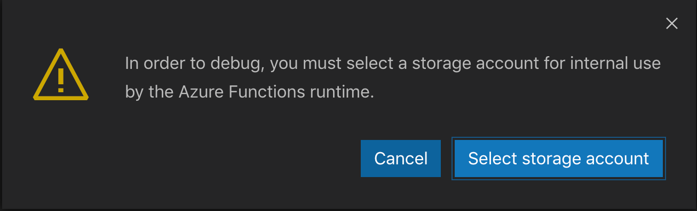

1. Once the app is started, click on the *Remote Explorer* icon in the VS Code activity bar.

1. Under *Environment Details*, port *7071* should already be listed as forwarded. Right-click on it and select *Copy Port URL*.
    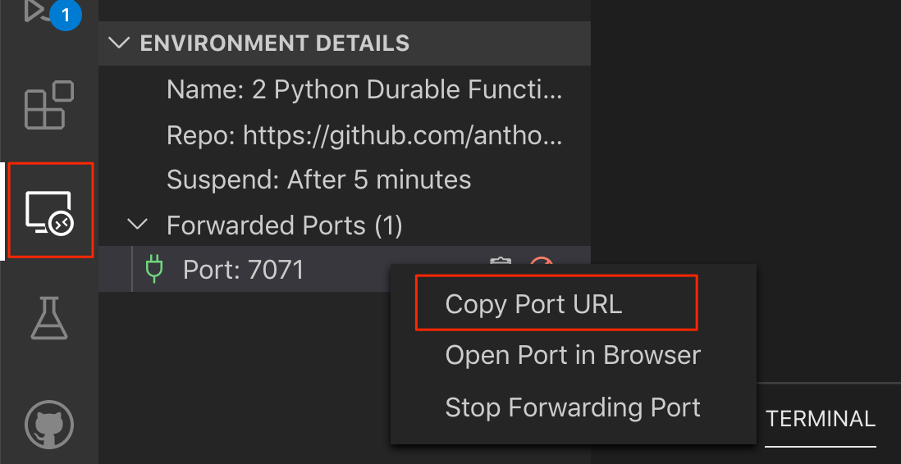

    > *Note:* If you're doing this in the browser version of VS Online and the copy function is not working, refresh the browser and try again.

1. Open another browser window and paste in the copied port URL. A default Function App page should display.
    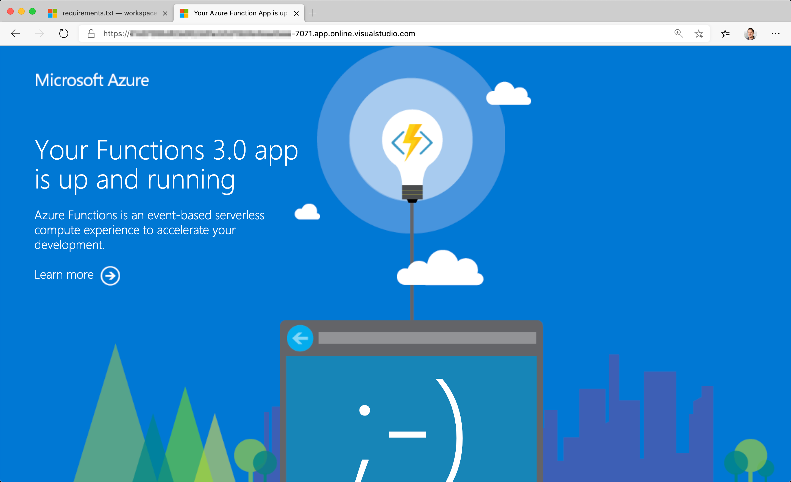

1. In the location bar, append `/api/orchestrators/HelloOrchestrator` to the URL and press Enter to trigger the *DurableFunctionsHttpStart* function that then starts an instance of *HelloOrchestrator*.
    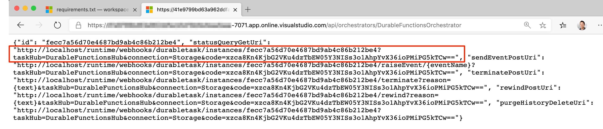

1. The HTTP function should return a set of URLs. Open the `statusQueryGetUri` in a browser window to view the orchestrator function's status.
    > In VS Online, localhost URLs may be returned. Replace `http://localhost` with the VS Online port URL.
    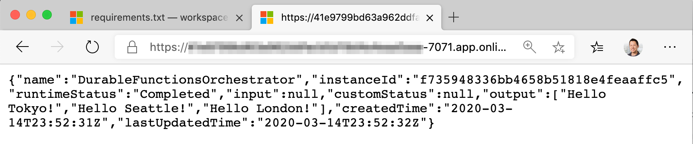

1. Stop debugging by clicking the red *Disconnect* button or press `Shift-F5`.

Congratulations! You've built and ran your first Python Durable Functions app! 🎉

## Deploy to Azure

Some components needed to run Python Durable Functions are not yet available on the Linux Consumption plan in Azure. For now, you'll package the app in a Docker container and deploy it to Azure Function's Elastic Premium plan.

### Build the container

This repository includes a [Dockerfile](./Dockerfile). You'll use it to build a container image for your app and push it to a registry such as Docker Hub or Azure Container Registry.

1. In the VS Code terminal, ensure you're in the root directory of your application (the one containing *host.json* and the *Dockerfile*).

1. Build the container image:
    ```bash
    docker build -t <your-registry-hostname>/my-python-durable-app .
    ```
    > Replace `<your-registry-hostname>` with your registry hostname. For example, a Docker Hub image name might look like: `anthonychu/my-python-durable-app`, and for Azure Container Registry, it might look like: `anthonychu.azurecr.io/my-python-durable-app`.

1. Once the image has been built, log in to the registry that you will push it to.
    - Docker Hub:
        ```bash
        docker login
        ```
    - Azure Container Registry:
        ```bash
        az login
        az acr login -n <registry-name>
        ```

1. Push the image.
    ```bash
    docker push <your-registry-hostname>/my-python-durable-app
    ```

### Create an Azure Functions app (Premium plan)

1. In the Azure portal, select *Create a resource*.

1. Select *Function App*.

1. Enter these values:
    | Field | Value |
    | --- | --- |
    | Resource Group | Create a new resource group |
    | Function App Name | Choose a unique name for your app |
    | Publish | Docker Container |
    | Region | Select a region close to you |

    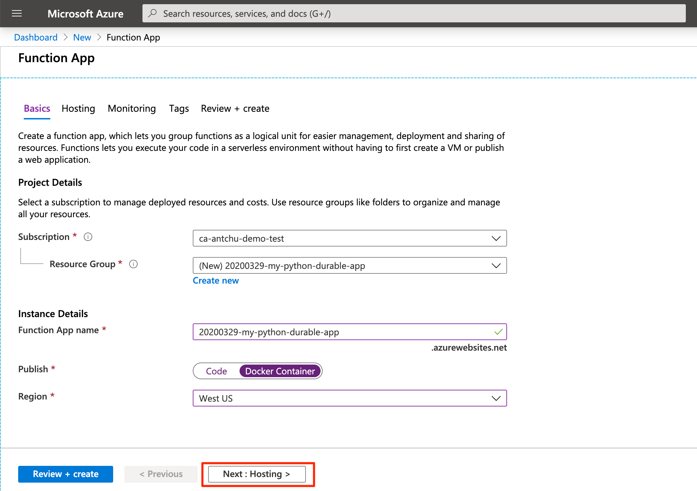

1. Select *Next: Hosting*.

1. In the hosting options, ensure these values are set:
    | Field | Value |
    | --- | --- |
    | Operating System | Linux |
    | Plan Type | Premium |
    | Linux Plan | A new plan name |
    | SKU and Plan Size | Elastic Premium EP1 |

    

1. Select *Review and Create*.

1. Select *Create*.

1. Once the resources have been created, select *Go to resource* to open the function app.

### Configure Managed Identity and permissions (Azure Container Registry only)

If you pushed your image to Azure Container Registry, you have to enable Managed Identity in your function app and give that identity permissions to pull images from the registry.

1. In the function app, open the Identity settings.

1. In the System Assigned tab, change *Status* to **On**.
    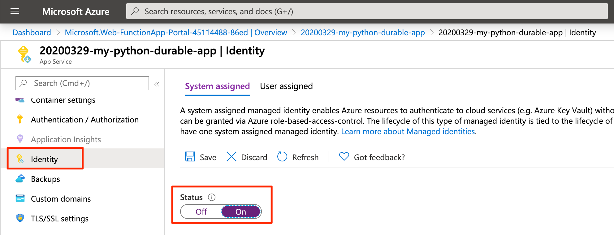

1. Select *Save*.

1. In the Azure portal, open the container registry that you pushed the image to.

1. Open the registry's *Access Control (IAM)* page.

1. Add a role assignment.
    1. Select *Add* under *Add a role assignment*.
    1. Select a role of *AcrPull*.
    1. Search for the name of the function app you just created.
    1. Select the function app.
    1. Select *Save*.

    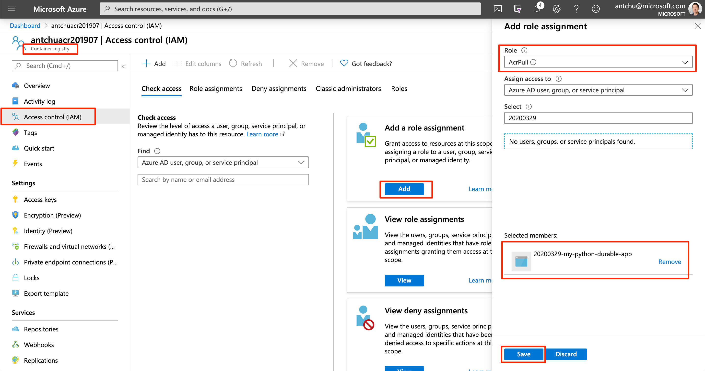

Now your function app has the correct permissions to pull images from the registry.

Open the function app again in the Azure portal.

### Configure the container image

1. Open the function app's *Container Settings* page.

1. Select the container image:
    - Docker Hub - Enter the name of the image. For example: `anthonychu/my-python-durable-app`.
    - Azure Container Registry - Select the registry, image, and tag.

    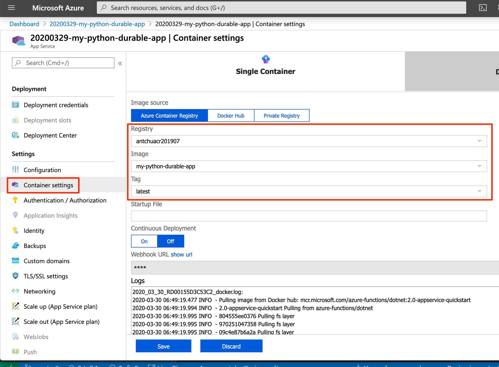

1. Select *Save*. 

1. Open the *Functions* page to see the functions in the app. You should see the functions. It can take a couple of minutes to pull the image and start the container. Click refresh until functions appear.
    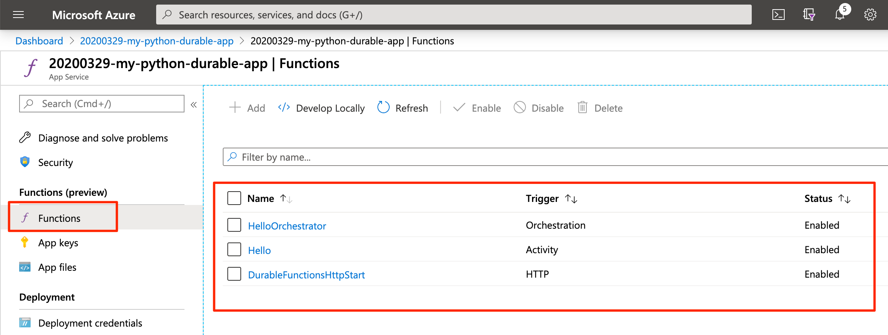

### Start an orchestration

1. In the *Functions* page, select the *DurableFunctionsHttpStart* function.

1. Click *Get Function Url* and copy the link.

1. Paste the URL into a new browser window, changing the `{functionName}` route segment to `HelloOrchestrator`. The URL should look something like `https://<appname>.azurewebsites.net/api/orchestrators/HelloOrchestrator`.

The orchestrator should start and the management and status URLs should appear.

## Next steps

* [Check out Durable Functions docs](https://docs.microsoft.com/en-us/azure/azure-functions/durable/durable-functions-overview?tabs=python) (Python code samples coming soon)
* Send us feedback at our GitHub repo (coming really soon)
