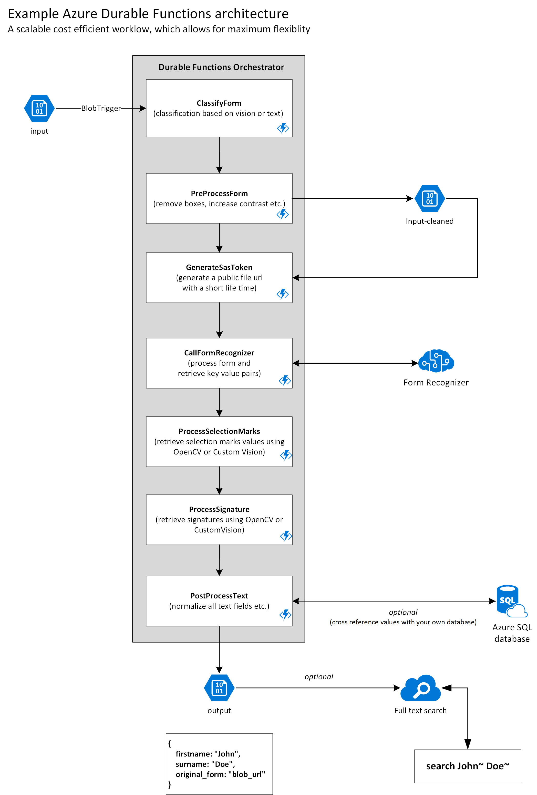

# Azure Durable Functions Pipeline - Form Recognizer

> Python support for Durable Functions is currently in public preview.

This example pipeline utilises the function chaining functionality from Durable Functions. In the function chaining pattern, a sequence of functions executes in a specific order. In this pattern, the output of one function is applied to the input of another function.


## Features

This example has the following functionality built-in, but could easily be extended by adding your own Activity functions.

- Triggered by new files on a blob storage
- Remove character boxes using OpenCV
- Call Form Recognizer service via a temporary SAS token
- Post processing to clean output

## Prerequisites

- Durable Functions require an Azure storage account. You need an Azure subscription.
- Form Recognizer instance and a model trained

## How to develop and test locally

The easiest way of development is to use [Dev Containers in Visual Studio Code](https://code.visualstudio.com/docs/remote/containers#_quick-start-open-an-existing-folder-in-a-container). This will guarantee that you have the latest Azure Function core tools and related dependencies. When you open the project the first time, it will ask you to create a virtual environment for Python.

You can also run the Azure Function on your local system, following this [quickstart](https://docs.microsoft.com/en-us/azure/azure-functions/durable/quickstart-python-vscode).

- Create a blob storage with 3 containers, name them `input`, `input-cleaned` and `output`.
- Create a Form Recognizer instance and [train a model](https://docs.microsoft.com/en-us/azure/cognitive-services/form-recognizer/quickstarts/label-tool)

Create a new file in the root, named `local.settings.json`.

```json
{
  "IsEncrypted": false,
  "Values": {
    "AzureWebJobsStorage": "Connection string from your Blob Storage",
    "FUNCTIONS_WORKER_RUNTIME": "python",
    "StorageAccount": "Connection string from your Blob Storage with the input / input-cleaned / output container",
    "FormRecognizer_Endpoint": "https://xxxxxx.cognitiveservices.azure.com",
    "FormRecognizer_SubscriptionKey": "",
    "FormRecognizer_ModelId": ""
  }
}

Run your project by selecting Run -> Start Debugging in VSCode.
```

## How to deploy

The easiest is to use Visual Studio Code to publish your project to Azure, following this [quickstart](https://docs.microsoft.com/en-us/azure/azure-functions/durable/quickstart-python-vscode#sign-in-to-azure). Make sure you add the values from your `local.settings.json` as environment variables to your Azure Function app.

## Architecture

[](../media/durable_functions_architecture.png)
