# Form Recognizer with Logic Apps

## Logic Apps introduction

Connect your business-critical apps and services with Azure Logic Apps, automating your workflows without writing a single line of code.

* Create business processes and workflows visually
* Integrate with SaaS and enterprise applications
* Unlock value from on-premises and cloud applications
* Automate EAI, B2B/EDI, and business processes
* Take advantage of the Microsoft Cloud to enhance your integration solutions

Please refer to [Logic Apps](https://docs.microsoft.com/en-us/azure/logic-apps/) for more info.

## Using Form Recognizer with Logic apps

Use Form Recognizer with Azure Logics Apps to orchestrate a flow for classifying, predicting and training

In this tutorial involves building a logic app which interfaces with the  various harnesses (APIs) being built by the code team to undertake the flow details in this [Visio diagram](https://microsoft-my.sharepoint.com/:u:/g/personal/shanepec_microsoft_com1/EWSBoh0nCT5Li_tyj1Sct-oBjVPq4JpNRAiYsRdIW8iLdw?e=obXn3R )  

Prerequisites

* Azure subscription  \- [Create one for free](https://azure.microsoft.com/free/).

* Request access for Form Recognizer

  * Form Recognizer is available in a limited-access preview. To get access to the preview, fill out and submit the [Form Recognizer access request](https://aka.ms/FormRecognizerRequestAccess) form. Once your request is approved by the Azure Cognitive Services  team, you'll receive an email with instructions for accessing the  service

* Understand the invoice to be analyzed

  * The sample data set that we use to train the model and test the model is available as a .zip file from [GitHub](https://go.microsoft.com/fwlink/?linkid=2090451). Download and extract the .zip file and open an invoice PDF file under the **/Train** folder. Notice how it has a table with the invoice number, invoice date, etc.

    

* Create an Azure Storage blob container

  * You use this container to upload sample data that is required to train the model.

  * Follow the instructions in [Create an Azure Storage account](https://docs.microsoft.com/en-us/azure/storage/common/storage-quickstart-create-account) to create a storage account. Use **formrecostorage** as the storage account name.

  * Follow the instructions in [Create an Azure blob container](https://docs.microsoft.com/en-us/azure/storage/blobs/storage-quickstart-blobs-portal) to create a container within the Azure Storage account. Use **formrecocontainer** as the container name. Make sure you set the public access level to **Container (anonymous read access for containers and blobs)**.

       

* Upload sample data to the Azure blob container

  * Download the sample data available at [GitHub](https://go.microsoft.com/fwlink/?linkid=2090451). Extract the data to a local folder and upload the contents of the **/Train** folder to the **formrecocontainer** that you created earlier. Follow the instructions at [Upload a block blob](https://docs.microsoft.com/en-us/azure/storage/blobs/storage-quickstart-blobs-portal#upload-a-block-blob) to upload data to a container.

    Copy the URL of the container. You will need this later in this  tutorial. If you created the storage account and the container with the  same names as listed in this tutorial, the URL will be *<https://formrecostorage.blob.core.windows.net/formrecocontainer/>*.

* Create a Form Recognizer resource

  * When you're granted access to use Form Recognizer, you'll receive a  Welcome email with several links and resources. Use the "Azure portal"  link in that message to open the Azure portal and create a Form  Recognizer resource. In the **Create** pane, provide the following information:

    | Property       | Description                                                  |
    | -------------- | ------------------------------------------------------------ |
    | Name           | A descriptive name for your resource. We recommend using a descriptive name, for example *MyNameFormRecognizer*. |
    | Subscription   | Select the Azure subscription which has been granted access. |
    | Location       | The location of your cognitive service instance. Different locations may introduce latency, but have no impact on the runtime availability of  your resource. |
    | Pricing Tier   | The cost of your resource depends on the pricing tier you choose and your usage. For more information, see the API [pricing details](https://azure.microsoft.com/pricing/details/cognitive-services/). |
    | Resource group | The [Azure resource group](https://docs.microsoft.com/azure/cloud-adoption-framework/govern/resource-consistency/resource-access-management#what-is-an-azure-resource-group) that will contain your resource. You can create a new group or add it to a pre-existing group. |

* Create a logic app

  * Follow these steps to set up your workflow.

    * From the main Azure menu, select **Create a resource** > **Integration** > **Logic App**.

    * Under **Create logic app**, provide details about your logic app as shown here. After you're done, select **Create**.

      | Property       | Value                     | Description                                                  |
      | -------------- | ------------------------- | ------------------------------------------------------------ |
      | Name           | logic app name            | our logic app name, which can contain only letters, numbers, hyphens (`-`), underscores (`_`), parentheses (`(`, `)`), and periods (`.`). This example uses "My-First-Logic-App". |
      | Subscription   | Azure subscription name   | Your Azure subscription name                                 |
      | Resource group | Azure resource group name | The name for the [Azure resource group](https://docs.microsoft.com/en-us/azure/azure-resource-manager/resource-group-overview) used to organize related resources. This example uses "My-First-LA-RG". |
      | Location       | Azure region              | The region where to store your logic app information. This example uses "West US". |
      | Log Analytics  | Off                       | Keep the **Off** setting for diagnostic loggin               |

    * After Azure deploys your app, on the Azure toolbar, select **Notifications** > **Go to resource** for your deployed logic app. Or, you can find and select your logic app by typing the name in the search box.

      The Logic Apps Designer opens and shows a page with an introduction video and commonly used triggers. Under **Templates**, select **Blank Logic App**.

       

    * Configure the logic app to trigger the workflow when training files are added or modified in Azure Storage

      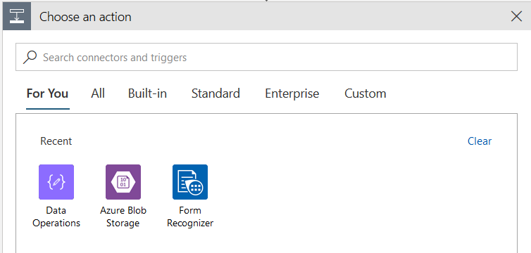

      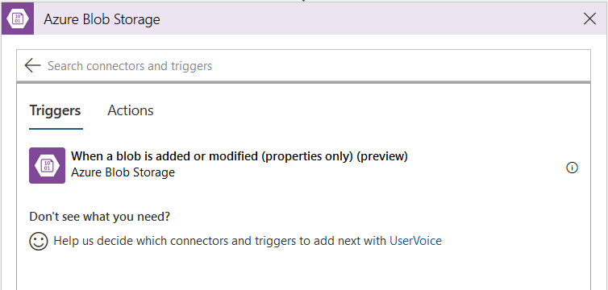

      Identify the container for training files, e.g., **/train**

      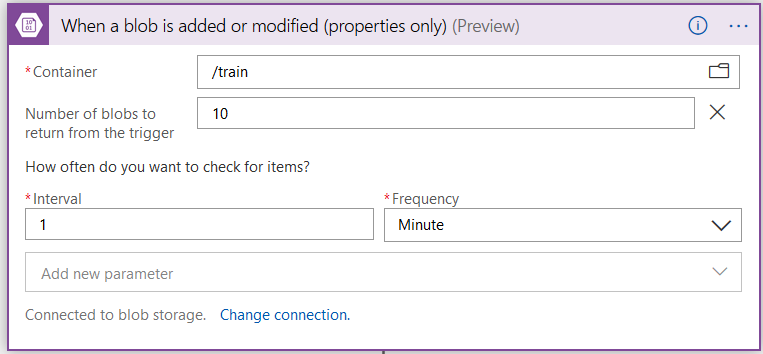

    * Configure the logic app to use Form Recognizer Train Model operation
  
      Before you can use the Form Recognizer service to analyze invoices, you  need to train a model by providing it some sample invoices data that the model can analyze and learn from.
  
       
  
       
  
    * Save the model to push in Azure Blob Storage, this step is to reuse the model for form analysis  testing
  
      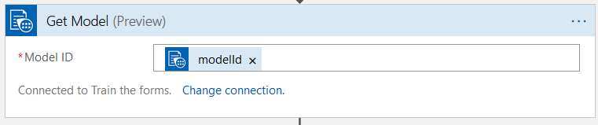
  
    * Push the trained model into Azure Blob Storage, choose Data Operations > Compose and save into Azure blob using Create blob action from Azure Blob Storage
  
      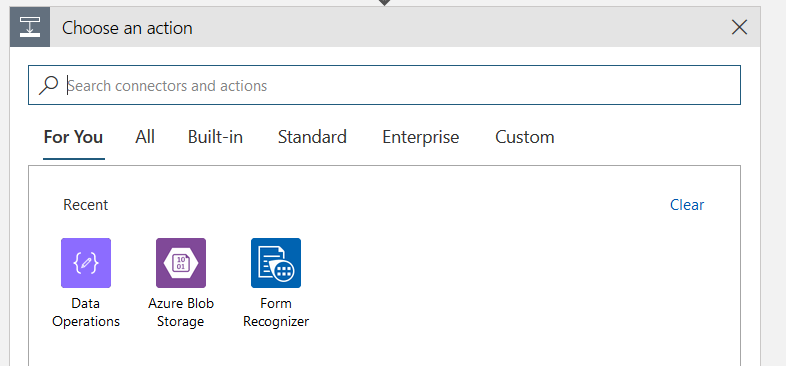
      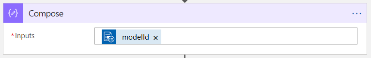
      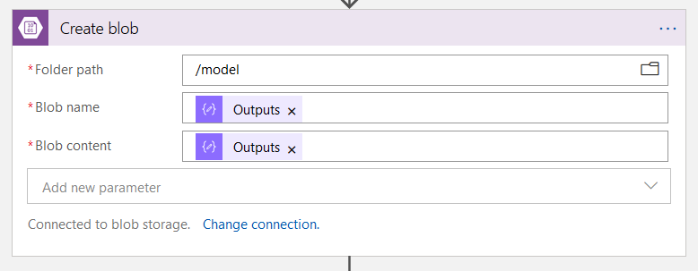

    * Prepare the testing data set, in this example we pulled from **/test** container from Azure blob storage using Get blob content action
  
      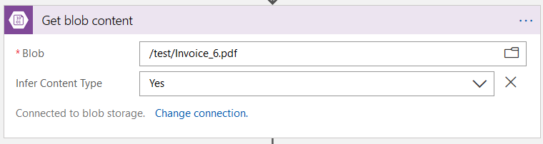
    * Test analysis result using **Analyze Form** action from Form recognizer, refer **modelId** and **File Content** from previous steps as well as put **application/pdf** at Content type
  
       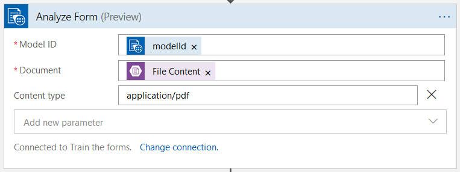
    * After testing on analysis, you can manipulate the JSON format from analysis result using **Data Operation** > **Parse JSON** action > put **Analyze API call result** in Content
  
       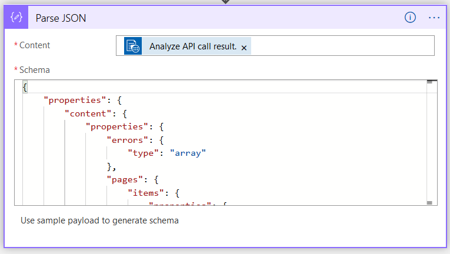
  
       and generate the JSON schema at **Use Sample payload to generate schema** by pasting sample analysis results
  
       ```json
       {
         "status": "success",
         "pages": [
           {
             "number": 1,
             "height": 792,
             "width": 612,
             "clusterId": 0,
             "keyValuePairs": [
               {
                 "key": [
                   {
                     "text": "Address:",
                     "boundingBox": [
                       57.3,
                       683,
                       100.5,
                       683,
                       100.5,
                       673.7,
                       57.3,
                       673.7
                     ]
                   }
                 ],
                 "value": [
                   {
                     "text": "14564 Main St.",
                     "boundingBox": [
                       57.3,
                       672.3,
                       124.3,
                       672.3,
                       124.3,
                       658.7,
                       57.3,
                       658.7
                     ],
                     "confidence": 0.86
                   },
                   {
                     "text": "Saratoga, CA 94588",
                     "boundingBox": [
                       57.3,
                       657.7,
                       147.3,
                       657.7,
                       147.3,
                       645,
                       57.3,
                       645
                     ],
                     "confidence": 0.86
                   }
                 ]
               },
               {
                 "key": [
                   {
                     "text": "Invoice For:",
                     "boundingBox": [
                       316.1,
                       683.1,
                       368.2,
                       683.1,
                       368.2,
                       673.7,
                       316.1,
                       673.7
                     ]
                   }
                 ],
                 "value": [
                   {
                     "text": "First Up Consultants",
                     "boundingBox": [
                       374,
                       687.9,
                       472,
                       687.9,
                       472,
                       673.7,
                       374,
                       673.7
                     ],
                     "confidence": 1
                   },
                   {
                     "text": "1234 King St",
                     "boundingBox": [
                       373.9,
                       673,
                       433.7,
                       673,
                       433.7,
                       658.7,
                       373.9,
                       658.7
                     ],
                     "confidence": 1
                   },
                   {
                     "text": "Redmond, WA 97624",
                     "boundingBox": [
                       373.8,
                       659.2,
                       472.3,
                       659.2,
                       472.3,
                       645,
                       373.8,
                       645
                     ],
                     "confidence": 1
                   }
                 ]
               },
               {
                 "key": [
                   {
                     "text": "Page",
                     "boundingBox": [
                       448.6,
                       96.1,
                       471.9,
                       96.1,
                       471.9,
                       86.7,
                       448.6,
                       86.7
                     ]
                   }
                 ],
                 "value": [
                   {
                     "text": "1 of",
                     "boundingBox": [
                       491.9,
                       96.1,
                       508.4,
                       96.1,
                       508.4,
                       86.7,
                       491.9,
                       86.7
                     ],
                     "confidence": 0.86
                   }
                 ]
               },
               {
                 "key": [
                   {
                     "text": "__Tokens__",
                     "boundingBox": [
                       0,
                       0,
                       0,
                       0,
                       0,
                       0,
                       0,
                       0
                     ]
                   }
                 ],
                 "value": [
                   {
                     "text": "Contoso Suites",
                     "boundingBox": [
                       38,
                       716.2,
                       188,
                       716.2,
                       188,
                       686.4,
                       38,
                       686.4
                     ],
                     "confidence": 0.86
                   },
                   {
                     "text": "1",
                     "boundingBox": [
                       532.7,
                       96.1,
                       538.2,
                       96.1,
                       538.2,
                       86.7,
                       532.7,
                       86.7
                     ],
                     "confidence": 0.86
                   }
                 ]
               }
             ],
             "tables": [
               {
                 "id": "table_0",
                 "columns": [
                   {
                     "header": [
                       {
                         "text": "Invoice Number",
                         "boundingBox": [
                           38.5,
                           585.2,
                           113.4,
                           585.2,
                           113.4,
                           575.8,
                           38.5,
                           575.8
                         ]
                       }
                     ],
                     "entries": [
                       [
                         {
                           "text": "7689302",
                           "boundingBox": [
                             38.5,
                             549.8,
                             77.3,
                             549.8,
                             77.3,
                             536.2,
                             38.5,
                             536.2
                           ],
                           "confidence": 1
                         }
                       ]
                     ]
                   },
                   {
                     "header": [
                       {
                         "text": "Invoice Date",
                         "boundingBox": [
                           139.7,
                           585.2,
                           198.5,
                           585.2,
                           198.5,
                           575.8,
                           139.7,
                           575.8
                         ]
                       }
                     ],
                     "entries": [
                       [
                         {
                           "text": "3/09/2015",
                           "boundingBox": [
                             139.7,
                             548.1,
                             184,
                             548.1,
                             184,
                             536.2,
                             139.7,
                             536.2
                           ],
                           "confidence": 1
                         }
                       ]
                     ]
                   },
                   {
                     "header": [
                       {
                         "text": "Invoice Due Date",
                         "boundingBox": [
                           240.5,
                           585.2,
                           321,
                           585.2,
                           321,
                           575.8,
                           240.5,
                           575.8
                         ]
                       }
                     ],
                     "entries": [
                       [
                         {
                           "text": "6/29/2016",
                           "boundingBox": [
                             240.5,
                             549,
                             284.8,
                             549,
                             284.8,
                             536.2,
                             240.5,
                             536.2
                           ],
                           "confidence": 1
                         }
                       ]
                     ]
                   },
                   {
                     "header": [
                       {
                         "text": "Charges",
                         "boundingBox": [
                           341.3,
                           585.2,
                           381.2,
                           585.2,
                           381.2,
                           575.8,
                           341.3,
                           575.8
                         ]
                       }
                     ],
                     "entries": [
                       [
                         {
                           "text": "$22,123.24",
                           "boundingBox": [
                             380.6,
                             548.5,
                             430.5,
                             548.5,
                             430.5,
                             536.2,
                             380.6,
                             536.2
                           ],
                           "confidence": 1
                         }
                       ]
                     ]
                   },
                   {
                     "header": [
                       {
                         "text": "VAT ID",
                         "boundingBox": [
                           442.1,
                           590,
                           474.8,
                           590,
                           474.8,
                           575.8,
                           442.1,
                           575.8
                         ]
                       }
                     ],
                     "entries": [
                       [
                         {
                           "text": "QR",
                           "boundingBox": [
                             447.7,
                             49.8,
                             462.6,
                             549.8,
                             462.6,
                             536.2,
                             447.7,
                             536.2
                           ],
                           "confidence": 1
                         }
                       ]
                     ]
                   }
                 ]
               }
             ]
           }
         ],
         "errors": []
       }
       ```

* Testing Azure logic app
  
  * Click **Run** and upload any training files into Azure Blob Storage to trigger Azure logic app at the first step. You may use [Azure Storage Explorer](https://azure.microsoft.com/en-us/features/storage-explorer/)  to upload.

     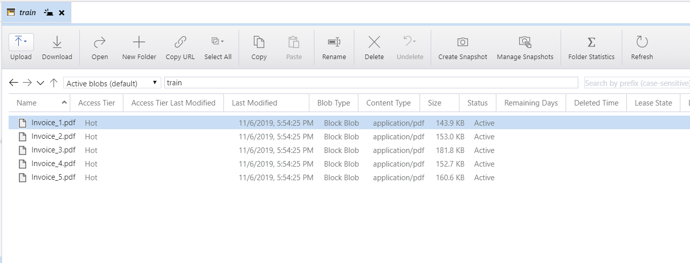
  
Back to the [Pipelines section](../README.md)
