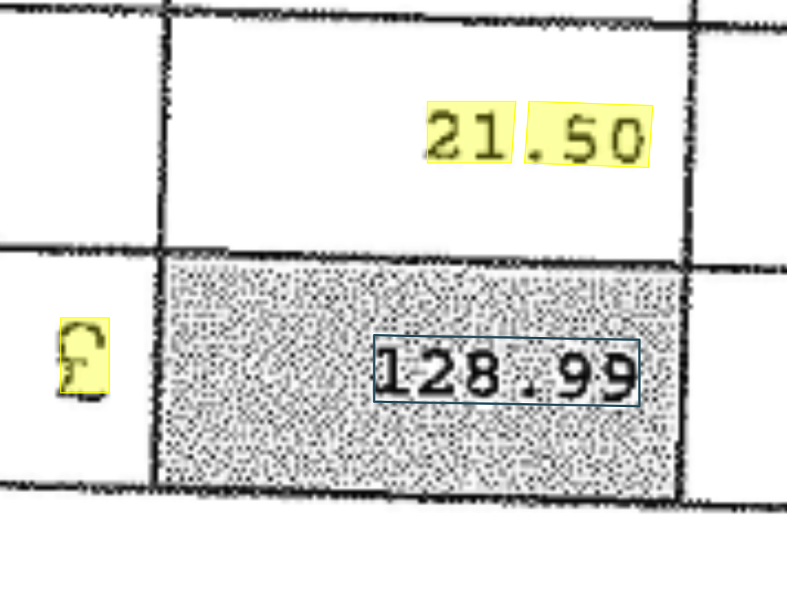

# The pre-processing phase

This is another vital stage in the project and the accuracy of the extraction will be largely defined during this stage.

During this step experiments are conducted on the data in attempts to normalise it, denoise it for improved accuracy and inform techniques on how the data can be segmented.

**Key Outcomes**:

* A segmentation approach(es) has been been validated and implemented.
* A normalisation approach(es) has been validated and implemented.
* A decision has been made on the models and their variability to extract the required data has been validated and implemented.

## Removing noise

**Key Questions**:

*Is the quality of the scanned images consistent?* *Is there anything in the form that is prohibiting data from being extracted?*

When dealing with forms at volume, chances are that the quality of the scans will deviate, which may impact the accuracy of the OCR extraction process. Analysis of the dataset needs to take place to understand any quality variation and to ensure consistency.

Furthermore, forms that contain financial information such as invoices often contain introduced 'noise' to obfuscate the value from being read through a physical envelope, see below:

Have a look at the code accelerator [Normalisation](Normalisation/preprocess_document.ipynb) which illustrates interactively how to analyse the RGB channels of an image and how to normalise. Once some thresholds have been defined, this could be applied batch to problematic forms.

## Document Format

**Key Questions**:

*What format can we expect the forms to be in?* *Are they consistent and will we need to convert the forms?*

If the format is not in the supported list below, conversion will clearly need to take place, have a look at the code accelerator [Prepare Files for AutoLabelling](../Training/Auto_Labelling/README.md#autolabel_prepare_files.py) which illustrates how to convert files from TIF to JPG to PDF.

The following formats are supported by the [Read API](https://docs.microsoft.com/en-gb/azure/cognitive-services/computer-vision/concept-recognizing-text#read-api):

* The image must be presented in JPEG, PNG, BMP, PDF, or TIFF format.
* The dimensions of the image must be between 50 x 50 and 10000 x 10000 pixels. PDF pages must be 17 x 17 inches or smaller.
* The file size of the image must be less than 20 megabytes (MB).
* The text in the image can be rotated by any multiple of 90 degrees plus a small angle of up to 40 degrees.
* Up to 200 pages can be processed in a single form.

And for the [OCR API](https://docs.microsoft.com/en-gb/azure/cognitive-services/computer-vision/concept-recognizing-text#ocr-optical-character-recognition-api):

* The image must be presented in JPEG, PNG, GIF, or BMP format.
* The size of the input image must be between 50 x 50 and 4200 x 4200 pixels.
* The text in the image can be rotated by any multiple of 90 degrees plus a small angle of up to 40 degrees.

## Skewness

**Key Questions**:

*Can we expect the orientation of the forms to be consistent?*

A common issue when dealing with forms at volume is that inevitably some forms will be scanned upside down or at an angle that may be detrimental to the extractio accuracy.

Have a look at the code accelerator [Skewness](Skewness/README.md) which illustrates how this can be checked and addressed.

## Optical Mark Recognition

At the time of writing, the Form Recognizer service is not yet able to extract values from checkboxes but this will be addressed in the near future. Thus in the interim, a strategy needs to be devised to handle these values if they are important to the extraction process.

**Key Questions**:

*Do the forms contain checkboxes that need to be extracted?* *Are the values handwritten?* *Are the values entered in the checkboxes consistently entered?*

Checkboxes may be populated with tick marks or and 'X' and thus needs to be explored and understood across the dataset.

Have a look at the code accelerator [Optical Mark Recognition](Optical_Make_Recognition/README.md) which illustrates a few techniques that can be applied.

Now refer to the [Training](../Training/README.md) section for model training.
