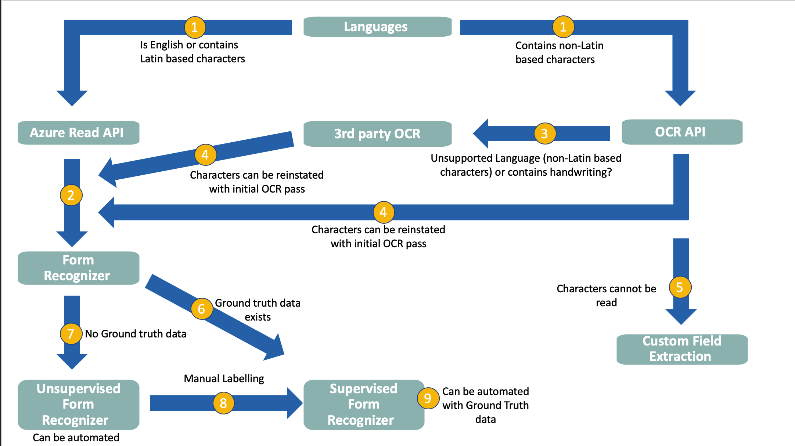

# Understanding whether Forms Recognizer is a good fit

The following section aims to help determine whether Form Recognizer is a viable option for the information to be extracted and the types of Forms.

Note, for clarity, we will refer to the Supervised version of the Form Recognizer service as being training with labels or using the ```Use Labels``` set to True option, while we will refer to the Unsupervised version of Form Recognizer as being training without labels or ```Use Labels``` is set to False.

## Document type

The first and most obvious decision point is that the Form Recognizer is intended to extract key/value pairs from structured documents or forms like invoices, receipts, or other static forms, thus it is not suitable for extracting large amounts of information from unstructured documents.

Forms can also be **multi-page**, alongside containing **handwriting** as well.

The following serves to provide high level guidance in terms of the types of questions to ask and the best approaches to take given the project specific data.

## Tips on Handwriting

*Do the documents contain handwriting?*

While Form Recognizer can handle handwriting, extracting handwriting only makese sense if it is consistently on a part of the form, otherwise it will be hard for the Form Recognizer models to learn or for a human being to label it.

Note, while handwriting can be extracted, it is prone to high rates of error due to the variability in handwriting. There are strategies that can be implemented to address these, such as creating a lookup dictionary of common OCR errors and then attempting to fix them. A simple example is if the letter O is read as a zero in a word, these can be easily fixed if found within a word containing only alphabetical characters on a part of the form that is not expected to contain numbers.

If the handwriting is simply adding noise, then pre-processing tasks such as de-noising and normalisation can be attempted to remove the handwriting. This is documented in the [Pre-Processing](../../Pre_Processing/README.md) section.

## Service Guidance flow

The following image illustrates some key decision points on deciding on the approach and how Form Recognizer can be used.



### Decision point 1: Languages

*Which languages are covered in the documents?*

Form Recognizer currently supports English documents only, but it is worth trying to use this service if the forms predomininantly use [Latin based characters](https://en.wikipedia.org/wiki/Latin_alphabet). If the forms do contain non-Latin based characters, such as a German Umlaut for example, an exercise needs to take place to determine whether these characters influence the context or meaning of the information to be extracted, if they do not then Form Recognizer can be considered.

Strategies to re-instate these characters, if they are deemed important, can be adopted by performing an initial OCR scan of the form, storing the coordinates of the characters of interest and then re-instating them after the Form Recognizer extraction.

If this approach is not viable or if the language to be extracted is not supported then custom extraction will be required.

#### The following section describes the languages supported by the various OCR versions

This is important as some of the Azure services and 3rd party products support different languages. For example, the
current state of the art  [Read API](https://docs.microsoft.com/en-gb/azure/cognitive-services/computer-vision/concept-recognizing-text#read-api) only supports English at the time of writing.

The previous version of this service, namely the [OCR API](https://docs.microsoft.com/en-gb/azure/cognitive-services/computer-vision/concept-recognizing-text#ocr-optical-character-recognition-api) supports far more languages [OCR API languages supported](https://docs.microsoft.com/en-gb/azure/cognitive-services/computer-vision/language-support#text-recognition)

If a language is required that is not supported by the [OCR API](https://docs.microsoft.com/en-gb/azure/cognitive-services/computer-vision/concept-recognizing-text#ocr-optical-character-recognition-api), a third party product such as [Tesseract OCR](https://github.com/tesseract-ocr/tesseract/wiki) could be considered.  

* Language: If the language is English, Spanish, German, French, Italian, Portuguese, and Dutch, the current state of the art service to use is the [Read API](https://docs.microsoft.com/en-gb/azure/cognitive-services/computer-vision/concept-recognizing-text#read-api). For languages other than those within tier 1 use the [OCR API](https://docs.microsoft.com/en-gb/azure/cognitive-services/computer-vision/concept-recognizing-text#ocr-optical-character-recognition-api).
* Handwriting: If the material contains handwriting and/or print, the [Read API](https://docs.microsoft.com/en-gb/azure/cognitive-services/computer-vision/concept-recognizing-text#read-api) can operate in mixed modes but for English only.
* Few different forms with consistent structure: If there a small number of form types to be processed then the [Form Recognizer](https://azure.microsoft.com/en-gb/services/cognitive-services/form-recognizer/) could be a good fit. Alternatively, if high amounts of variation exist in the form types expected, a custom field extraction approach would be a more suitable approach. *Note*, if a high amount of variation exists, analysis of the form type distrubtion would be a good exercise to undertake in case a small number of form types represent a singificant proportion of forms to be processed.

### Decision point 2: Form Recognizer service

As stated before, if the forms to be extracted are static, note there can be large amounts of different form types or layouts, but if the forms within a type or layout are static, then Form Recognizer could be a good fit.

### Decision point 3: 3rd Party OCR

If the characters to be extracted are not based on Latin characters and are not one of the supported languages of the [OCR API](https://docs.microsoft.com/en-gb/azure/cognitive-services/computer-vision/) then a 3rd Party OCR service should be considered, such as [Tesseract OCR](https://github.com/tesseract-ocr/tesseract/wiki)  for example.

### Decision point 4: Performing an initial OCR Pass

If the [Read API](https://docs.microsoft.com/en-gb/azure/cognitive-services/computer-vision/concept-recognizing-text#read-api) OCR service that is used by the Form Recognizer is not sufficient and an initial OCR pass was required using a different service, either to handle non-Latin characters or an unsupported language, then this data can be passed to the output of the Form Recognizer step to enrich it.

For example, should a German Umlaut be deemed vital for the context of the data to be extracted, it can be extracted initially, the bounding box coordinates stored, and then used to enrich the data extracted by the [Read API](https://docs.microsoft.com/en-gb/azure/cognitive-services/computer-vision/concept-recognizing-text#read-api) OCR service during the Post-Processing step.

### Decision point 5: Custom Field Extraction

Custom field extraction needs to be considered if you are dealing with a language or characters that are not supported by any of the public OCR services.

### Decision point 6: Sufficient Ground Truth data exists

If sufficient Ground Truth data exists, [AutoLabelling](../../Training/Auto_Labelling/README.md) can be considered using the Supervised version of Form Recognizer service if the training process needs to be automated.

### Decision point 7: No or insufficient Ground Truth data exists

The options here are to either use the Unsupervised version of Form Recognizer if the solution is fully automated, eitherwise consider Decision point 8: Manual Labelling.

By default, Form Recognizer uses unsupervised learning to understand the layout and relationships between fields and entries in your forms. When you submit your input forms, the algorithm clusters the forms by type, discovers what keys and tables are present, and associates values to keys and entries to tables. This doesn't require manual data labeling or intensive coding and maintenance, and we recommend you try this method first.

Note, this will drastically reduce but not remove the need for a *human-in-the-loop*.

### Decision point 8: Manual Labelling

If no Ground Truth data exists, then manual labelling for the Supervised version of the Form Recognizer service can be considered for training. When you train with labeled data, the model does supervised learning to extract values of interest, using the labeled forms you provide. This results in better-performing models and can produce models that work with complex forms or forms containing values without keys.

Form Recognizer uses the Layout API to learn the expected sizes and positions of printed and handwritten text elements. Then it uses user-specified labels to learn the key/value associations in the documents. We recommend that you use five manually labeled forms of the same type to get started when training a new model and add more labeled data as needed to improve the model accuracy.

### Decision point 9: Automating the Supervised version

[AutoLabelling](../../Training/Auto_Labelling/README.md) may be used to attempt to automatically label the forms using the Ground Truth data. Note, this will drastically reduce but not remove the need for a *human-in-the-loop*.

Now refer to the [Analysis section](../../Analysis/README.md)
