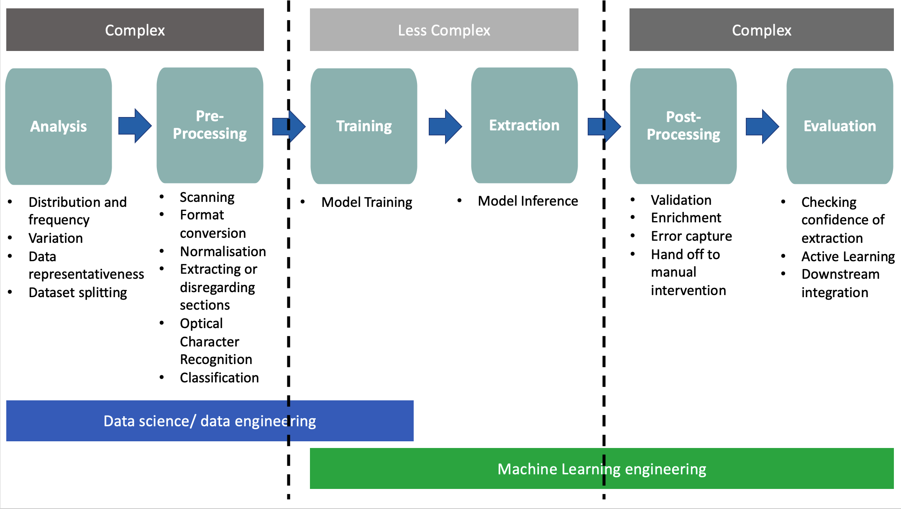

# Getting Started

The following section aims to provide high level guidance on the approach to take depending on the type of forms and documents that need to be processed. Note, for simplicity the training and evaluation processes or pipelines have been summarised into a single flow. When implementing in into a pipeline for production use, these two processes need to be separated.

## Understanding the problem

Prior to any development work a good understanding of the problem to be solved, i.e. the knowledge to extract and the nature of the data is required. Please refer to the [Checklist](Checklist/README.md) to ensure that these crucial aspects have been considered.

## The common stages of Knowledge Extraction

The following illustrates the 6 high level stages of Knowledge Extraction and the relative complexity level and roles required:

### Analysis

During this vital stage of the project, analysis of the viability and representativeness of the data is conducted to determine whether the data available is relevant to business problem. This stage typically requires implementing techniques to better understand the variability, distribution and datasets available.

**Key Outcomes**:

* The data available is relevant to the business problem to be solved.
* An approach of how the data can be segmented is defined for further experimentation.
* The data has been analysed and informs the hypotheses, the approach and the initial experiments.

### Pre-Processing

During this optional step experiments are conducted on the data if required to normalise it, de-noise it for improved accuracy and inform techniques on how the data can be segmented.

**Key Outcomes**:

* A segmentation approach has been been validated and implemented.
* A normalisation approach(es) has been validated and implemented.
* A decision has been made on the models and their variability to extract the required data has been validated and implemented.

### Training

This stage requires training the model(s) on the training datasets.

*Key Outcomes*:

* A model(s) that is clearly correlated to the data it was trained on (data lineage) and the seperated dataset(s) it will be validated and tested on.
* Baselines on simpler models or early versions have been captured for comparison.
* Clarity and confidence that the model(s) will generalise well against the production data.

### Extraction or inference

This stage involves the evaluation of the model against the validation and test datasets.

**Key Outcomes**:

* Versions of model improvements and iterations captured.

### Post-Processing

During this stage the data that have been extracted from the previous steps are formatted and validated in accordance with business rules and transformed into a format suitable for downstream tasks and evaluation.

**Key Outcomes**:

* The data is in a consistent format for evaluation.

### Evaluation

This stage determines the accuracy of the overall training process and scores against the Ground Truth (GT) or labelled data to determine the accuracy of the models. During the prediction pipeline in a production environment, the confidence of the predictions here are assessed and a threshold is set to hand off for manual intervention if required.

Active learning may be implemented here, a simple example could may be identifying if a new form has been introduced and to hand it off for automated training.

Now refer to the [Service Decision](Decision_Guidance/README.md) section to determine whether the Form Recognizer service is a good fit.
