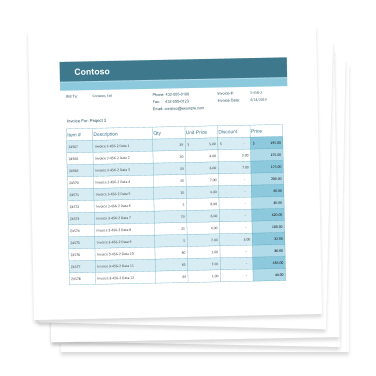
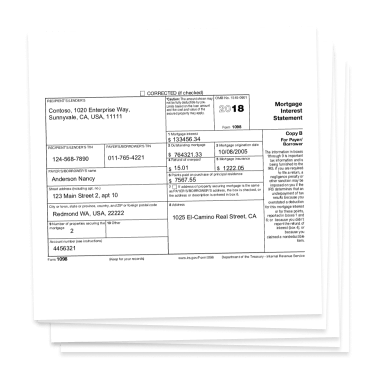

# Knowledge Extraction Recipes - Forms 





Retrieving information from documents and forms has long been a challenge, and even now at the time of writing,
organisations are still handling significant amounts of paper forms that need to be scanned, classified and mined
for specific information to enable downstream automation and efficiencies. Automating this extraction and applying
intelligence is in fact a fundamental step toward digital transformation that organisations are still struggling
to solve in an efficient and scalable manner.

An example could be a bank that receives hundreds of kilograms of very diverse remittance forms a day that need to be
processed manually by people in order to extract a few key fields. Or medicinal prescriptions need to be automated to extract the
prescribed medication and quantity.

Typically organisations will have built text mining and search solutions which are often tailored for a scenario,
with baked in application logic, resulting in an often brittle solution that is difficult and expensive to maintain.

Thanks to the breakthroughs and rapid innovation in the machine learning fields of Computer Vision and Natural
Language Processing (NLP), reliable options are now available to provide data driven solutions that generalise
and provide high degrees of accuracy in extracting information from structured forms.

Coupled with Azure services this provides rapidly deployable, cost efficient and
scalable solutions ready for production workloads.

## Overview

The goal of this Playbook is to build a set of guidance, tools, examples and documentation that illustrate some
known techniques for information extraction, all of which have been applied in real customer solutions.

We hope that the Playbook can significantly reduce the overall development time by simplifying the decision making
process from defining the business problem to analysis and development.

The first focus of the Playbook is extraction of information from Forms.

## Intended audience

The intended audience of this Playbook include:

* Engineering/project leads
* Data scientists/data engineers
* Machine learning engineers
* Software engineers

## How this Playbook is structured

This Playbook aims to provide step-by-step guidance for each phase of a typical Forms Extraction project alongside typical considerations, key outcomes and code accelerators per phase. To follow the guidance process see the [Walkthrough](Project_Preparation/README.md) or dip into the individual [code accelerators](README.md#code-accelerators)

## Getting Started

The best place to start if this is your first foray into this Playbook is with the [Checklist](Project_Preparation/Checklist/README.md), and then the [Walkthrough](Project_Preparation/README.md) to ensure that the most important
points are addressed in order to build a successful solution in this space.

## Terminology used in this Playbook

We refer to the *Supervised* version of the Form Recognizer service when the argument ```Use Labels``` set to True when training, and the *Unsupervised* version of Form Recognizer as when the argument ```Use Labels``` is set to False.

We refer to a form issuer as being the unique source of a form, for example, the vendor of an invoice, or the bank of origin of an application form.

## End to end demos ✨

***NEW*** (▀̿Ĺ̯▀̿ ̿)

| Stage | Scenario | Description |
| -------- | ----------- | ------|
| AutoLabelling and Prediction | [AutoLabelling](Demos/AutoLabelDemo.ipynb) | Chains AutoLabelling, Training and Prediction on sample invoices
| Pre-Processing Remove Boxes  | [RemoveBoxes](Demos/RemoveBoxes.ipynb) | Shows how to remove boxes that cause OCR errors and find the best image transformation
| Get Values in CheckBoxes  | [Detect and get CheckBox value](Demos/RemoveBoxes.ipynb#Let's-see-if-we-can-find-the-checkboxes) | Detects and gets the value from CheckBoxes

## Code accelerators

The following code accelerators serve as starting points to try approaches that are known to work for Knowledge
Extraction.
**Note - these accelerators need to be adapted to your data and tested and profiled, they are not production ready**
**and need to be incorporated into your pipeline and profiled**

The code accelerators included are available in Jupyter notebooks, APIs and python scripts that showcase some of the scenarios
in this repository using diverse approaches.

| Stage | Scenario | Description |
| -------- | ----------- | ------|
| Project preparation | [Checklist](Project_Preparation/Checklist/README.md) | Steps to ensure success
| Project preparation | [Decision Guidance](Project_Preparation/README.md) | Core decision points |
| Project preparation | [Data Structure](Project_Preparation/Data_Structure/README.md) | Recommended training data structure
| Analysis | [Understanding the data distribution](Analysis/Distribution/Distribution.ipynb) | Illustrates a simple way to understand the distribution of vendor to invoice frequency
| Analysis | [Understanding form variation](Analysis/Form_Variation/README.md) | Illustrates how to analyse  whether variation in a single form type exists
| Analysis | [Form layout type labelling using clustering based on text features](Analysis/Form_Layout_Clustering/README.md) | Shows an approach which can be used to discover/label different layout types within a big dataset of forms images
| Analysis | [Form layout clustering based on text and text layout features](Analysis/Compact_Layout_Clustering/README.md) | Shows another approach which can be used to discover different layouts within a big dataset of images, taking words and positions of words on a page into account |
| Analysis | [Classifying forms](Analysis/Attribute_Search_Classification/README.md) | Illustrates how to use an attribute based search approach to classify forms for Form Recognizer model correlation
| Analysis | [Routing forms](Analysis/Routing_Forms/README.md) | Demonstrates how to use OCR results to find which Form Recognizer model to send an unknown form to
| Pre-Processing | [Image Channel Normalisation](Pre_Processing/Normalisation/preprocess_document.ipynb) | Illustrates interactive normalisation, binarization and greyscale conversion
| Pre-Processing Remove Boxes  | [RemoveBoxes](Demos/RemoveBoxes.ipynb) | Illustrates interactively how to remove boxes that cause OCR errors and find the best image transformation
| Pre-Processing | [Conversion](Training/Auto_Labelling/README.md#conversion) | Converting documents between various formats such as TIF to PDF, JPG to PDF etc
| Pre-Processing | [Scan skewness](Pre_Processing/Skewness/README.md) | Illustrates testing and correcting skewness
| Pre-Processing | [Projection](Pre_Processing/Projection/README.md) | Illustrates how to identify document skew and location of text lines
| Pre-Processing | [Detect and get CheckBox value](Demos/RemoveBoxes.ipynb#Let's-see-if-we-can-find-the-checkboxes) | Illustrates how to detect and get a CheckBox value
| Pre-Processing     | [Optical Mark Recognition](Pre_Processing/Optical_Mark_Recognition/README.md) | Illustrates some techniques to determine if a checkbox exists and how to extract it
| Training | [Dataset representativeness](Training/Representativeness/README.md) | Illustrates how test how to test the train and test datasets for representativeness
| Training | [Named Entity Recognition](Training/README.md#named-entity-recognition) | Illustrates how NER can be trained used to identify and extract entities on a form
| Training | [Auto-labelling and training set optimisation](Training/README.md#the-autolabelling-process) | Illustrates how forms can be automatically labelled for the supervised version of Form Recognizer
| Training | [Generating a taxonomy](Training/Taxonomy/README.md) | Illustrates a simple approach to generating a taxonomy of known terms from the forms
| Extraction     | Custom Corpus | Describes an approach to handling a custom corpus
| Extraction     | Handwriting and common OCR Errors | Describes an approach how to deal with common errors
| Extraction     | [Predicting forms with Form Recognizer Supervised](Extraction/Supervised/README.md) | Predicting forms with Forms Recognizer Supervised
| Extraction     | [Predicting forms with Form Recognizer Unsupervised](Extraction/Unsupervised/README.md) | Predicting forms with Forms Recognizer Unsupervised
| Extraction | [Using filter keys from a taxonomy](Extraction/Unsupervised/README.md#using-a-taxonomy-to-filter-keys) | Illustrates how to filter the keys extracted from the unsupervised version of Form Recognizer using a taxonomy of known terms
| Extraction     | [Table Extraction](Scenarios/Table_Extraction_FR/README.md) | Illustrates extracting tables with Form Recognizer
| Evaluation     | [Scoring](Evaluation/README.md) | Illustrates how to evaluate and score with Form Recognizer

## PowerApps ✨

***NEW*** (▀̿Ĺ̯▀̿ ̿)

| Stage | Scenario | Description |
| -------- | ----------- | ------|
| Invoice Automation | [PowerApps](PowerApps/InvoiceAutomation/README.md) | Invoice Automation using the Power Platform

## Example Pipelines

The [Pipelines](Pipelines/README.md) section contains some example patterns and pipelines for Knowledge Extraction using Azure Services.

 Scenario | Description |
| -------- | ----------- |
| [Azure Cognitive Search](Pipelines/Azure_Cognitive_Search/ReadMe.md)| Sample pipeline using Azure Cognitive Search
| [Azure Kubernetes Service](Pipelines/Azure_Kubernetes_Service/README.md)| Sample pipeline using Azure Kubernetes Service
| [Azure Machine Learning](Pipelines/Azure_Machine_Learning/README.md)| Sample pipeline using Azure Machine Learning
| [Azure Logic Apps](Pipelines/Azure_Logic_Apps/README.md)| Sample pipeline using Azure Logic Apps
| [Azure (Durable) Functions](Pipelines/Azure_Functions/README.md)| Sample pipeline using Azure (Durable) Functions

## Tips and Best Practices for Form Recognizer

For tips and best practices for managing Form Recognizer models via MLOps and deployment pipelines, view [MLOps Tips and Tricks for Form Recognizer](FormRecognizer/MLOpsTips.md).

## Example Scenarios

This section contains some documented common scenarios

 Scenario | Description |
| -------- | ----------- |
| [CV or Resume Extraction](Scenarios/CV_Resume)| Sample extraction flow for a CV/Resume
| [Email Extraction](Scenarios/Email_Processing) | Sample extraction from emails
| [Geolocation Extraction](Scenarios/Geolocation_Data) | Sample extraction for Geolocation
| [Prebuilt Receipt Model](Scenarios/Prebuilt_Receipt_Model) | Sample extraction for the prebuilt Receipt model
| [Table extraction with Forms Recognizer](Scenarios/Table_Extraction_FR) | Sample extraction for Tables using Forms Recognizer
| [Document Extraction detailed example using JFK Files](Scenarios/Document_Extraction_JFK_Files) | Sample extraction for Tables using Form Recognizer
| [Dealing with multiple languages](Scenarios/Multiple_Languages/README.md) | Illustrates a few approaches with dealing with multiple languages
| [Custom extraction from Japanese forms](Scenarios/Custom_Extraction_Japanese/README.md) | Illustrates a an approach to custom extraction from Japanese forms
| [Informative Image Selection using OCR with Form Recognizer Extraction](Scenarios/Informative_Image_Selection_FR_Pattern/README.md) | Illustrates an approach to selecting the most "informative" image from a group of similar images before extracting data with the Form Recognizer

## Azure Services used in this repository

### Azure Computer Vision OCR

[Read API](https://docs.microsoft.com/en-gb/azure/cognitive-services/computer-vision/concept-recognizing-text#read-api)
detects text content in an image using our latest recognition models and converts the identified text into a
machine-readable character stream. It's optimized for text-heavy images (such as documents that have been digitally
scanned) and for images with a lot of visual noise. It will determine which recognition model to use for each line
of text, supporting images with both printed and handwritten text. The Read API executes asynchronously because
larger documents can take several minutes to return a result.

[OCR API](https://docs.microsoft.com/en-gb/azure/cognitive-services/computer-vision/concept-recognizing-text#ocr-optical-character-recognition-api) Computer Vision's optical character recognition (OCR)
API is similar to the Read API, but it executes synchronously and is not optimized for large documents. It uses an
earlier recognition model but works with more languages

### Azure Cognitive Search

[Azure Cognitive Search](https://azure.microsoft.com/en-us/services/search/) is a fully managed search as a service to reduce
complexity and scale easily including:

* Auto-complete, geospatial search, filtering, and faceting capabilities for a rich user experience
* Built-in AI capabilities including OCR, key phrase extraction, and named entity recognition to unlock insights
* Flexible integration of custom models, classifiers, and rankers to fit your domain-specific needs

### Form Recognizer Service

[Form Recognizer](https://azure.microsoft.com/en-gb/services/cognitive-services/form-recognizer/) applies advanced
machine learning to accurately extract text, key/value pairs and tables from documents.

The [Form Recognizer](https://azure.microsoft.com/en-gb/services/cognitive-services/form-recognizer/) has two modes
of operation:

* [**Custom Model**](https://docs.microsoft.com/en-us/azure/cognitive-services/form-recognizer/quickstarts/curl-train-extract):
This mode can be trained to recognise specific form types based on your own example data set
* [**Prebuilt Receipt Model**](https://docs.microsoft.com/en-us/azure/cognitive-services/form-recognizer/quickstarts/curl-receipts): This model is pre-trained (requires no training from you) to reocgnise and extract key data points from receipts
(i.e. till receipts, resturant bills, general retail receipts etc)

The Custom Model requires the following for training:

* Format must be JPG, PNG, or PDF (text or scanned). Text-embedded PDFs are best because there's no possibility of error in character extraction and location.
* If your PDFs are password-locked, you must remove the lock before submitting them.
* File size must be less than 4 MB.
* For images, dimensions must be between 600 x 100 pixels and 4200 x 4200 pixels.
* If scanned from paper documents, forms should be high-quality scans.
* Text must use the Latin alphabet (English characters).
* Data must contain keys and values.
* Keys can appear above or to the left of the values, but not below or to the right.

Form Recognizer doesn't currently support these types of input data:

* Complex tables (nested tables, merged headers or cells, and so on).
* Checkboxes or radio buttons.
* PDF documents longer than 50 pages.

See more on [training Form Recognizer here](https://docs.microsoft.com/en-us/azure/cognitive-services/form-recognizer/build-training-data-set)

The requirements for the prebuilt receipt model are slightly different.

* Format must be JPEG, PNG, BMP, PDF (text or scanned) or TIFF.
* File size must be less than 20 MB.
* Image dimensions must be between 50 x 50 pixels and 10000 x 10000 pixels.
* PDF dimensions must be at most 17 x 17 inches, corresponding to Legal or A3 paper sizes and smaller.
* For PDF and TIFF, only the first 200 pages are processed (with a free tier subscription, only the first two pages
are processed).

### Azure Machine Learning service

[Azure Machine Learning service](https://azure.microsoft.com/en-us/services/machine-learning-service/) is a cloud
service used to train, deploy, automate, and manage machine learning models, all at the broad scale that the cloud
provides. AzureML is presented in notebooks across different scenarios to enhance the efficiency of developing Natural
Language systems at scale and for various AI model development related tasks like:

* [**Accessing Datastores**](https://docs.microsoft.com/en-us/azure/machine-learning/service/how-to-access-data)
to easily read and write your data in Azure storage services such as blob storage or file share.
* Scaling up and out on [**Azure Machine Learning Compute**](https://docs.microsoft.com/en-us/azure/machine-learning/service/how-to-set-up-training-targets#amlcompute).
* [**Automated Machine Learning**](https://docs.microsoft.com/en-us/azure/machine-learning/service/how-to-configure-auto-train) which builds high quality machine learning models by automating model and hyperparameter selection.
* [**Tracking experiments and monitoring metrics**](https://docs.microsoft.com/en-us/azure/machine-learning/service/how-to-track-experiments) to enhance the model creation process.
* [**Distributed Training**](https://docs.microsoft.com/en-us/azure/machine-learning/service/how-to-train-ml-models#distributed-training-and-custom-docker-images)
* [**Hyperparameter tuning**](https://docs.microsoft.com/en-us/azure/machine-learning/service/how-to-tune-hyperparameters)
* Deploying the trained machine learning model as a web service to [**Azure Container Instance**](https://azure.microsoft.com/en-us/services/container-instances/) for deveopment and test,  or for low scale, CPU-based workloads.
* Deploying the trained machine learning model as a web service to [**Azure Kubernetes Service**](https://azure.microsoft.com/en-us/services/kubernetes-service/) for high-scale production deployments and provides autoscaling, and fast response times.

To successfully run these code accelerators, you will need an [**Azure subscription**](https://azure.microsoft.com/en-us/)
or can [**try Azure for free**](https://azure.microsoft.com/en-us/free/). There may be other Azure services or products
used in the code. Introduction and/or reference of those will be provided in the code themselves.

## Contributors ✨

<!-- ALL-CONTRIBUTORS-LIST:START - Do not remove or modify this section -->
<!-- prettier-ignore-start -->
<!-- markdownlint-disable -->
<table>
  <tr>
    <td align="center"><a href="https://github.com/aljannuzzi"><br /><sub><b>Alessandro Jannuzzi</b></sub></a><br /></td>
    <td align="center"><a href="https://github.com/alexhock"><br /><sub><b>Alex Hocking</b></sub></a><br /></td>
    <td align="center"><a href="https://github.com/aykhara"><br /><sub><b>Ayaka Hara</b></sub></a><br /></td>
    <td align="center"><a href="https://github.com/dariuszparys"><br /><sub><b>Dariusz Parys</b></sub></a><br /></td>
    <td align="center"><a href="https://github.com/ikivanc"><br /><sub><b>Ibrahim Kivanc</b></sub></a><br /></td>
    <td align="center"><a href="https://github.com/karolzak"><br /><sub><b>Karol Zak</b></sub></a><br /></td>
    <td align="center"><a href="https://github.com/Kagigz"><br /><sub><b>Katia Gil Guzman</b></sub></a><br /></td>
  </tr>
  <tr>
    <td align="center"><a href="https://github.com/kritcs18"><br /><sub><b>Krit Kamtuo</b></sub></a><br /></td>
    <td align="center"><a href="https://github.com/madossan01"><br /><sub><b>Marcia Dos Santos</b></sub></a><br /></td>
    <td align="center"><a href="https://github.com/vapaunic"><br /><sub><b>Nuno Silva</b></sub></a><br /></td>
    <td align="center"><a href="https://github.com/ignaciofls"><br /><sub><b>Ignacio Floristan</b></sub></a><br /></td>
    <td align="center"><a href="https://github.com/ashepetko"><br /><sub><b>Oleksiy Shepetko</b></sub></a><br /></td>
    <td align="center"><a href="https://github.com/omri374"><br /><sub><b>Omri Mendels</b></sub></a><br /></td>
    <td align="center"><a href="https://github.com/PreteshPatel"><br /><sub><b>Pretesh Patel </b></sub></a><br /></td>
  </tr>
  <tr>
    <td align="center"><a href="https://github.com/rajnemani"><br /><sub><b>Raj Nemani</b></sub></a><br /></td>
    <td align="center"><a href="https://github.com/sbaidachni"><br /><sub><b>Sergii Baidachnyi</b></sub></a><br /></td>
    <td align="center"><a href="https://github.com/tompaana"><br /><sub><b>Tomi Paananen</b></sub></a><br /></td>
    <td align="center"><a href="https://github.com/martinkearn"><br /><sub><b>Martin Kearn</b></sub></a><br /></td>
    <td align="center"><a href="https://github.com/shanepeckham"><br /><sub><b>Shane Peckham</b></sub></a><br /></td>
    <td align="center"><a href="https://github.com/imicknl"><br /><sub><b>Mick Vleeshouwer</b></sub></a><br /></td>
   <td align="center"><a href="https://github.com/jomalsan"><br /><sub><b>Jon Malsan</b></sub></a><br /></td>
  </tr>
  <tr>
    <td align="center"><a href="https://github.com/evamok"><br /><sub><b>Eva Mok</b></sub></a><br /></td>
    <td align="center"><a href="https://github.com/mover333"><br /><sub><b>Mitchell Overfield</b></sub></a><br /></td>
    <td align="center"><a href="https://github.com/alkofahi"><br /><sub><b>Jafar Al-Kofahi</b></sub></a><br /></td>
    <td align="center"><a href="https://github.com/dafatade"><br /><sub><b>Daniel Fatade</b></sub></a><br /></td>
  </tr>
</table>

<!-- markdownlint-enable -->
<!-- prettier-ignore-end -->
<!-- ALL-CONTRIBUTORS-LIST:END -->

## Contributing

See [CONTRIBUTING.md](CONTRIBUTING.md) for contribution guidelines.

## Additional References

Please refer to the following fantastic references for additional material relevant to knowledge extraction:

### Azure Cognitive Search additional links

* [Azure Search Knowledge mining](https://github.com/Azure-Samples/azure-search-knowledge-mining)
* [Azure Search Knowledge Mining Bootcamp](https://github.com/Azure/LearnAI-KnowledgeMiningBootcamp)

* [Azure Search custom skills](https://github.com/microsoft/SkillsExtractorCognitiveSearch)

### General and custom information extraction

* [Custom NLP models - Microsoft NLP Recipes](https://github.com/microsoft/nlp-recipes)
* [Spacy Phrasematcher](https://github.com/explosion/spaCy/blob/master/examples/information_extraction/phrase_matcher.py)
* [RegEx debugger and code snippets](https://www.debuggex.com/)
* [Recognizers-Text](https://github.com/microsoft/Recognizers-Text) (entity recognition for numbers, units, and date/time; in multiple languages)

### Addresses

* [Address parsing](https://medium.com/@albarrentine/statistical-nlp-on-openstreetmap-part-2-80405b988718)

### Image pre-processing

* [Compressing and enhancing hand-written notes](https://mzucker.github.io/2016/09/20/noteshrink.html)

### PDF conversion

* [PDF Miner](https://github.com/pdfminer/pdfminer.six)
* [PDF Focus](https://sautinsoft.com/products/pdf-focus/)
* [ImageMagick](https://imagemagick.org/index.php)

### OCR

* [OCR Labelling Tool](https://github.com/microsoft/OCR-Form-Tools)
* [Azure OCR Visualiser](https://github.com/ikivanc/OCRVisualizer)
* [Tesseract](https://github.com/tesseract-ocr)

### MLOps

* [MLOps](https://github.com/microsoft/MLOps)
* [MLOpsPython](https://github.com/Microsoft/MLOpsPython)

### Intelligent Kiosk Demo

* [Intelligent Kiosk](http://aka.ms/intelligentkiosk)
