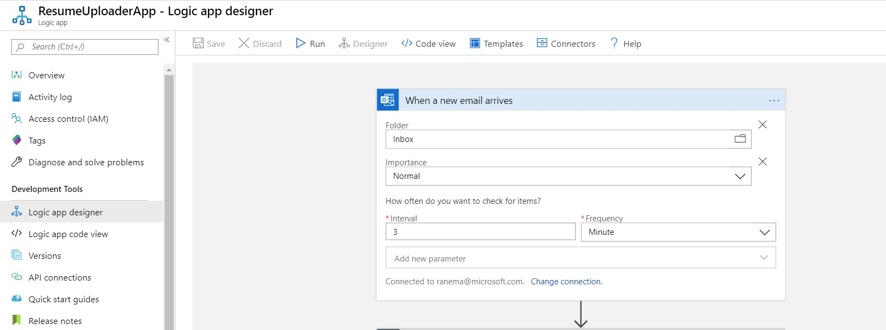
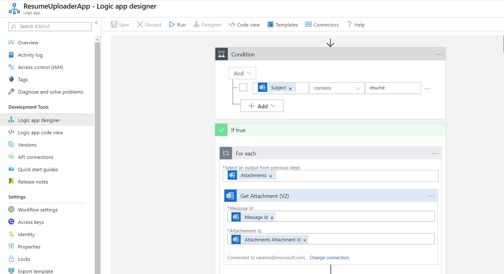

# CV and Resume

## Introduction

Recruiters can benefit vastly from a tool that can help augment the recruitment process overhead by identifying candidates that would likely be a good match based on the content in their CV. 

The goal is to streamline the process by building out a recruiter tool leveraging various Azure services that will take in candidate CVs and the job description and then output a similarity metric that can be filtered downstream. 

## Proposed Solution

One solution is to extract the key phrases from the the resume using Azure Text Analytics API, part of Azure Cognitive Services offering.  The extracted key phrases can then be compared against a single or a corpus of job descriptions to generate the similarity metric.

### Workflow

#### Step 1

Resume/CV arrives via email to a designated mailbox.  An Azure Logic App is configured to listen to this mailbox.  As soon as the email arrives, the Logic App listening on the mailbox will trigger to extract the resume/CV attachment from the email and uploads it to an Azure Storage blob container.  The configuration of the Logic App is shown below.






#### Step 2

The next step in the workflow is to use an Azure Function that is triggered on the arrival of a resume/cv into the Azure Storage blob container as explained in step 1 above.  The function performs three tasks. 

1. The first task is to extract the text from the document.  Currently it only processes pdf documents.  Azure function uses Read API from Computer Vision cognitive service to extract the data.  More information on the API can be found [here](https://westus.dev.cognitive.microsoft.com/docs/services/5adf991815e1060e6355ad44/operations/2afb498089f74080d7ef85eb). This API  employs the state-of-the-art Optical Character Recognition (OCR) algorithms optimized for text-heavy documents. It can handle hand-written, printed or mixed documents. When you use the Batch Read File interface, the response contains a field called "Operation-Location". The "Operation-Location" field contains the URL that you must use for your [Get Read Operation Result](https://westus.dev.cognitive.microsoft.com/docs/services/5adf991815e1060e6355ad44/operations/5be108e7498a4f9ed20bf96d) operation to access OCR results. 

   ```c#
   public static async Task<string> ExtractText(ComputerVisionClient client, string urlImage)
   		{
   			// Read text from URL
   			BatchReadFileHeaders textHeaders = await client.BatchReadFileAsync(urlImage);
   			// After the request, get the operation location (operation ID)
   			string operationLocation = textHeaders.OperationLocation;
   			// </snippet_extract_call>
   
   			// <snippet_extract_response>
   			// Retrieve the URI where the recognized text will be stored from the Operation-Location header. 
   			// We only need the ID and not the full URL
   			const int numberOfCharsInOperationId = 36;
   			string operationId = operationLocation.Substring(operationLocation.Length - numberOfCharsInOperationId);
   
   			// Extract the text 
   			// Delay is between iterations and tries a maximum of 10 times.
   			int i = 0;
   			int maxRetries = 10;
   			ReadOperationResult results;
   			Console.WriteLine($"Extracting text from URL image {System.IO.Path.GetFileName(urlImage)}...");
   			Console.WriteLine();
   			do
   			{
   				results = await client.GetReadOperationResultAsync(operationId);
   				Console.WriteLine("Server status: {0}, waiting {1} seconds...", results.Status, i);
   				await Task.Delay(1000);
   			}
   			while ((results.Status == TextOperationStatusCodes.Running ||
   					results.Status == TextOperationStatusCodes.NotStarted) && i++ < maxRetries);
   			// </snippet_extract_response>
   
   			// <snippet_extract_display>
   			// Display the found text.
   			Console.WriteLine();
   			var recognitionResults = results.RecognitionResults;
               string content = string.Empty;
   			foreach (TextRecognitionResult result in recognitionResults)
   			{
   				foreach (Microsoft.Azure.CognitiveServices.Vision.ComputerVision.Models.Line line in result.Lines)
   				{
   					Console.WriteLine(line.Text);
                       content+=line.Text + Environment.NewLine;
   				}
   			}
   			Console.WriteLine();
               return content;
   		}
   ```

   

2. The second task is to run the extracted text through the key phrase extraction process

   1. Text Analytics cognitive service provides an API to extract the key phrases.  More information on the Key Phrases API can be found [here](https://westcentralus.dev.cognitive.microsoft.com/docs/services/TextAnalytics-v2-1/operations/56f30ceeeda5650db055a3c6).  The code sample (snippet shown below) provided along with document uses this API to extract key phrases. 
   2. Flexibility exists here to replace the Text Analytics API from Azure Cognitive Services with any custom key phrase extractor that is trained to perform better for this particular domain/scenario and available as REST API endpoint.  

   ```c#
   private static string ExtractkeyPhrases (string result, TextAnalyticsClient ta_client, ILogger log) {
               string assembledContent = string.Empty;
               string keyPharases = string.Empty;
               var charCount=5000; //due to character limitation with KeyPharase extractor
    
               if (result.Length<charCount) {
                   keyPharases+= keyPhrases(ta_client,result);
               }
               else {
                   
                   var count = result.Length/charCount;
                   var remainder = result.Length%charCount;
                   for (int i = 0; i < count; i++)
                   {
                       assembledContent+=result.Substring(charCount*i, charCount);
                       keyPharases+= keyPhrases(ta_client,result.Substring(charCount*i, charCount));
   
                   }
                   assembledContent+= result.Substring(count*charCount);
                   //check to make sure chunking is working correctly
                   if (assembledContent.Equals(result)) {
                       log.LogInformation("original string and chunked+assembled strings match!");
                       keyPharases+= keyPhrases(ta_client,result.Substring(count*charCount));
                   }
                   else {
                       log.LogInformation("Invalid chunking. Cannot proceed");
                   }
   
               }
               log.LogInformation(keyPharases);
               return keyPharases;
               
           }
   ```

   

3. Once the key phrases are extracted, we can use this data in several ways

   1. We can build a database of list of potential candidates and their skill sets.  The key phrases list may need to be cured further to narrow down the key phrases list.  Alternatively, a custom key phrase extractor developed for this domain/scenario could return a focused list of key phrases or skills.
   2. We can also build a tool that compares a focused list of key phrases or skills (see #1 above) with a job description database to generate suitability metric.  This job description database could be an Azure Search Index.  One implementation could be search query built with a set of skills, submitted to the job description search index to get a list of documents and  potentially use the score associated with each result to determine applicant suitability with particular job description.

