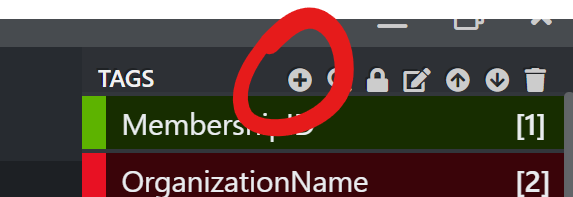
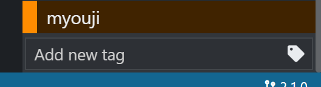
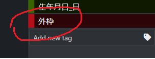
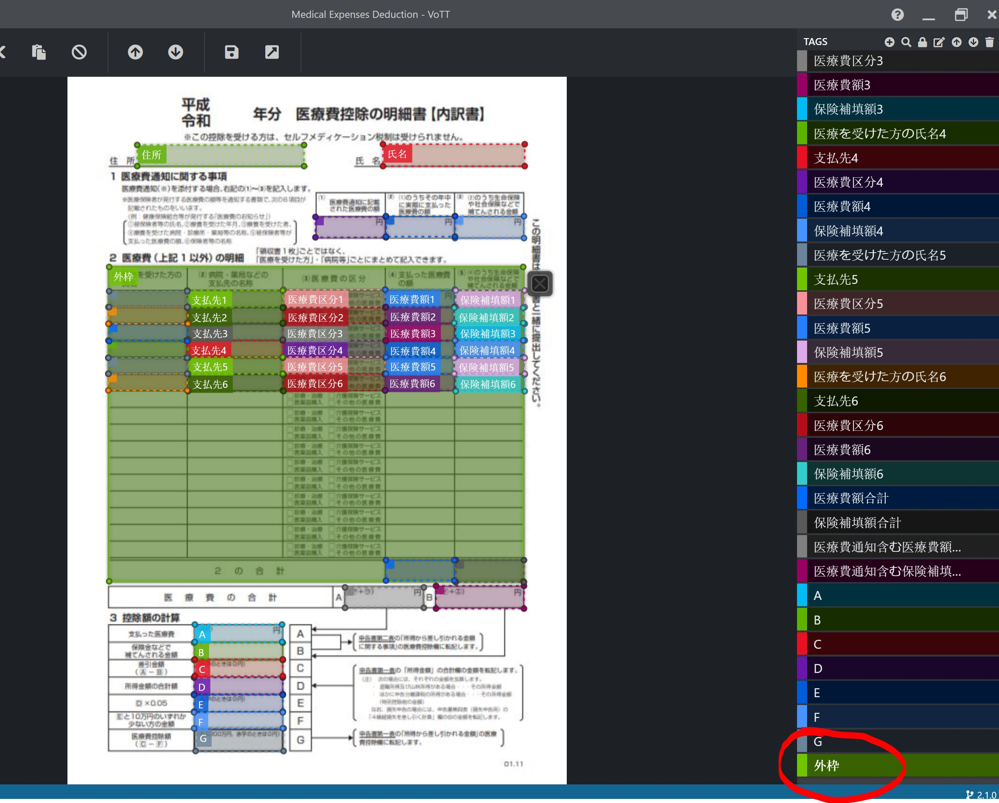
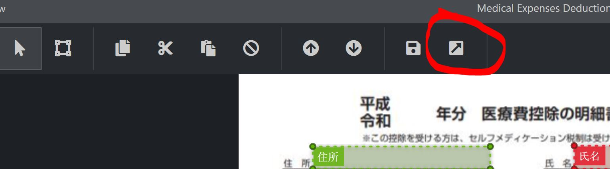

# Multiple Languages

This section illustrates a custom extraction approach for Japanese forms.

## Scenario : using VoTT + OpenCV + OCR API/Tesseract
<!-- TOC -->

- [Multiple Languages](#multiple-languages)
  - [Scenario : using VoTT + OpenCV + OCR API/Tesseract](#scenario--using-vott--opencv--ocr-apitesseract)
    - [Prerequisite](#prerequisite)
    - [Step 1 : VoTT (Visual Object Tagging Tool](#step-1--vott-visual-object-tagging-tool)
      - [Environment Setting](#environment-setting)
      - [Before you start: Create image of uncompleted form](#before-you-start-create-image-of-uncompleted-form)
      - [Create a new project](#create-a-new-project)
      - [Define the area with VoTT to input data](#define-the-area-with-vott-to-input-data)
        - [Tag Fragment Regions in VoTT](#tag-fragment-regions-in-vott)
      - [Save the VoTT Project](#save-the-vott-project)
      - [Export Regions and Extent from VoTT](#export-regions-and-extent-from-vott)
    - [Step 2 : Python script with OpenCV](#step-2--python-script-with-opencv)
      - [How to process images](#how-to-process-images)
    - [Step 3 : OCR API - for Printed Japanese characters](#step-3--ocr-api---for-printed-japanese-characters)
    - [Step 3 : Tesseract - for Handwritten Japanese characters](#step-3--tesseract---for-handwritten-japanese-characters)

<!-- /TOC -->

### Prerequisite

### Step 1 : VoTT (Visual Object Tagging Tool

The [Visual Object Tagging Tool](https://github.com/Microsoft/VoTT) is a form annotation tool originally developed for classifying images for machine learning. It provides an interface for defining and tagging regions on an image. The following are the steps to define a new form with VoTT.

#### Environment Setting

*This step only needs to be done once*

VoTT requires [NodeJS (>= 10.x, Dubnium) and NPM](https://github.com/nodejs/Release)

   ```bash
    git clone https://github.com/Microsoft/VoTT.git
    cd VoTT
    npm ci
    npm start
   ```

   > **IMPORTANT**
   >
   > When running locally with `npm`, both the electron and the browser versions of the application will start. One major difference is that the electron version can access the local file system.

#### Before you start: Create image of uncompleted form

To create an image of an uncompleted form:

1. Open the form in Excel


1. Export the form as a PDF


1. Convert the PDF to an image (jpg or png)

    - Use an image conversion tool:
      - [PDF Miner](https://github.com/pdfminer/pdfminer.six)
      - [PDF Focus](https://sautinsoft.com/products/pdf-focus/)
      - [ImageMagick](https://imagemagick.org/index.php)
  or
    - Open the PDF and use a screen snipping tool to capture an image
    *Note:* this is generally sufficient for the precision required

#### Create a new project

Enter the project name (display name).（e.g. 医療費控除明細書）


Click the Add button to specify and create a tagging target folder (a folder with images prepared in advance) and a destination folder after tagging.


When you specify the folder path to save and save the settings, they will be displayed in the selection list of the tagging target folder and the tagging storage folder.

#### Define the area with VoTT to input data

*This step only needs to be done once*

Tags can be added incrementally or by an administrator.

To add a field that is not in the list, click the add tag button:



In the `Add new tag` field, enter a name for the tag:



**<span style="color:red">Tag "Extent" in VoTT</span>**



##### Tag Fragment Regions in VoTT

For each fragment that this form contains:

1. Create a region on the form by clicking and dragging from one corner of the fragment to the opposite corner
1. With that region selected, click the appropriate tag from the list of tags on the right of the screen


**<span style="color:red">Important: Apply "Extent" tag to the largest area in the form</span>**

Drag a region the starts on the top-left rectification mark and finishes on the bottom-right rectification mark. Select the "Extent (外枠)" tag from the list of tags on the right of the screen.



This extent will be used to calculate the position of the fields from the step before relative to those marks, rather than to the full size of the form.

#### Save the VoTT Project

Click the Save button in VoTT to save the project. This makes repeating or correcting the export procedure much quicker.

#### Export Regions and Extent from VoTT

In VoTT, click the Export button - this will create a `json` file with all of the fragment locations and dimensions defined along with a field tag for each.



### Step 2 : Python script with OpenCV

#### How to process images

1. Azure Data Lake Storage Gen2 `[storage account name - application images]/[container name - before processed  (e.g. medicalexpense)]` (which is passed from Azure Batch as environment arguments) connection and retrieve single image (application) which is passed from Azure Batch as a command-line argument
1. Find the largest area on the image and get the contours, width, height, and angle
1. Image rectification with angle of rotation
1. After image rectification, re-find the largest area on the image and get the contours, width, height, and angle
1. Pass storage path to API and get back FormDetails (Extent, field list etc)  ⇒ **API (GET: /api/Form)**

e.g.：me01

```json
"formId": "320b6ee3-d577-d83b-5976-78c7ec0811db",
  "formName": "01-001.jpg",
  "category": "medicalexpense",
  "storagePath": "medicalexpense/me01",
  "formExtent": {
    "height": 3044.852631645745,
    "width": 1905.8660398541076
  },
  "fields": [
    {
      "fieldName": "住所",
      "fieldType": 0,
      "fieldOptions": [],
      "coordinate": {
        "topLeft": {
          "x": -3.701934272079143,
          "y": 273.8525718406394
        },
        "heightWidth": {
          "height": 75.88990677024516,
          "width": 436.68373462407277
        }
      }
    },....
]
```

6. Cut field fragments based on coordinates (from step 5.)
    1. Save fragments to Azure Data Lake Storage Gen2 `[storage account name - fragment images]` (which is passed from Azure Batch as an environment argument)
    **Make sure here that there are fragment images based on all fields of the form image (Application). If not, start over from the first stap of creating fragments.**

    - Approach : Azure Blob storage client library v12 SDK for Python
    Saving all fragment images correctly is confirmed by receiving callback for progress with signature function(current, total) where current is the number of bytes transfered so far and the number must be reach the total size of each fragment image. The number of saved fragment images must be equal to the number of fields.
    <br>

     2. Insert data (`ApplicationId`, `FormId`, `ApplicationFileName`) into `Application` table (Cosmos DB `[Azure Cosmos DB account name]/[database name]/[container name - applications]`) ⇒ **API (PUT: /api/Application/{id})**

    | Column Name | Value | Example |
    | ---------------- |:-----------:|:------------|
    |`ApplicationId`|applicationId|GUID, Generated on Python Script|
    |`FormId`|formId|GUID, Generated on UWP-FormDef|
    |`ApplicationFileName`|applicationFileName|Image name (Application)|
    <br>

    3. Insert data (`FragmentId`, `ApplicationId`, `FormId`, `FileName`) to `Fragment` table (Cosmos DB `[Azure Cosmos DB account name]/[database name]/[container name -fragments]`), and Send messages to a queue `waiting-fragments` ⇒ **API (PUT: /api/Application/{id}/fragments)**

    | Column Name | Value |Example |
    | ---------------- |:-----------:|:------------|
    |`FragmentId`|fragmentId|GUID, Generated on Python Script|
    |`ApplicationId`|applicationId|GUID (above-mentioned)|
    |`FormId`|formId|GUID (above-mentioned)|
    |`FieldName`|fieldName|Field tag name e.g. 医療機関名 (clinic name)|
    |`FragmentFileName`|fragmentFilename|fragmentId + ".jpg"|
    |`FieldType`|fieldType|Data type defined on UWP-FormDef  0:Text/1:List/2:multiSelect|
    |`FieldOptions`|fieldOptions|Options list defined on UWP-FormDef, e.g.男(male)/女(female), 会社名(company names), オプション(course options)|
    |`Value`|value|Actual data inputted by 2operators

    4. The form image is deleted from Azure Data Lake Storage Gen2 `[storage account name - application images]/[container name - before processed  (e.g. medicalexpense)]` and is moved to `[storage account name - application images]/processed`
    <br>
    Reference: [Azure Data Lake Storage Gen2](../Infrustructure/DataLakeGen2.md)

### Step 3 : OCR API - for Printed Japanese characters

TBU

### Step 3 : Tesseract - for Handwritten Japanese characters

TBU
