# Custom Extraction - Japanese

There are many services available to deal with text recognition and analysis but they don't offer the same level of support for all languages. Japanese is also one of less-supported languages. This section illustrates a custom extraction approach for Japanese forms.
<br>
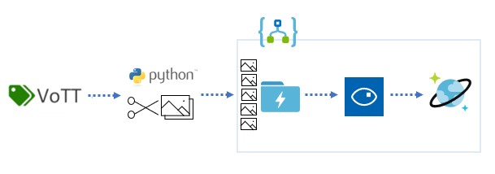

## Scenario : using VoTT + OpenCV + OCR API
<!-- TOC -->

- [Custom Extraction - Japanese](#custom-extraction---japanese)
  - [Scenario : using VoTT + OpenCV + OCR API](#scenario--using-vott--opencv--ocr-api)
    - [Step 1 : VoTT (Visual Object Tagging Tool)](#step-1--vott-visual-object-tagging-tool)
      - [Environment Setting](#environment-setting)
      - [Before you start: Create image of uncompleted form](#before-you-start-create-image-of-uncompleted-form)
      - [Create a new project](#create-a-new-project)
      - [Define the area with VoTT to input data](#define-the-area-with-vott-to-input-data)
        - [Tag Fragment Regions in VoTT](#tag-fragment-regions-in-vott)
      - [Save the VoTT Project](#save-the-vott-project)
      - [Export Regions and Extent from VoTT](#export-regions-and-extent-from-vott)
    - [Step 2 : Python script with OpenCV](#step-2--python-script-with-opencv)
      - [Prerequisite](#prerequisite)
      - [How to process images](#how-to-process-images)
    - [Step 3 : OCR API - for Printed Japanese characters](#step-3--ocr-api---for-printed-japanese-characters)
      - [Prerequisite](#prerequisite-1)
      - [Create a Logic App](#create-a-logic-app)
      - [Create a Blob Storage trigger](#create-a-blob-storage-trigger)
      - [Run the Logic App](#run-the-logic-app)

<!-- /TOC -->

### Step 1 : VoTT (Visual Object Tagging Tool)

The [Visual Object Tagging Tool](https://github.com/Microsoft/VoTT) is a form annotation tool originally developed for classifying images for machine learning. It provides an interface for defining and tagging regions on an image. The following are the steps to define a new form with VoTT.

#### Environment Setting

*This step only needs to be done once*

VoTT requires [NodeJS (>= 10.x, Dubnium) and NPM](https://github.com/nodejs/Release)

   ```bash
    git clone https://github.com/Microsoft/VoTT.git
    cd VoTT
    npm ci
    npm start
   ```
   > **IMPORTANT**
   >
   > When running locally with `npm`, both the electron and the browser versions of the application will start. One major difference is that the electron version can access the local file system.

#### Before you start: Create image of uncompleted form

To create an image of an uncompleted form:

1. Open the form in Excel
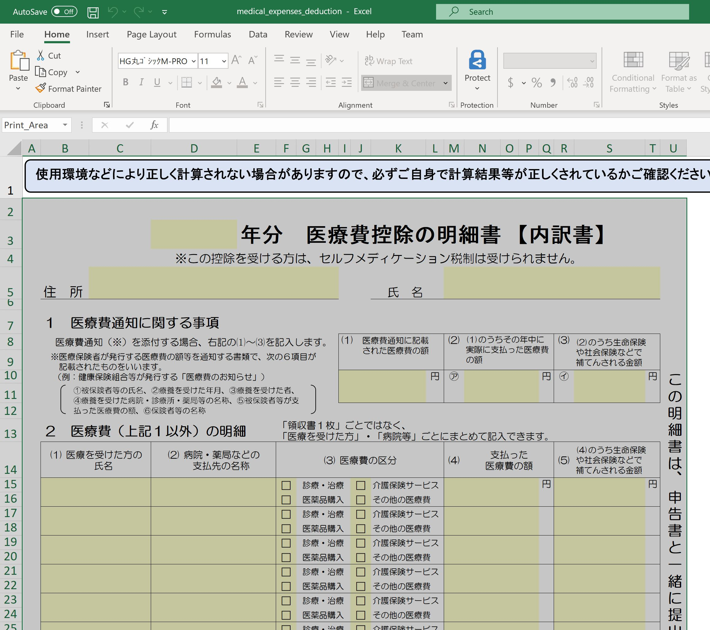

2. Export the form as a PDF
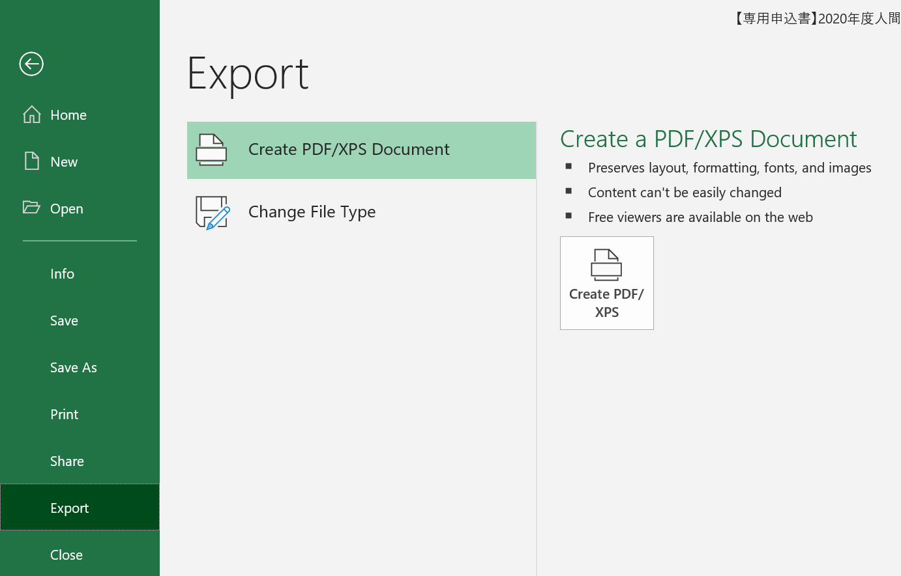

3. Convert the PDF to an image (jpg or png)

    - Use an image conversion tool:
      - [PDF Miner](https://github.com/pdfminer/pdfminer.six)
      - [PDF Focus](https://sautinsoft.com/products/pdf-focus/)
      - [ImageMagick](https://imagemagick.org/index.php)
  or
    - Open the PDF and use a screen snipping tool to capture an image
    *Note:* this is generally sufficient for the precision required

#### Create a new project

Enter the project name (display name).（e.g. 医療費控除明細書）
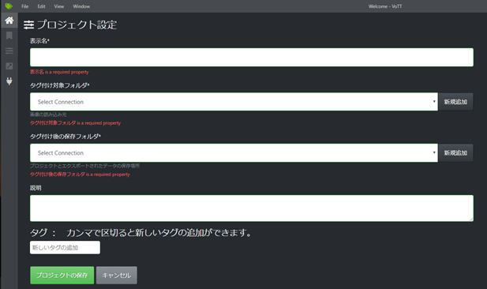

Click the Add button to specify and create a tagging target folder (a folder with images prepared in advance) and a destination folder after tagging.

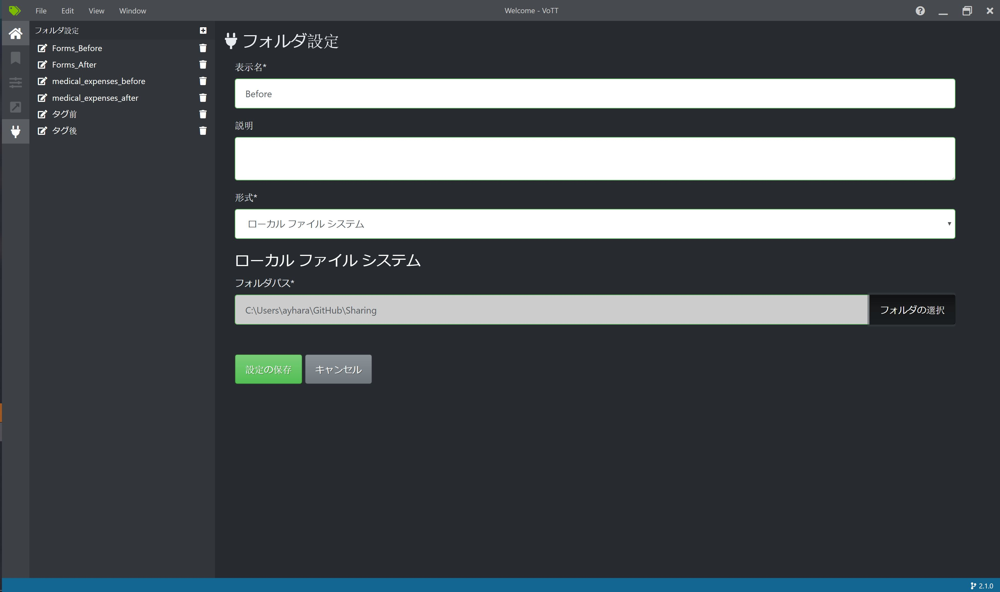

When you specify the folder path to save and save the settings, they will be displayed in the selection list of the tagging target folder and the tagging storage folder.

#### Define the area with VoTT to input data

*This step only needs to be done once*

Tags can be added incrementally or by an administrator.

To add a field that is not in the list, click the add tag button:

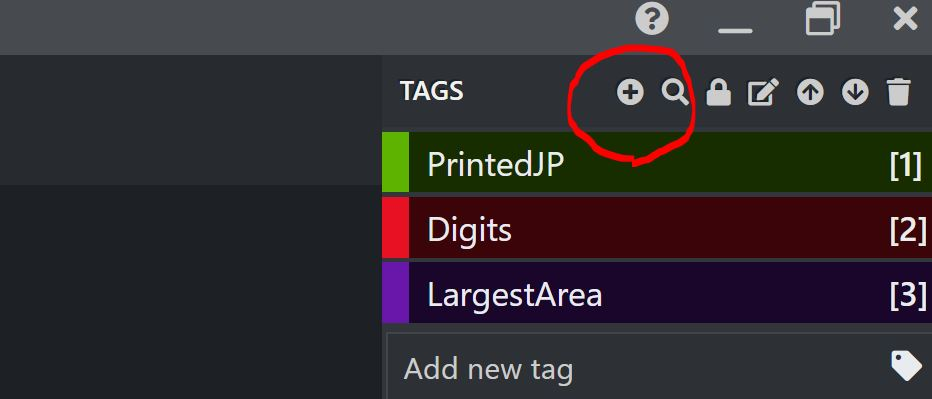

In the `Add new tag` field, enter a name for the tag:

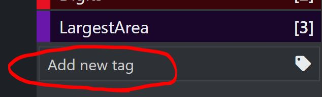

**<span style="color:red">Tag "Extent" in VoTT</span>**

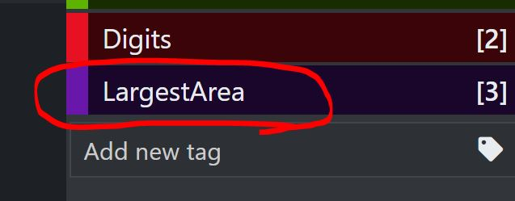

##### Tag Fragment Regions in VoTT

For each fragment that this form contains:

1. Create a region on the form by clicking and dragging from one corner of the fragment to the opposite corner
1. With that region selected, click the appropriate tag from the list of tags on the right of the screen


**<span style="color:red">Important: Apply "LargestArea" tag to the largest area in the form</span>**

Drag a region the starts on the top-left rectification mark and finishes on the bottom-right rectification mark. Select the "LargestArea" tag from the list of tags on the right of the screen.

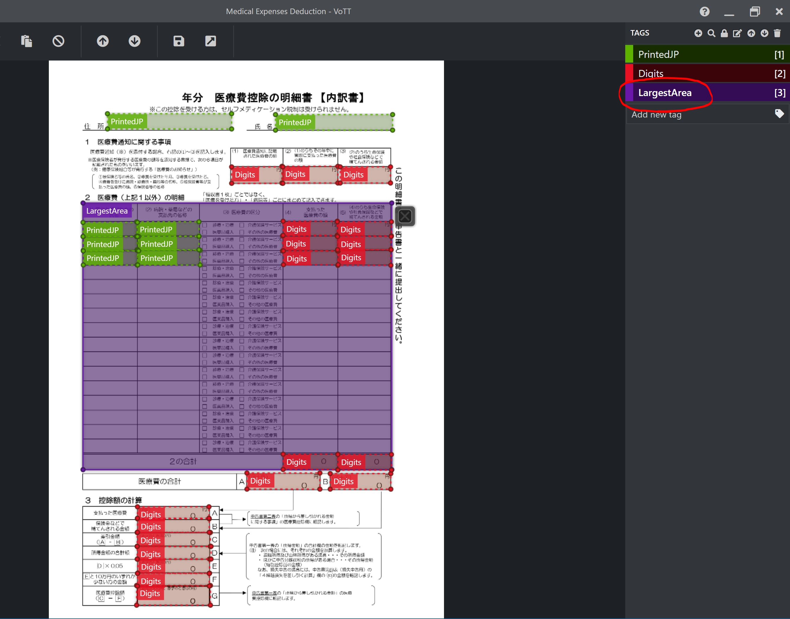

This "LargestArea" will be used to calculate the position of the fields from the step before relative to those marks, rather than to the full size of the form.

#### Save the VoTT Project
Click the Save button in VoTT to save the project. This makes repeating or correcting the export procedure much quicker.

#### Export Regions and Extent from VoTT

In VoTT, click the Export button - this will create a `json` file with all of the fragment locations and dimensions defined along with a field tag for each.

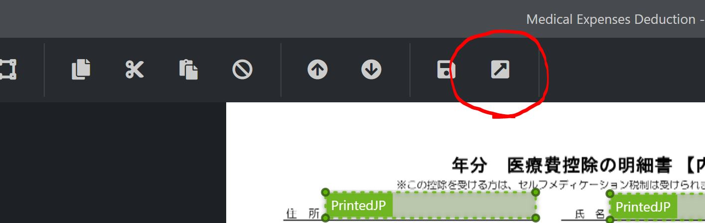

### Step 2 : Python script with OpenCV

#### Prerequisite
1. Create Azure Data Lake Storage Gen2 to store fragment images (e.g. dlsjpform001) and application images* (e.g. dlsjpform002). *application image: actual form image which you want to extract text from.
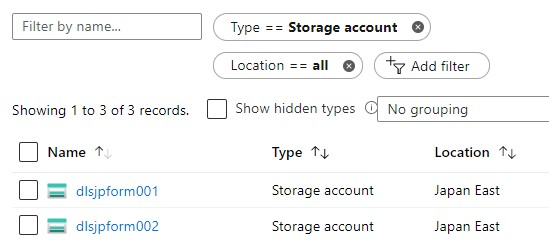

2. Create blobs to store fragment images of printed Japanese (e.g. dlsjpform001/fragments-all/PrintedJP) and digits (e.g. dlsjpform001/fragments-all/Digits).
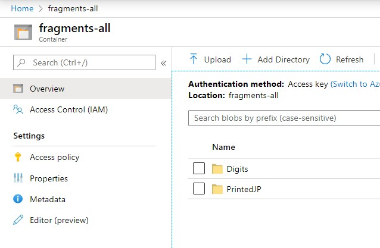

3. Create a blob to store application images (e.g. dlsjpform002/medicalexpense).
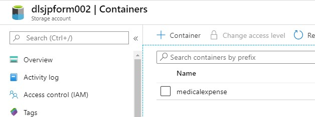

4. Set the variables in Python script  - storage account names, storage access keys, container names, and vott json info (lastVisitedAssetId and path).

#### How to process images

1. Connect to Azure Data Lake Storage Gen2 `[storage account name - application images]/[container name - before processed  (e.g. medicalexpense)]` and retrieve single image (application) which is passed as a command-line argument.
1. Find the largest area on the image and get the contours, width, height, and angle.
1. Image rectification with angle of rotation.
1. After image rectification, re-find the largest area on the image and get the contours, width, height, and angle.
1. Pass storage path and get back FormDetails (LargestArea, field list etc) from VoTT json file.
1. Cut field fragments based on coordinates (from step 5.)
1. Save fragments to Azure Data Lake Storage Gen2 `[storage account name - fragment images]/[container name (e.g. fragments-all)]`<br>
**Make sure here that there are fragment images based on all fields of the form image (Application). If not, start over from the first stap of creating fragments.**

- Approach : Azure Blob storage client library v12 SDK for Python
Saving all fragment images correctly is confirmed by receiving callback for progress with signature function(current, total) where current is the number of bytes transfered so far and the number must be reach the total size of each fragment image. The number of saved fragment images must be equal to the number of fields.<br>

### Step 3 : OCR API - for Printed Japanese characters

#### Prerequisite
1. Create an Azure Cosmos DB account (e.g. cosmos-fragments-all).
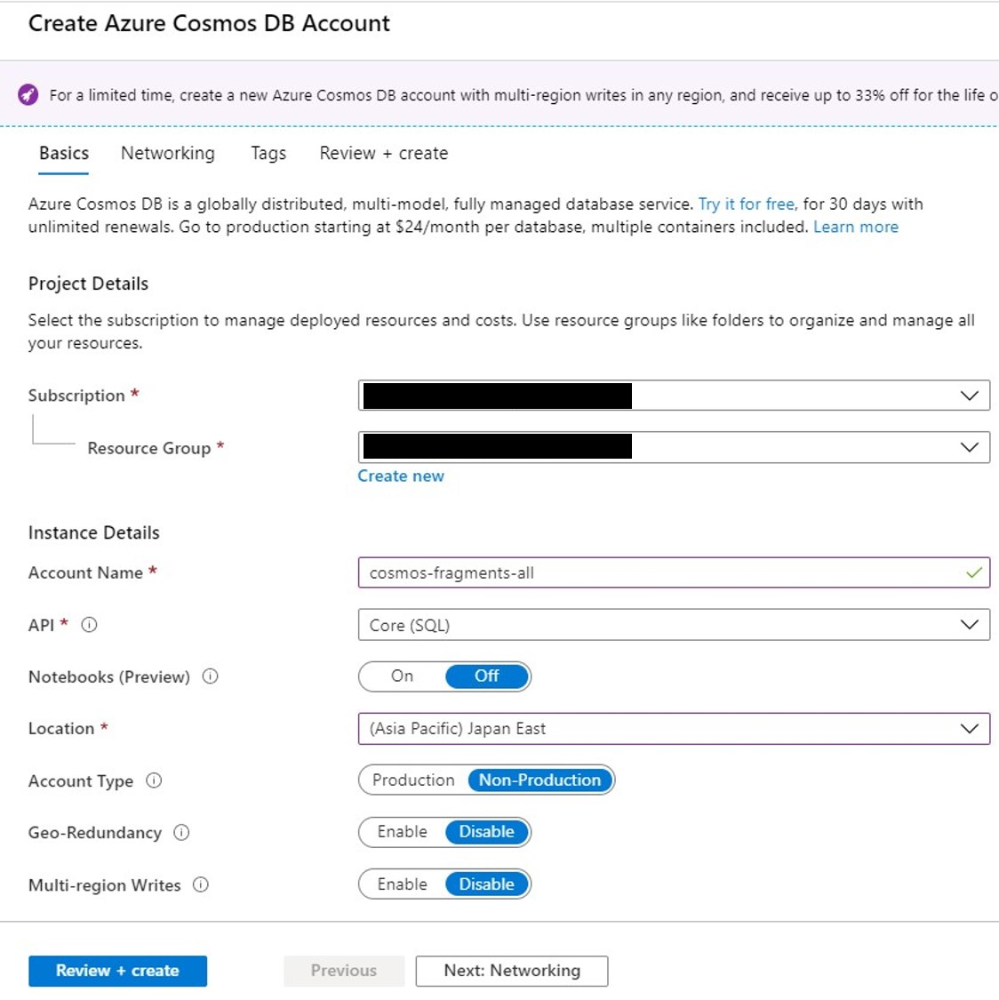

2. Select Data Explorer from the left navigation on the Cosmos DB account page, and then add New Container.
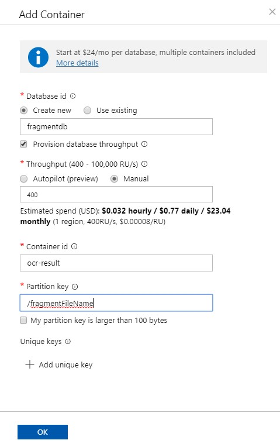

#### Create a Logic App
1. On the Azure Portal, create a Logic App.
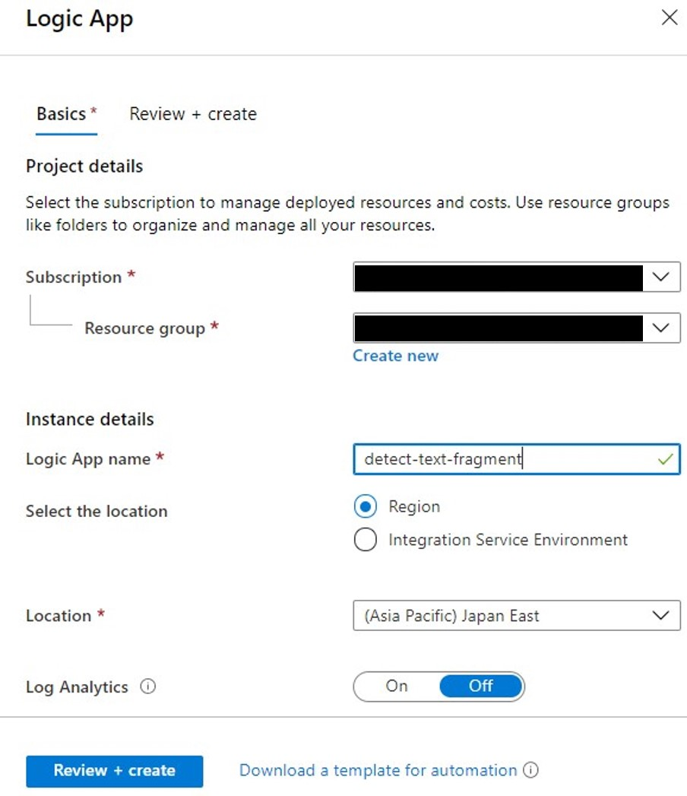

2. Select "Edit"
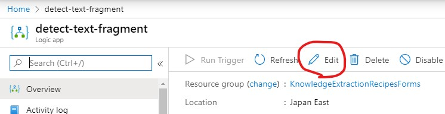


3. Select "Blank Logic App" on Logic Apps Designer
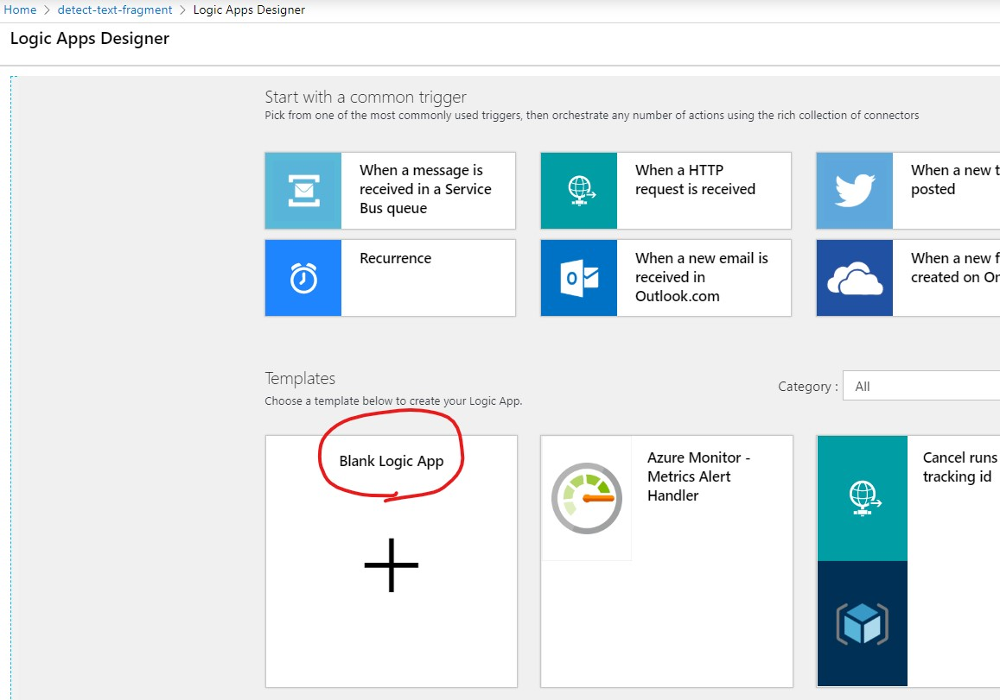

#### Create a Blob Storage trigger
1. Select "When a blob is added or modified (properties only)" as 1st step on Logic Apps Designer and set the container which fragment images (printed Japanese) are stored.
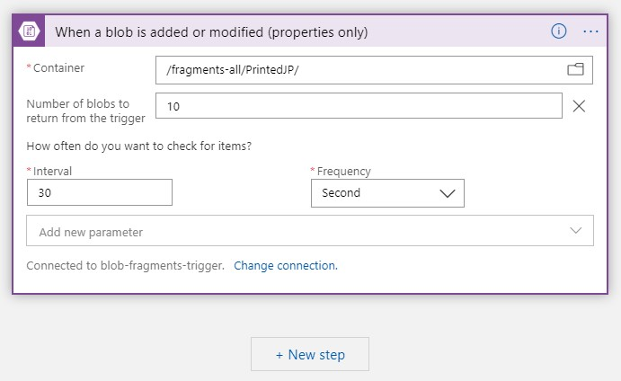

2. Select "Get blob content using path" as 2nd step on Logic Apps Designer and set the blob path.
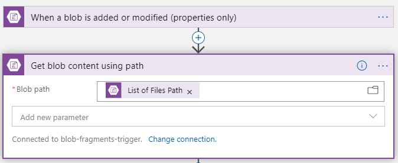

3. Select "Optical Character Recognition (OCR) to Text" as 3rd step on Logic Apps Designer and set the image source and content.
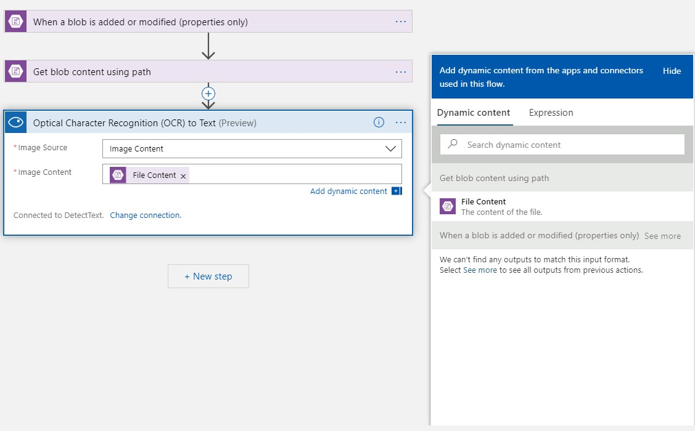

4. Select "Create or update document" as 4th step on Logic Apps Designer. Fistly set Connection Name and select the DocumentDB Account (e.g. cosmos-fragments) created in advance. Next, set the Database ID (e.g.fragmentdb), Collection ID (e.g. ocr-result), Document, and Partition key value.
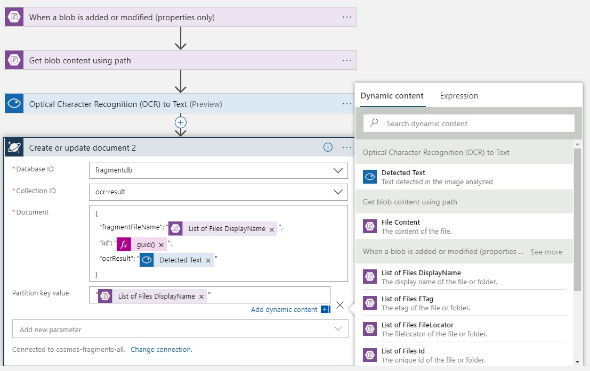

5. Click "Save" at the top left of Logic Apps Designerand. Now it's ready to run the Logic App!

#### Run the Logic App
1. Run the python script to make fragment images.

2. Start running the Logic App once the fragment images are coming to blob.

3. Store the output in Cosmos DB. You can see the output which is extracted with OCR!
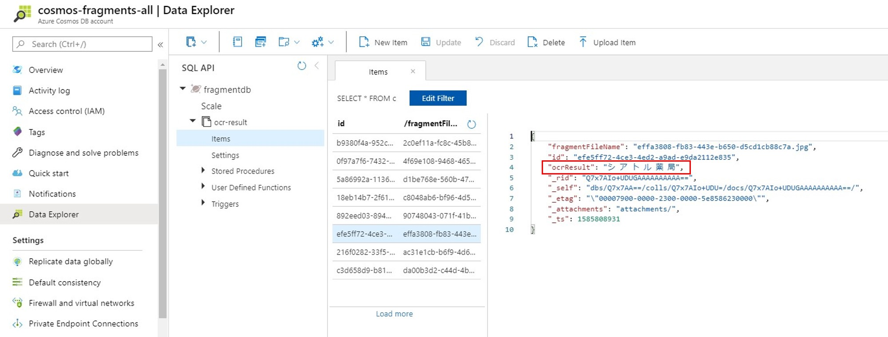
