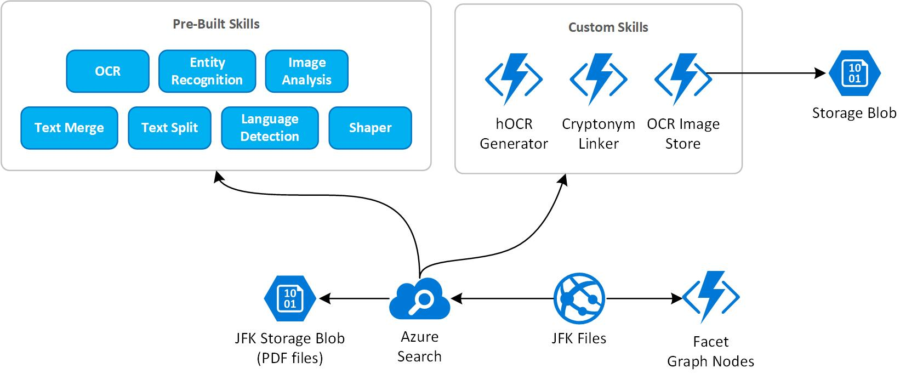

# JFK Files

The [JFK Files](https://github.com/microsoft/AzureSearch_JFK_Files) project is an accelerator for scenarios that require **document processing + knowledge extraction** using [Cognitive Search](https://docs.microsoft.com/en-us/azure/search/cognitive-search-concept-intro) (built-in and custom skills) features of Azure Search. 

In this sample you will explore the JFK Assassination files through an interactive web application. You can watch the demo in action in a short [online video](https://channel9.msdn.com/Shows/AI-Show/Using-Cognitive-Search-to-Understand-the-JFK-Documents) or explore the JFK files yourself with the [online demo](https://jfk-demo.azurewebsites.net/#/).

> Note: The JFK Files project has been tested on Azure Search version 2019-05-06.

## Architecture Overview

- The Azure Search ingests data from an Azure Blob Storage that contains JFK assassination files in PDF format (all files are open sourced [here](https://www.archives.gov/research/jfk/release)).
- Cognitive Search features of Azure Search are composed by built-in and custom skills.
- A front-end application integrates with Azure Search to run search queries, as well as render images and metadata based on query results.

## Prerequisites

- Install [Node.js](https://nodejs.org/en/download/)
- Install [Visual Studio](https://visualstudio.microsoft.com/downloads/) 2017 or later with [Azure Developer Tools](https://azure.microsoft.com/en-us/tools/)

## Project structure

The JFK sample contains the following projects:

| Project | Description |
|---------|-------------|
| JfkInitializer | C# console app that creates an Azure Blob Storage, Azure Search objects (e.g. dataset, skillset, index, indexers) and deploys the front end application to Azure Web App. A detailed documentation can be found [here](./docs/jfk-initializer.md).|
| JfkWebApiSkills | A set of HTTP Trigger Azure Functions (C#) used as Azure Search custom skills (Web APIs). A detailed documentation can be found [here](./docs/jfk-webapi-skills.md).|
| frontend | A front-end application (built with Node.js, TypeScript and React) used to search and view JFK documents. A detailed documentation can be found [here](./docs/frontend.md).|

## Customize the JFK Files

If you have testes the JFK Files and would like to customize the project (e.g. add your own documents, update the Azure Search skillset, improve the front-end application), follow the instructions on [Customize the JFK Files](./docs/customize-jfk-files.md).
