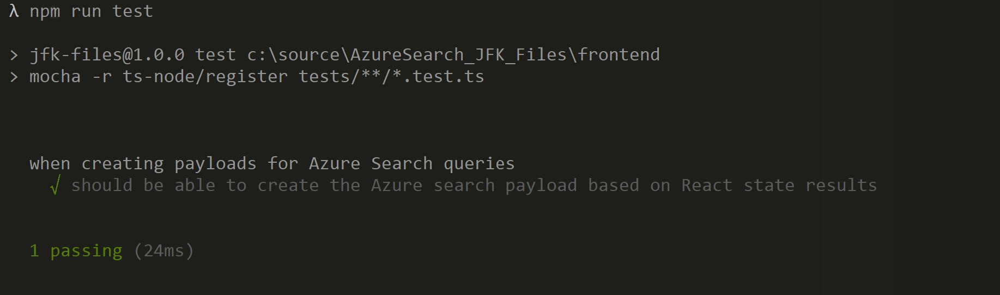

# Customize the JFK Files

You deployed the JFK sample to test document processing and knowledge extraction using Cognitive Search features of Azure Search. Now you want to customize the web app for your needs. This section will guide you to some examples on how to customize the JFK Files.

## Processing your own documents

If you would like to process your own documents instead of the JFK Assassination documents, you have to point your Azure Search to another data source. Assuming you already have a Blob Storage and a container with your documents, open the `JfkWebApiSkills/JfkInitializer` project on Visual Studio and update the following values on `App.config`:

```csharp
<!--Location of sample JFK file documents that we are providing to you.-->
<add key="JFKFilesBlobStorageAccountConnectionString" value="<BLOB_CONN_STRING>" />
<add key="JFKFilesBlobContainerName" value="<CONTAINER_NAME>" />
```

> **Note:**  If you would like to change the name of `JFKFilesBlobStorageAccountConnectionString` and `JFKFilesBlobContainerName` keys, make sure to update the key names on `SearchResources.cs` file.

Then run the `JfkInitializer` project to index your Azure Search based on the new data source.

## Add your own skillset to Azure Search

Pre-built and custom skills are added programmatically as a skillset schema on `JfkWebApiSkills/JfkInitializer/SearchResources.cs` file, on `GetSkillset` method.

For example, if you want to include a new custom skill (e.g. an Azure Function) to do a specific document processing, you can add a new `WebApiSkill` object on the `Skills` property:

```csharp
new WebApiSkill()
{
  Description = "My custom skill description",
  Context = "/document",
  Uri = "<FUNCTION_URI>",
  BatchSize = 1,
  Inputs = new List<InputFieldMappingEntry>(),
  Outputs = new List<OutputFieldMappingEntry>()
},
```

Then run the `JfkInitializer` project to update the Azure Search skillset.

## Adding unit tests

In this section we are going to create a simple unit test to validate an Azure Search payload using [Mocha](https://github.com/mochajs/mocha) as our test framework and [Chai](https://github.com/chaijs/chai) for BDD/TDD assertion. 

Access the `frontend` folder that contains the JFK Files web app and install these new dependencies:

```sh
npm install mocha chai ts-node @types/mocha @types/chai --save-dev
```

Update your `packages.json` to add the `test` script:

```json
"scripts": {
    "start": "env-cmd .env if-env NODE_ENV=production && npm run start:prod || npm run start:dev",
    "start:dev": "env-cmd .env cross-env NODE_ENV=development webpack-dev-server --config=webpack.dev.config.js",
    "start:prod": "env-cmd .env cross-env NODE_ENV=production node server",
    "clean": "rimraf dist",
    "build": "env-cmd .env if-env NODE_ENV=production && npm run build:prod || npm run build:dev",
    "build:dev": "npm run clean && env-cmd .env cross-env NODE_ENV=development webpack --config=webpack.dev.config.js",
    "build:prod": "npm run clean && env-cmd .env cross-env NODE_ENV=production webpack -p --config=webpack.prod.config.js",
    "test": "mocha -r ts-node/register tests/**/*.test.ts"
  }
```

Update the `tsconfig.json` to compile modules as `commonjs`:

```json
{
  "compilerOptions": {
    "target": "es6",
    "module": "commonjs",
    "moduleResolution": "node",
    "declaration": false,
    "noImplicitAny": false,
    "jsx": "react",
    "sourceMap": true,
    "noLib": false,
    "suppressImplicitAnyIndexErrors": true,
    "skipLibCheck": true
  },
  "compileOnSave": false,
  "exclude": [
    "node_modules"
  ]
}
```

Now open the project on your favorite text editor (e.g VS Code), create a `tests` folder, then create a `search.payload.test.ts` file. Therefore the path should be `frontend/tests/search.payload.test.ts`.


```ts

import { State } from "../src/pages/search-page/view-model";
import { jfkServiceConfig } from "../src/pages/search-page/service/jfk";
import { AzPayload } from "../src/az-api";
import { expect } from "chai";

describe("when creating payloads for Azure Search queries", () => {
    it("should be able to create the Azure search payload based on React state results", () => {
        const state: State = {
            searchValue: "hello",
            itemCollection: null,
            activeSearch: null,
            targetWords: null,
            facetCollection: null,
            filterCollection: null,
            suggestionCollection: null,
            resultCount: 0,
            showDrawer: false,
            resultViewMode: null,
            loading: false,
            pageSize: 0,
            pageIndex: 0,
            pulseToggle: null,
            lastPageIndexReached: false,
        };

        const payload: AzPayload = jfkServiceConfig.searchConfig.mapStateToPayload(state, jfkServiceConfig);

        expect(payload.search).to.equal("hello");
    })
});
```

Then run your test:

```sh
npm run test
```

It's expected to have a result similar to this:




> Note: If you would like to test React components, follow the guidelines described on [Testing Recipes](https://reactjs.org/docs/testing-recipes.html#data-fetching).
