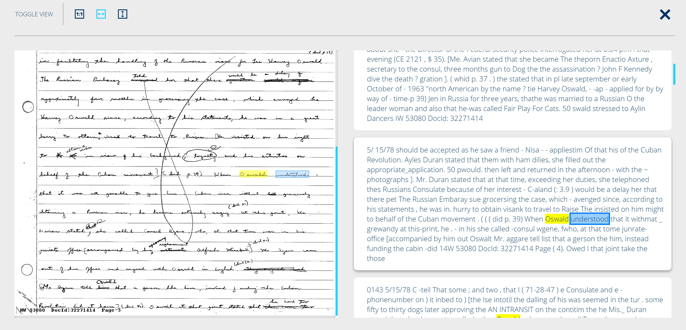

# hOCR Generation

hOCR is an open standard of data representation for formatted text obtained from OCR. The definition encodes text, style, layout information, recognition confidence metrics and other information in XHTML format.

The following example is an hOCR extraction:

```html
<span class='ocr_line' title="bbox 348 797 1482 838; baseline -0.009 -6">
    <span class='ocrx_word' title='bbox 348 805 402 832; x_wconf 93'>Die</span> 
    <span class='ocrx_word' title='bbox 421 804 697 832; x_wconf 90'>Darlehenssumme</span> 
    <span class='ocrx_word' title='bbox 717 803 755 831; x_wconf 96'>ist</span> 
    <span class='ocrx_word' title='bbox 773 803 802 831; x_wconf 96'>in</span> 
    <span class='ocrx_word' title='bbox 821 803 917 830; x_wconf 96'>ihrem</span>
</span>
```

## hOCR in the JFK Files context

The interactive experience we have on JFK Files web app where we can map a word extracted from OCR with its position on the original document is only possible because of hOCR.



But how the web app renders the bounding box of each extracted word?

1. A Web API custom skill called `hOCR Generator` (built as a C#Azure Function) is attached to the Cognitive Search skillset. This custom skill reads the text extracted from OCR, converts the text to hOCR format and save the converted text as a metadata on Azure Search.

2. The web app runs a search query on Azure Search, reads the `metadata` JSON property that contains the hOCR result in XHTML and renders the result in a container.
