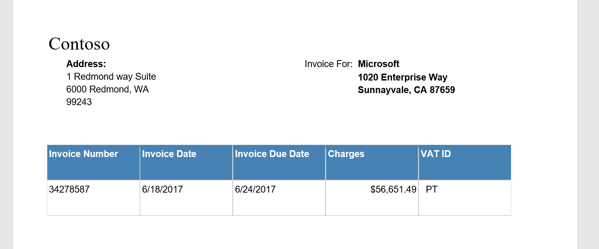
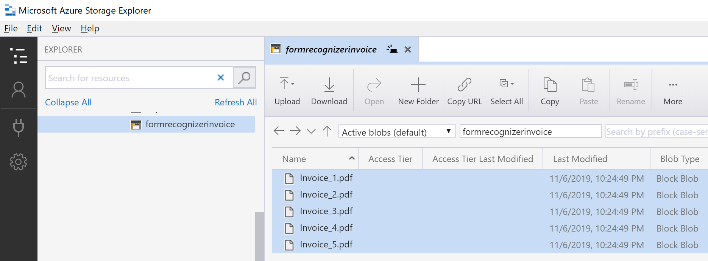

# Invoices

Invoice recognition with Form Recognizer

[Form Recognizer](https://azure.microsoft.com/en-gb/services/cognitive-services/form-recognizer/) is a preview API to help extract data from digital printed forms, input form documents must be one of the supported content types - JPEG, PNG, or PDF formats.

Form Recognizer applies advanced machine learning to accurately extract text, key/value pairs, and tables from documents.  

Form Recognizer extracts key value pairs and tables from documents and includes the following options:

- **Custom** - Extracts information from forms (PDFs and images) into structured data based on a model created by a set of representative training forms. Form Recognizer learns the structure of your forms to intelligently extract text and data. It ingests text from forms, applies machine learning technology to identify keys and tables, and then outputs structured data that includes the relationships within the original file.
- **Prebuilt Receipt** - Detects and extracts data from receipts using optical character recognition (OCR) and our receipt model, enabling you to easily extract structured data from receipts such as merchant name, merchant phone number, transaction date, transaction total, and more.

There's a great documentation to train your form template and use to extract data.

[Quickstart: Train a Form Recognizer model and extract form data by using the REST API with Python](https://docs.microsoft.com/en-us/azure/cognitive-services/form-recognizer/quickstarts/python-train-extract)

Let's use this QuickStart document to extract information from our Sample Invoice dataset.

## How to extract info from an Invoice



Let's use above some invoice samples like above to train a form model. You can use [sample dataset](sample_data.zip) to train.

## Train an Invoice Form Recognizer model

First, you'll need a set of training data in an Azure Storage blob container. You should have a minimum of five filled-in forms (PDF documents and/or images) of the same type/structure as your main input data. Or, you can use a single empty form with two filled-in forms. The empty form's file name needs to include the word "empty." See [Build a training data set for a custom model](https://docs.microsoft.com/en-us/azure/cognitive-services/form-recognizer/build-training-data-set) for tips and options for putting together your training data.

To train a Form Recognizer model with the documents in your Azure blob container, call the **Train** API by running the following python code. Before you run the code, make these changes:

1. Replace  <Endpoint>  with the endpoint URL for your Form Recognizer resource.
2. Replace  <Subscription key>  with the subscription key you copied from the previous step.
3. Replace  <SAS URL>  with the Azure Blob storage container's shared access signature (SAS) URL. To retrieve the SAS URL, open the Microsoft Azure Storage Explorer, right-click your container, and select **Get shared access signature**. Make sure the **Read** and **List** permissions are checked, and click **Create**. Then copy the value in the **URL** section. It should have the form:  `https://<storage account>.blob.core.windows.net/<container name>?<SAS value>`.



```python
  ########### Python Form Recognizer Train #############
  from requests import post as http_post
  # Endpoint URL
  base_url = r"<Endpoint>" + "/formrecognizer/v1.0-preview/custom"
  source = r"<SAS URL>"
  headers = {
      # Request headers
      'Content-Type': 'application/json',
      'Ocp-Apim-Subscription-Key': '<Subscription Key>',
  }
  url = base_url + "/train"  
  body = {"source": source}
  try:
      resp = http_post(url = url, json = body, headers = headers)
      print("Response status code: %d" % resp.status_code)
      print("Response body: %s" % resp.json())
  except Exception as e:
      print(str(e))
```

4. Save the code in a file with a .py extension. For example, *form-recognize-train.py*.
5. Open a command prompt window.
6. At the prompt, use the `python` command to run the sample. For example, `python form-recognize-train.py`.

 You'll receive a `200 (Success)` response with this JSON output will be like below.

```json
{
  "modelId": "59e2185e-ab80-4640-aebc-f3653442617b",
  "trainingDocuments": [
    {
      "documentName": "Invoice_1.pdf",
      "pages": 1,
      "errors": [],
      "status": "success"
    },
    {
      "documentName": "Invoice_2.pdf",
      "pages": 1,
      "errors": [],
      "status": "success"
    },
    {
      "documentName": "Invoice_3.pdf",
      "pages": 1,
      "errors": [],
      "status": "success"
    },
    {
      "documentName": "Invoice_4.pdf",
      "pages": 1,
      "errors": [],
      "status": "success"
    },
    {
      "documentName": "Invoice_5.pdf",
      "pages": 1,
      "errors": [],
      "status": "success"
    }
  ],
  "errors": []
}
```

## Extract key-value pairs and tables from forms

Next, you'll analyze a document and extract key-value pairs and tables from it. Call the **Model - Analyze** API by running the Python script that follows. Before you run the command, make these changes:

1. Replace <Endpoint> with the endpoint that you obtained with your Form Recognizer subscription.
2. Replace  <path to your form>  with the file path of your form (for example, C:\temp\file.pdf). For this quickstart, you can use the files under the **Test** folder of the [sample data set](https://go.microsoft.com/fwlink/?linkid=2090451).
3. Replace <modelID>  with the model ID you received in the previous section.
4. Replace  <file type>  with the file type. Supported types: `application/pdf`, `image/jpeg`, `image/png`.
5. Replace  <subscription key>  with your subscription key.

```python
########### Python Form Recognizer Analyze #############
from requests import post as http_post

# Endpoint URL
base_url = r"<Endpoint>" + "/formrecognizer/v1.0-preview/custom"
file_path = r"<path to your form>"
model_id = "<modelID>"
headers = {
    # Request headers
    'Content-Type': '<file type>',
    'Ocp-Apim-Subscription-Key': '<subscription key>',
}

try:
    url = base_url + "/models/" + model_id + "/analyze"
    with open(file_path, "rb") as f:
        data_bytes = f.read()  
    resp = http_post(url = url, data = data_bytes, headers = headers)
    print("Response status code: %d" % resp.status_code)
    print("Response body:\n%s" % resp.json())
except Exception as e:
    print(str(e))
```

4. Save the code in a file with a .py extension. For example, *form-recognize-analyze.py*.
5. Open a command prompt window.
6. At the prompt, use the `python` command to run the sample. For example, `python form-recognize-analyze.py`.

Test result will be like below

```json
{'status': 'success', 'pages': [
        {'number': 1, 'height': 792, 'width': 612, 'clusterId': 0, 'keyValuePairs': [
                {'key': [
                        {'text': 'Address:', 'boundingBox': [
                                57.4,
                                683.1,
                                100.5,
                                683.1,
                                100.5,
                                673.7,
                                57.4,
                                673.7
                            ]
                        }
                    ], 'value': [
                        {'text': '1 Redmond way Suite', 'boundingBox': [
                                57.4,
                                671.3,
                                154.8,
                                671.3,
                                154.8,
                                659.2,
                                57.4,
                                659.2
                            ], 'confidence': 0.86
                        },
                        {'text': '6000 Redmond, WA', 'boundingBox': [
                                57.4,
                                657.1,
                                146.9,
                                657.1,
                                146.9,
                                645.5,
                                57.4,
                                645.5
                            ], 'confidence': 0.86
                        },
                        {'text': '99243', 'boundingBox': [
                                57.4,
                                643.4,
                                85.0,
                                643.4,
                                85.0,
                                632.3,
                                57.4,
                                632.3
                            ], 'confidence': 0.86
                        }
                    ]
                },
                {'key': [
                        {'text': 'Invoice For:', 'boundingBox': [
                                316.1,
                                683.1,
                                368.2,
                                683.1,
                                368.2,
                                673.7,
                                316.1,
                                673.7
                            ]
                        }
                    ], 'value': [
                        {'text': 'Microsoft', 'boundingBox': [
                                374.0,
                                687.9,
                                418.8,
                                687.9,
                                418.8,
                                673.7,
                                374.0,
                                673.7
                            ], 'confidence': 1.0
                        },
                        {'text': '1020 Enterprise Way', 'boundingBox': [
                                373.9,
                                673.5,
                                471.3,
                                673.5,
                                471.3,
                                659.2,
                                373.9,
                                659.2
                            ], 'confidence': 1.0
                        },
                        {'text': 'Sunnayvale, CA 87659', 'boundingBox': [
                                373.8,
                                659.0,
                                479.4,
                                659.0,
                                479.4,
                                645.5,
                                373.8,
                                645.5
                            ], 'confidence': 1.0
                        }
                    ]
                },
                {'key': [
                        {'text': '__Tokens__', 'boundingBox': [
                                0.0,
                                0.0,
                                0.0,
                                0.0,
                                0.0,
                                0.0,
                                0.0,
                                0.0
                            ]
                        }
                    ], 'value': [
                        {'text': 'Contoso', 'boundingBox': [
                                38.0,
                                715.7,
                                104.9,
                                715.7,
                                104.9,
                                688.7,
                                38.0,
                                688.7
                            ], 'confidence': 0.53
                        }
                    ]
                }
            ], 'tables': [
                {'id': 'table_0', 'columns': [
                        {'header': [
                                {'text': 'Invoice Number', 'boundingBox': [
                                        38.5,
                                        585.2,
                                        113.4,
                                        585.2,
                                        113.4,
                                        575.8,
                                        38.5,
                                        575.8
                                    ]
                                }
                            ], 'entries': [
                                [
                                    {'text': '34278587', 'boundingBox': [
                                            38.5,
                                            547.3,
                                            82.8,
                                            547.3,
                                            82.8,
                                            537.0,
                                            38.5,
                                            537.0
                                        ], 'confidence': 1.0
                                    }
                                ]
                            ]
                        },
                        {'header': [
                                {'text': 'Invoice Date', 'boundingBox': [
                                        139.7,
                                        585.2,
                                        198.5,
                                        585.2,
                                        198.5,
                                        575.8,
                                        139.7,
                                        575.8
                                    ]
                                }
                            ], 'entries': [
                                [
                                    {'text': '6/18/2017', 'boundingBox': [
                                            139.7,
                                            546.8,
                                            184.0,
                                            546.8,
                                            184.0,
                                            537.0,
                                            139.7,
                                            537.0
                                        ], 'confidence': 1.0
                                    }
                                ]
                            ]
                        },
                        {'header': [
                                {'text': 'Invoice Due Date', 'boundingBox': [
                                        240.5,
                                        585.2,
                                        321.0,
                                        585.2,
                                        321.0,
                                        575.8,
                                        240.5,
                                        575.8
                                    ]
                                }
                            ], 'entries': [
                                [
                                    {'text': '6/24/2017', 'boundingBox': [
                                            240.5,
                                            546.8,
                                            284.8,
                                            546.8,
                                            284.8,
                                            537.0,
                                            240.5,
                                            537.0
                                        ], 'confidence': 1.0
                                    }
                                ]
                            ]
                        },
                        {'header': [
                                {'text': 'Charges', 'boundingBox': [
                                        341.3,
                                        585.2,
                                        381.2,
                                        585.2,
                                        381.2,
                                        575.8,
                                        341.3,
                                        575.8
                                    ]
                                }
                            ], 'entries': [
                                [
                                    {'text': '$56,
                                        651.49', 'boundingBox': [
                                            387.6,
                                            546.4,
                                            437.5,
                                            546.4,
                                            437.5,
                                            537.0,
                                            387.6,
                                            537.0
                                        ], 'confidence': 1.0
                                    }
                                ]
                            ]
                        },
                        {'header': [
                                {'text': 'VAT ID', 'boundingBox': [
                                        442.1,
                                        590.0,
                                        474.8,
                                        590.0,
                                        474.8,
                                        575.8,
                                        442.1,
                                        575.8
                                    ]
                                }
                            ], 'entries': [
                                [
                                    {'text': 'PT', 'boundingBox': [
                                            447.7,
                                            550.6,
                                            460.4,
                                            550.6,
                                            460.4,
                                            537.0,
                                            447.7,
                                            537.0
                                        ], 'confidence': 1.0
                                    }
                                ]
                            ]
                        }
                    ]
                }
            ]
        }
    ], 'errors': []
}
```

## In Summary

The Forms Recognizer is a very powerful new API which is able to extract meaningful information from documents and receipts.

The fact that the Form Recognizer API also gives you the OCR results as well as the specially recognized data points means that you can add logic to extract additional information as required.

## Further Reading

You may find these resources useful.

- [Cognitive Services Form Recognizer Product Page](https://azure.microsoft.com/en-us/services/cognitive-services/form-recognizer/)
- [Microsoft Azure Docs > Forms Recognizer Overview](https://docs.microsoft.com/en-us/azure/cognitive-services/form-recognizer/overview)
- [Microsoft Azure Docs > Quickstart: Train a Form Recognizer model and extract form data by using the REST API with cURL](https://docs.microsoft.com/en-us/azure/cognitive-services/form-recognizer/quickstarts/curl-train-extract)
- [Microsoft Azure Docs > Quickstart: Train a Form Recognizer model and extract form data by using the REST API with Python](https://docs.microsoft.com/en-us/azure/cognitive-services/form-recognizer/quickstarts/python-train-extract)
- [Form Recognizer API reference](https://westus2.dev.cognitive.microsoft.com/docs/services/form-recognizer-api/operations/AnalyzeWithCustomModel)
