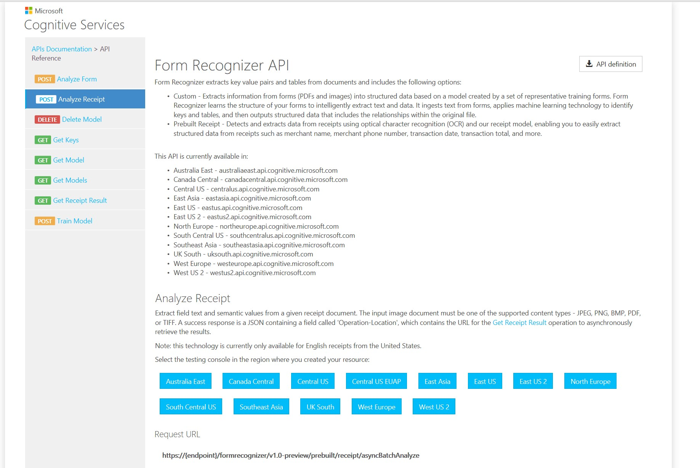
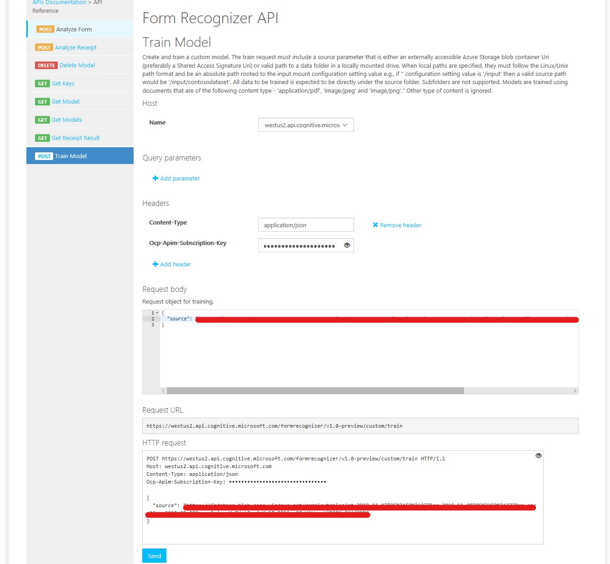
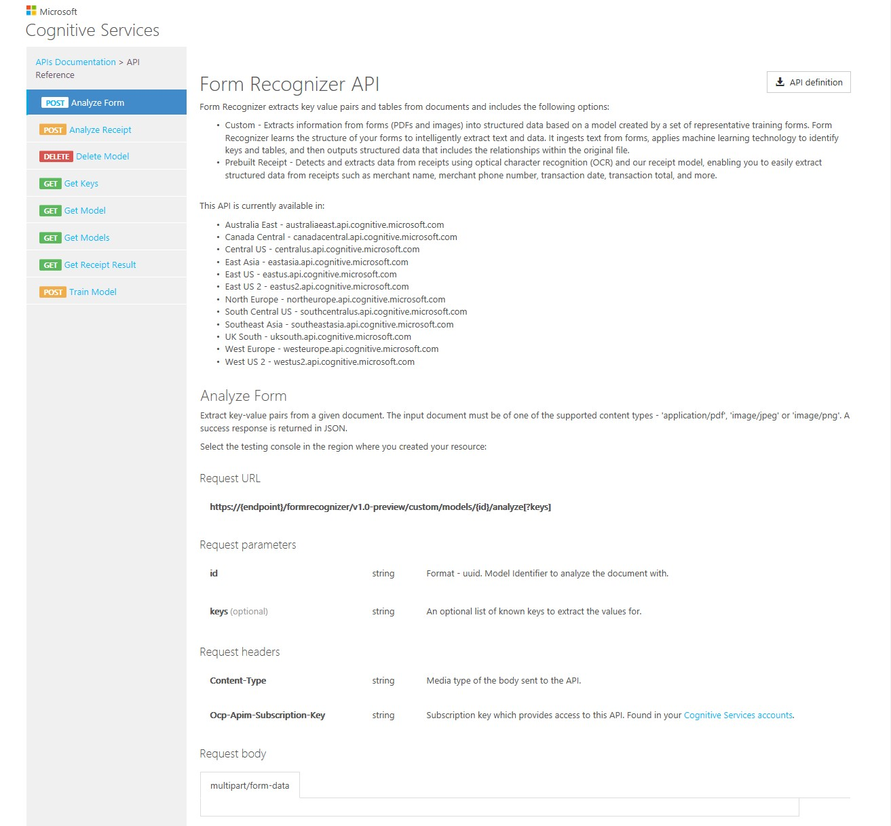
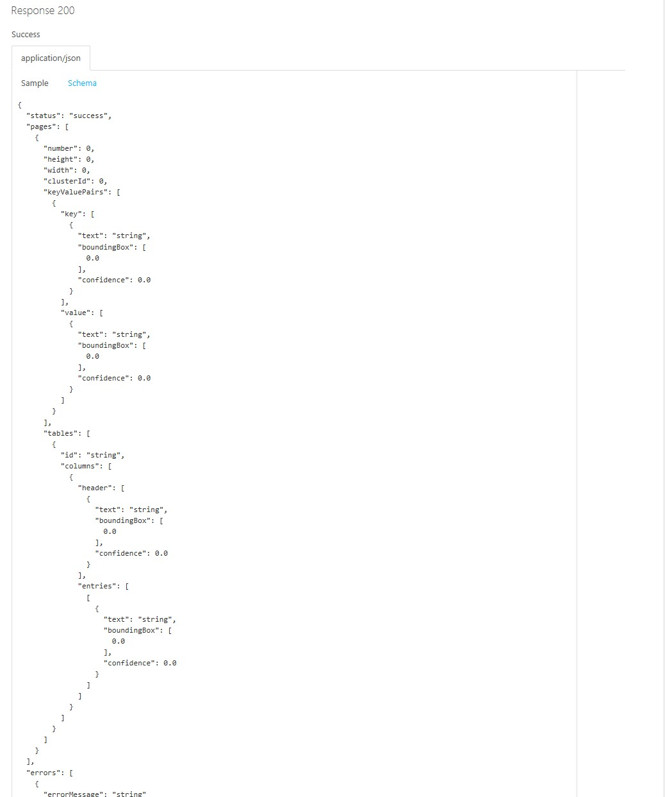
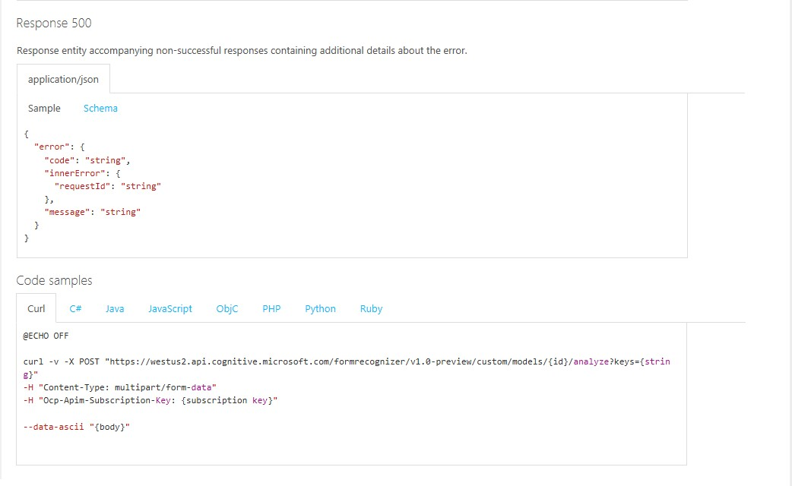
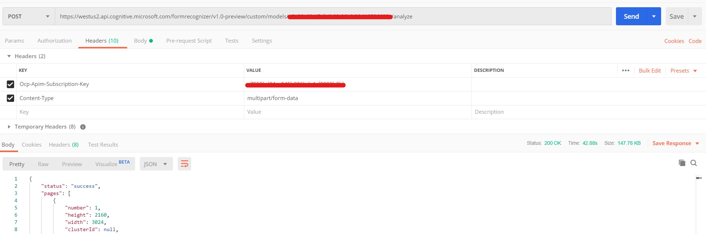
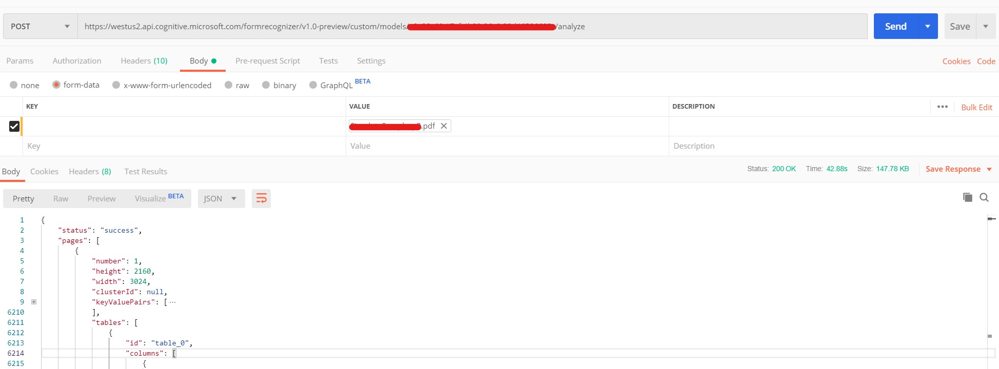
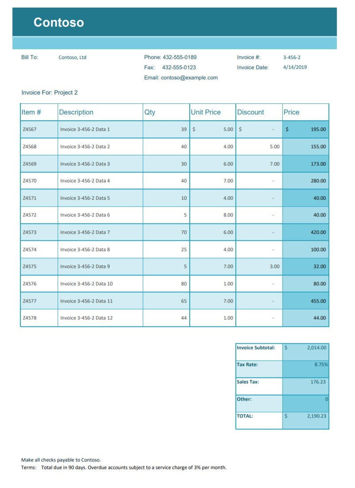
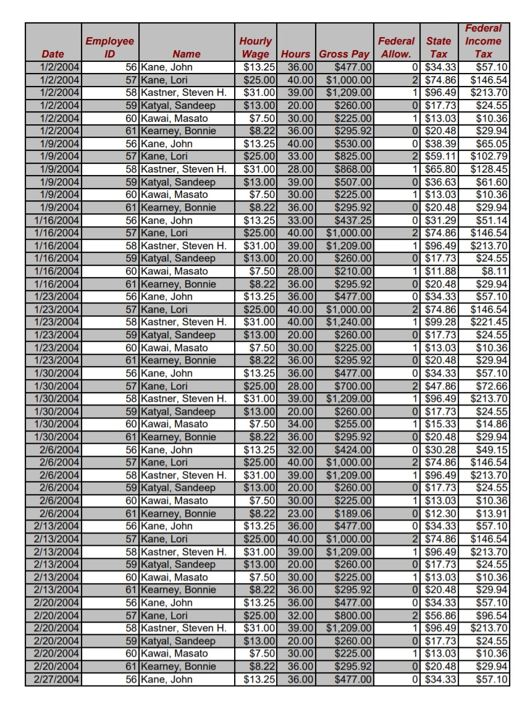
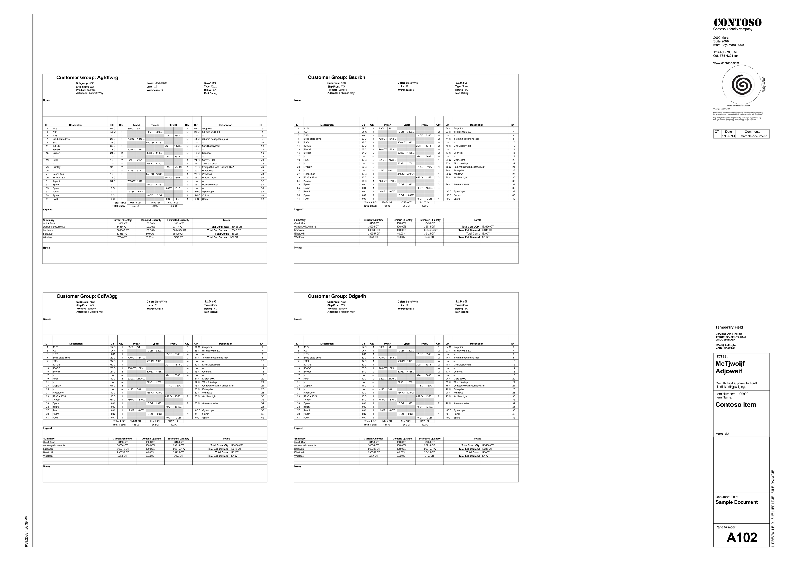

# Tables

Table extraction using Form Recognizer

## Introduction

Azure Form Recognizer is a cognitive service that uses machine learning technology to identify and extract key/value pairs and table data from documents using a custom model consisting of 5 filled in forms or an empty form and two filled in forms without any human inputs.  When you submit your input data, the algorithm clusters the forms by type, discovers what keys and tables are present,and associates values to keys and entries to tables.  Azure Form Recognizer also has a pre-built model for reading sales receipts which will not be discussed here.  

## Table Extraction - How To

### Train

To train the model,

1. Upload the train set of forms to externally accessible Azure Storage blob container Uri (preferably a Shared Access Signature Uri).  
2. The Train Model API of Form Recognizer can then be used for training using the training set uploaded to the storage blob container in the step above. Form Recognizer provides an easy to use API Console in the portal for training.

#### Using API Console

1. Access the API Console by navigating to the Forms Recognizer resource created in portal and selecting the 'Quick Start' option on the left navigation menu and then clicking on the 'API Console' (Step 2) on the main page to access a page that looks as shown below

2. Select the region in which the Forms Recognizer source is created to access the Swagger endpoint for the Forms Recognizer API as shown below

#### Analyze

To analyze and extract table data from a new form

1. Use the the Analyze Form API found on the Swagger home page for Forms Recognizer API. Accessing the Analyze Form API will display a page that will show details about the how to call the API (including code samples on how to call from different languages)

2. Call the API using the code samples provided on the Swagger endpoint page.  The API can also be called using POSTMAN

## Table Extraction Examples

The output schema of the Form Recognizer is available [here](form-understanding-json-output-schema).

Examples of tables and the output generated by the Form Recognizer for these tables are given below.

The output produced by Forms Recognizer for the above table looks like [this](resources/simple-sample1.json)

The output produced by Forms Recognizer for the above table looks like [this](resources/simple-sample3.json)

The output produced by Forms Recognizer for the above table looks like [this](resources/simple-sample4.json)

## Current Limitations

### Complex Tables

Form Recognizer doesn't currently support complex tables (nested tables, merged headers or cells,and so on). An example of the types of tables that are not supported currently by Forms Recognizer is shown below.

The output generated by the Forms Recognizer for the example table shown above is given [here](resources\complex-sample1.json).  As you can see in the JSON output, the column headers "TypeA", "TypeB", and "TypeC" are repeated for each column under the merged header cell.  Another problem is with "Total ABC" and "Total Cbas"  merged footer cells in the table.  These values are not extracted as part of the table but are extracted as key-value pairs instead.  

### Languages

English is the only language currently supported by Forms Recognizer.  Consequently form recognition in other languages will have to performed using custom implementations.  This usually takes of the form of text extraction using open source libraries that support languages in addition to  English.  

### FeedbackLoop (Forms Recognizer V2)

The Form Recognizer FeedbackLoop, currently in internal private preview, is the next version of Forms Recognizer.   The Form Recognizer Feedback Loop enables you to improve the model accuracy and extract key-value pairs from forms such as photos, forms containing values without keys, and complex forms with high accuracy. You can call Form Recognizer Feedback Loop by using a simple REST API to reduce complexity and easily integrate it into your workflow or application. To get started, you will need just 10 filled-in form documents.  Currently Form Recognizer FeedbackLoop does not support extraction from any tables, simple or otherwise.  
