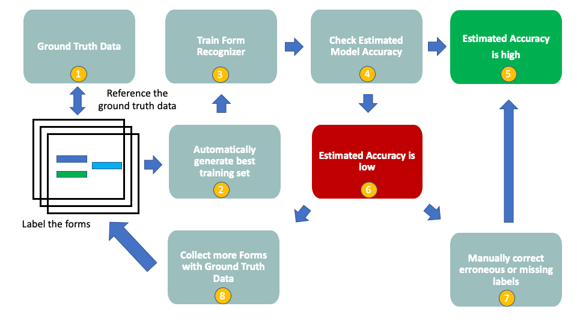

# The AutoLabelling process

This document describes how to implement the autolabelling process for the Supervised version of Forms Recognizer. By using an autolabelling approach we are able to reduce but not remove the need for a *human-in-the-loop*. It is strongly recommended that manual labelling still takes place for poorly performing models, but the need for manual labelling should be significantly reduced.

Note, no specialist skills are required for labelling, and thus with a little training and a disciplined and rigourous approach, poorly perfoming models due to autolabelling failures can be quickly rectified. What we have seen from real project implementations is that Auto-Labelling will produce high accuracy for most of the layout types/models, the poorly performing models will typically be due to mixed layouts, poor quality scans and noise such as messy handwriting overlapping over other text.

To amend the labels or indeed add new ones, or correct an Auto-labelled model please refer to the [Form Recognizer Sample Labelling Tool](https://docs.microsoft.com/en-us/azure/cognitive-services/form-recognizer/quickstarts/label-tool)

The result is that we can obtain the high accuracy scores of a supervised approach but also benefit from the ability to automate training at scale that is typically available in an unsupervised approach.

Note, in order to implement autolabelling, sufficient Ground Truth (GT) data must be available. The autolabelling process is very much a data driven process, and thus the more data available, and the more representative it is of the final production data, the better the end results and accuracy.

The image below illustrates the overall process:



* Step 1 - We retrieve the corresponding GT data for the relevant form
* Step 2 - We perform a double pass of the data and generate two candidate training sets and automatically select the best one
* Step 3 - We train Form Recognizer with the ```Use Labels``` option on the best training dataset
* Step 4 - We check the estimated accuracy of the model on the training data set
* Step 5 - The estimated accuracy score is high, we can proceed to evaluation
* Step 6 - The estimated accuracy score is low, we need to take further action
* Step 7 - We manually correct the erroneous labels to ensure high accuracy, or if applicable modify the autolabeling code to account for edge cases
* Step 8 - We collect more GT data and forms in order to improve our dataset and re-run the autolabelling process to see if the accuracy improves

## Folder structure

### Shared code

This sub-folder contains all the code related to the autolabeling process. You can use these pieces of code independently.

- FR Helpers

This file contains all the code related to the Form Recognizer API.

- Autolabeling

This file contains all the code related to document labeling (finding the fields we want to extract).

- Formatting

This file contains all the code related to text formatting for each field type.

- Model Evaluation

This file contains all the code related to evaluating a supervised model (comparing results to ground truth data).

- Storage Helpers

This file contains all the code to interact with Azure Storage (Blob storage, Queue storage, Table storage).

- Utils

This files contains utility code that does not fit anywhere else.


### Services

This sub-folder contains the code to run the different services (training, document processing, evaluation, prediction). You can run these services from the CLI or any other way you want.

- Base Processor

This class initializes the basic elements for all services: storage clients, app settings, as well as the list of fields we want to train supervised models to recognize.
If you add an app setting or want to change the list of fields to extract, **you should update this file**. All other services classes extend this class, so you when you change something in BaseProcessor, it impacts other services as well.

- Trigger Processor

This service lists the files in storage that will be used for supervised training for a given vendor, and puts messages in a queue to process the files.

- Queue Processor

This service adds messages in a queue.

- Process Doc

This service processes a given document to prepare it for supervised training. Processing means getting OCR data if it's not already done and labeling the fields we want to extract.

- Train Model

This service trains models for a given document type. You can either train an unsupervised model, a supervised model, or both.

- Predict Doc

This service gets predictions for a given document. It will get results from the unsupervised and supervised model if both exist, as well as OCR data.

- Model Evaluation

This service lists the files in storage meant to be used for testing, gets predictions for each of them and compares results to ground truth data to evaluate supervised models.


### CLI

This sub-folder contains the code related to the CLI tool. For each service, there's a corresponding file allowing the use of the service from the CLI.

**These files are provided as an example**. If you want to use them, you can move the files from the *cli* folder to the root of the autolabeling folder to avoid import issues.

### Tests

This sub-folder contains tests for the shared code. Before running tests, make sure you have test data and provide all needed values.

To run all tests at once run the command `pytest` from the root folder.

The tests are marked by category, so if you want to run only a subset of the tests, you can run the following command:

`pytest -m <marker>`

The existing markers are: *autolabeling*, *formatting*, *frhelpers*, *evaluation*, *storagehelpers*, *utils*.

### Basic implementation

This sub-folder contains code for an alternative way of automatically labelling documents. It contains its own README for more details.


## Setup

### Virtual environment

Before using this app, you should create a python virtual environment and install all dependencies by running `pip install -r requirements.txt`.

To create a python virtual environment, run the following commands:

Bash
```bash
python3.6 -m venv .venv
source .venv/bin/activate
```

Powershell
```bash
py -3.6 -m venv .venv
.venv\\scripts\\activate
```

**Note**: This code has been tested with **python version 3.6.8**.

### Storage

If you want to use the services in this folder and not just use pieces of code independently, know that the app assumes that your storage account contains:

* One queue named *processing*
* One table named *status*
* One table named *models*

You are free to change these names, but make sure to update the environment variables or the code accordingly.

### Data

If you want to use the services in this folder and not just use pieces of code independently, know that the app assumes that the data is in a single storage container with the following structure:

```
|- DocumentType1
|  |- test
|     |- DocumentID1.pdf
|     |- DocumentID2.pdf
|     |  ...
|  |- train
|     |- DocumentID3.pdf
|     |- DocumentID4.pdf
|     |  ...
|- DocumentType2
|  |- test
|     |- DocumentID5.pdf
|     |- DocumentID6.pdf
|     |  ...
|  |- train
|     |- DocumentID7.pdf
|     |- DocumentID8.pdf
|     |  ...
```

The train folder should contain at least 5 documents per document type.

Whether you want to use the whole app or just the autolabelling code, you also need to provide ground truth data, that can either be in storage or in the local root folder. Make sure this ground truth data (in the form of an excel file) contains a line per document that you want to process, as well as columns matching what is described in *lookup_fields.json*.

The app assumes by default that there is a column *FileID* in the ground truth with the file names corresponding to each row.
For instance, if your file name is *abcde.pdf*, the *FileID* column in the ground truth should contain the value *abcde*. You can change this column name (file_header) in the code if need be.

*lookup_fields.json* should follow these guidelines:

* There should be a "types" and a "keys" attributes
* *keys* should contain the keys defined in *BaseProcessor*, mapping to one or several columns (given as a list) in the ground truth
* *types* should map each ground truth column used to a type (e.g. money, date, address... default is text)

Ex. file:

```json
{
    "types":{
        "Total": "money",
        "Delivery": "money",
        "Date": "date",
        "Name": "text",
        "AddressLine1": "address",
        "AddressCity": "city",
        "AddressPostalCode": "postalCode",
        "AddressCountry": "text",
        "Article1": "text",
        "Article1Price": "money"
    },

    "keys":{
            "Total amount": ["Total"],
            "Delivery amount": ["Delivery"],
            "Date": ["Date"],
            "Name": ["Name"],
            "Address line 1": ["AddressLine1"],
            "Address line 2": ["AddressCity", "AddressPostalCode"],
            "Address country": ["AddressCountry"],
            "Item name": ["Article1"],
            "Item price": ["Article1Price"]
        }
}
```

If a field maps to several columns, the joint values in these columns will be treated as a unique field.
If you add a field mapping to a column of a specific type that is not handled yet\*, you can add code to specifically handle that type of fields in the *formatting* file.

\* Types of fields handled: money, date, address, postal code, state, regular text (default).*

### Environment variables

Create a .env file in the root folder to define environment variables:

```
QueueConnection="<STORAGE_ACCOUNT_CONNECTION_STRING>"
STORAGE_ACCOUNT_NAME="<STORAGE_ACCOUNT_NAME>"
STORAGE_ACCOUNT_URL="https://<STORAGE_ACCOUNT_NAME>.blob.core.windows.net"
STORAGE_KEY="<STORAGE_ACCOUNT_KEY>"
DATA_CONTAINER="data"
SAS_TOKEN="<STORAGE_ACCOUNT_SAS_TOKEN>"
STATUS_TABLE="status"
MODELS_TABLE="models"
FR_REGION="westeurope"
FR_KEY="<FORM_RECOGNIZER_KEY>"
GT_PATH="<GROUND_TRUTH_PATH>"
LOOKUP_FILE="./lookup_fields.json"
ENVIRONMENT="dev"
```

## Services

This part will describe how to use each service. You can use them with the CLI tool provided or call them from custom code that you developed.


### Trigger Processing

This service lists all the files in the train folder for a given document type, updates their status with the status parameter in the status table, and puts each file path as a new message in the processing queue.

It requires a parameter **doctype**. This **doctype** parameter needs to match exactly the name of the folder containing the pdf invoices.

It also accepts a **status** parameter, to indicate if the files should be entirely processed or not.

By default, the **status** parameter is "new", which resets the status of all the files for a given folder to new: the *OCR* file will be created for each file as well as the *labels* file.

If the status is set to "ocr-done", only the *labels* file will be created and the already existing *OCR* files will be loaded from storage. This allows the process to execute faster.

If the status is set to "done", neither the *OCR* or *labels* file will be created.

If the status is set to "keep", each file will keep its current status. Make sure you have ran the process at least once before doing this because if you've never done it the files' status will never have been initialized.


### Process Doc

This service cannot be called directly, as it is processing messages from a queue. It can process each queue message one by one, or, if used from the CLI, it looks at an abstract queue and processes everything all at once.

It takes a blob path in the processing queue and checks the status of the file in the status table.

If the status is not "done" or "ocr-done" ("new"), it will create an *OCR* file for the document (same path appended with ".ocr.json"), then create a *labels* file (same path appended with ".labels.json")

If the status is "ocr-done", it will get the *OCR* file from storage and use it to create the *labels* file.

The *OCR* file is created by calling the *Form Recognizer - Analyze Layout* API, then waiting for the results.

The *labels* file is created by using the OCR results and combining the extracted text with the values found in the ground truth. As a result, text and corresponding bounding boxes are mapped to certain fields.

These files are then saved in the same folder as the training data to be used for supervised training.


### Train Model

This service allows to train supervised and unsupervised models for a given document type.

It requires a parameter **doctype**. This **doctype** parameter needs to match exactly the name of the folder containing the pdf invoices.

It also accepts **supervised** and **unsupervised** parameters, that can be set to True or False, depending on whether you want to train a model in an unsupervised way, supervised way, or both.

If you're training a supervised model, it gets the status of the training files from the status table, and if they are all "done", the model training can begin.

It will call the *Form Recognizer - Train Model* API, then wait for the results.

When each model is trained, 2 results files are saved to storage in the document type folder with the model id, and in the case of a supervised model, average accuracy and field details. The models and their details are stored in the *models* table to be able to retrieve them later. The "unsupervised" or "supervised" label is contained in the partition key.


### Predict Doc

This service allows to get a prediction for a given document. A prediction contains the results from the unsupervised and supervised models if they exist, as well as the OCR data.

It requires a parameter **doctype**. This **doctype** parameter needs to match exactly the name of the folder containing the pdf invoices.

It also requires a **source** parameter, which should be a blob SAS URL.

The document type label is used to get the model IDs from the *models* table. If both unsupervised and supervised models exist, both predictions are ran to get results for the fields we're interested in (from the supervised model) as well as the automatically extracted key-value pairs (from the unsupervised model). The response body also contains the read (OCR) results.


### Model Evaluation

This service allows to evaluate a supervised model using the test set for a given document type and the corresponding ground truth data. 

It requires a parameter **doctype**. This **doctype** parameter needs to match exactly the name of the folder containing the pdf invoices.

It also accepts a **reuse** parameter, that can be set to True or False, depending on whether you want to reuse a previously created evaluation file, or run the predictions again (which you should do if you retrained a model).

The test set is sent for prediction (same process as in the Predict Doc service, but only for the supervised model) and the returned values for the required fields are compared with the values in the ground truth.

The response contains the metrics of the model: average accuracy and precision and breakdown by field, as well as number of unlabelled fields. An evaluation file is also saved to storage in the document type folder with the same information, plus the list of mismatches to be able to check what wasn't extracted correctly.

## Flow

This flow describes how to onboard a new document type.

### 1. Prepare Data

You should have at least 5 files for training with corresponding ground truth data. Try with 5 files at first but if the accuracy is low, add more training files.

### 2. Prepare storage account (optional)

If you want to use the default naming conventions and the code in this repo instead of custom code, make sure to prepare your storage account accordingly (see setup above).

### 3. Run the training pipeline

Use the CLI tool or any other custom code to trigger the processing of the training documents, then when it's all done call the Train Model service.

If you want to use the CLI tool, you can run:

```
(venv) python .\trigger_processing.py
```

This will prompt you for the document type label (this should be the exact name of one of your data folders) and the status. If this is the first time your run this, set the status as *new*.

You should have a message saying that the processing has started. This means that messages representing each file have been added to the processing queue.

To actually process the messages, you can now run:

```
(venv) python .\process_docs.py
```

This creates the files needed for training. You can now launch the actual training:

```
(venv) python .\train_model.py
```

This will prompt you for the document type label, and will require a "yes" or "no" for supervised training and unsupervised training. It's up to you to decide if you want to also train in an unsupervised way (it will take longer), but if you want to use the supervised training feature which this code is all about you can answer "yes" for Supervised. 

This step requires that all files for this document type are in status "done", so if you haven't done the previous steps successfully the training will not start.


### 3. If necessary, review automatically generated labels

After training a supervised model, you get the average accuracy and can use this to determine if this new model requires your attention or not. If the accuracy for the fields you're interested in is low, review the automoatically generated labels (using the [Labeling Tool](https://docs.microsoft.com/en-us/azure/cognitive-services/form-recognizer/quickstarts/label-tool) or by looking at the *labels* files.)

If the labels are correctly generated, add more files to the training set.
If not, identify potential fixes: it could be due to ground truth data that does not match what's on the document, or to edge cases that require code changes.

After you have done modifications, you should re-trigger the processing pipeline to generate labels again. You do not need to generate *OCR* files, so you can trigger the processing while setting the status of the files to "ocr-done".


### 4. Evaluate

When the training accuracy returned is good enough, you can evaluate the model by using a test set. Make sure you have corresponding ground truth for the test files. 

If the evaluation metrics returned are low, review the *model_eval* file to identify mismatches. They could be due to ground truth errors, to OCR errors or to actual field extraction errors. If applicable, fix the ground truth, and if there are field extraction errors, add more files to the training set to improve the results. The more variety you have in your training set, the better the evaluation results will be, as this will prevent overfitting.

If you're using the provided CLI tool, you can run:

```
(venv) python .\model_evaluation.py
```

This will prompt you for the document type label.

### 5. Consume

Once you're satisfied with the results, you can consider the new document type onboarded and use the Predict Doc service to get fields and automatically generated key-value pairs for a new document of the same type.

If you're using the provided CLI tool, you can run:

```
(venv) python .\predict_doc.py
```

This will prompt you for the document type label and a Blob SAS URL to send to your model.


## Extend

### Add fields

To add fields to extract, you should:
- Update the list of fields in *BaseProcessor*
- Update the **lookup_fields.json* file with the new fields mapping to ground truth columns
- Add the newly used ground truth columns types
- If the values are of a new type that needs specific handling, update the *formatting* file to handle this new type in a specific way


### Update autolabeling code

The autolabeling code is meant to be generalized and not tailored to a specific document type. If you identify a problem in the way documents are labeled for a new document type, an edge case might come to light that requires a code change.

This code change could be either in the *formatting* file or in the *autolabeling* file. If you change something, make sure this will not affect the other document types that have already been processed correctly.